

<strong>Universidad Peruana de Ciencias Aplicadas</strong>

<strong>Ingeniería de Software</strong> 
Aplicaciones para Dispositivos Móviles 
<strong>Profesor:</strong> Jorge Luis Mayta  

<h3 align="center">Seccion: 1795  </h3>

<h2 align="center">INFORME</h2>
<h2 align="center">2025 - 20</h2>

<h3 align="center">Startup: PolarNet</h3>

<strong>Producto: CoolGuard </strong>

<h3 align="center">Team Members:</h3>

| **Member**                           | **Code**     |
|--------------------------------------|--------------|
|  Paulo Percy Quincho Gamarra     |   U20191E562 |
|   Geronimo Quispe Pablo Antonio     | u202314304  |
|    Sandro Dinklange Arevalo   |  u202313419 |
|   Jamir Ángel Marzál Pérez      |  u201824409 |
|  Ayrton Damian Inga Hernandez     | u201924756   |

<strong>Diciembre 2025</strong>

# Registro de Versiones del Informe
| Versión | Fecha       | Autor(es)                                                              | Descripción                                                                                                                                         |
|---------|-------------|------------------------------------------------------------------------|-----------------------------------------------------------------------------------------------------------------------------------------------------|
| TB1     | 13/09/2025  | Paulo Percy Quincho Gamarra       | Desarrollo del capítulo I: Introducción                                                                                                             |
| TB1     | 14/09/2025  | Geronimo Quispe Pablo Antonio       | Desarrollo del capítulo II                                                                                                            |
| TB1     | 15/09/2025  | Sandro Dinklange Arevalo      | Desarrollo del capítulo II                                                                                                               |
| TB1     | 16/09/2025  | Jamir Ángel Marzál Pérez       | Desarrollo del capítulo II: Needfinding y Requirements specification                                                                                                                |
| TB1     | 17/09/2025  | Ayrton Damian Inga Hernandez      | Desarrollo del capítulo          II                     |

# Project Report Collaboration Insights
Link del repositorio: https://github.com/Paulo02-pixel/Aplicaciones-Para-Dispositivos-Moviles-1795.git

# Tabla de Contenidos

- [Capítulo I: Presentación](#capítulo-i-presentación)  
  - [1.1. Startup Profile](#11-startup-profile)  
    - [1.1.1. Descripción de la Startup](#111-descripción-de-la-startup)  
    - [1.1.2. Perfiles de integrantes del equipo](#112-perfiles-de-integrantes-del-equipo)  
  - [1.2. Solution Profile](#12-solution-profile)  
    - [1.2.1. Antecedentes y problemática](#121-antecedentes-y-problemática)  
    - [1.2.2. Lean UX Process](#122-lean-ux-process)  
      - [1.2.2.1. Lean UX Problem Statements](#1221-lean-ux-problem-statements)  
      - [1.2.2.2. Lean UX Assumptions](#1222-lean-ux-assumptions)  
      - [1.2.2.3. Lean UX Hypothesis Statements](#1223-lean-ux-hypothesis-statements)  
      - [1.2.2.4. Lean UX Canvas](#1224-lean-ux-canvas)  
  - [1.3. Segmentos objetivo](#13-segmentos-objetivo)  

- [Capítulo II: Requirements Development and Software Solution Design](#capítulo-ii-requirements-development-and-software-solution-design)  
  - [2.1. Competidores](#21-competidores)  
    - [2.1.1. Análisis competitivo](#211-análisis-competitivo)  
    - [2.1.2. Estrategias y tácticas frente a competidores](#212-estrategias-y-tácticas-frente-a-competidores)  
  - [2.2. Entrevistas](#22-entrevistas)  
    - [2.2.1. Diseño de entrevistas](#221-diseño-de-entrevistas)  
    - [2.2.2. Registro de entrevistas](#222-registro-de-entrevistas)  
    - [2.2.3. Análisis de entrevistas](#223-análisis-de-entrevistas)  
  - [2.3. Needfinding](#23-needfinding)  
    - [2.3.1. User Personas](#231-user-personas)  
    - [2.3.2. User Task Matrix](#232-user-task-matrix)  
    - [2.3.3. User Journey Mapping](#233-user-journey-mapping)  
    - [2.3.4. Empathy Mapping](#234-empathy-mapping)  
    - [2.3.5. Ubiquitous Language](#235-ubiquitous-language)  
  - [2.4. Requirements specification](#24-requirements-specification)  
    - [2.4.1. User Stories](#241-user-stories)  
    - [2.4.2. Impact Mapping](#242-impact-mapping)  
    - [2.4.3. Product Backlog](#243-product-backlog)  
  - [2.5. Strategic-Level Domain-Driven Design](#25-strategic-level-domain-driven-design)  
    - [2.5.1. EventStorming](#251-eventstorming)  
      - [2.5.1.1. Candidate Context Discovery](#2511-candidate-context-discovery)  
      - [2.5.1.2. Domain Message Flows Modeling](#2512-domain-message-flows-modeling)  
      - [2.5.1.3. Bounded Context Canvases](#2513-bounded-context-canvases)  
    - [2.5.2. Context Mapping](#252-context-mapping)  
    - [2.5.3. Software Architecture](#253-software-architecture)  
      - [2.5.3.1. Context Level Diagrams](#2531-software-architecture-context-level-diagrams)  
      - [2.5.3.2. Container Level Diagrams](#2532-software-architecture-container-level-diagrams)  
      - [2.5.3.3. Deployment Diagrams](#2533-software-architecture-deployment-diagrams)  
  - [2.6. Tactical-Level Domain-Driven Design](#26-tactical-level-domain-driven-design)  
    - [2.6.x. Bounded Context](#26x-bounded-context)  
      - [2.6.x.1. Domain Layer](#26x1-domain-layer)  
      - [2.6.x.2. Interface Layer](#26x2-interface-layer)  
      - [2.6.x.3. Application Layer](#26x3-application-layer)  
      - [2.6.x.4. Infrastructure Layer](#26x4-infrastructure-layer)  
      - [2.6.x.5. Component Level Diagrams](#26x5-bounded-context-software-architecture-component-level-diagrams)  
      - [2.6.x.6. Code Level Diagrams](#26x6-bounded-context-software-architecture-code-level-diagrams)  
        - [2.6.x.6.1. Domain Layer Class Diagrams](#26x61-bounded-context-domain-layer-class-diagrams)  
        - [2.6.x.6.2. Database Design Diagram](#26x62-bounded-context-database-design-diagram)  

- [Capítulo III: Solution UI/UX Design](#capítulo-iii-solution-uiux-design)  
  - [3.1. Product design](#31-product-design)  
    - [3.1.1. Style Guidelines](#311-style-guidelines)  
      - [3.1.1.1. General Style Guidelines](#3111-general-style-guidelines)  
    - [3.1.2. Information Architecture](#312-information-architecture)  
      - [3.1.2.1. Organization Systems](#3121-organization-systems)  
      - [3.1.2.2. Labelling Systems](#3122-labelling-systems)  
      - [3.1.2.3. SEO Tags and Meta Tags](#3123-seo-tags-and-meta-tags)  
      - [3.1.2.4. Searching Systems](#3124-searching-systems)  
      - [3.1.2.5. Navigation Systems](#3125-navigation-systems)  
    - [3.1.3. Landing Page UI Design](#313-landing-page-ui-design)  
      - [3.1.3.1. Wireframe](#3131-landing-page-wireframe)  
      - [3.1.3.2. Mock-up](#3132-landing-page-mock-up)  
    - [3.1.4. Mobile Applications UX/UI Design](#314-mobile-applications-uxui-design)  
      - [3.1.4.1. Wireframes](#3141-mobile-applications-wireframes)  
      - [3.1.4.2. Wireflow Diagrams](#3142-mobile-applications-wireflow-diagrams)  
      - [3.1.4.3. Mock-ups](#3143-mobile-applications-mock-ups)  
      - [3.1.4.4. User Flow Diagrams](#3144-mobile-applications-user-flow-diagrams)  
      - [3.1.4.5. Prototyping](#3145-mobile-applications-prototyping)  

- [Capítulo IV: Product Implementation & Validation](#capítulo-iv-product-implementation--validation)  
  - [4.1. Software Configuration Management](#41-software-configuration-management)  
    - [4.1.1. Development Environment Configuration](#411-software-development-environment-configuration)  
    - [4.1.2. Source Code Management](#412-source-code-management)  
    - [4.1.3. Source Code Style Guide & Conventions](#413-source-code-style-guide--conventions)  
    - [4.1.4. Deployment Configuration](#414-software-deployment-configuration)  
  - [4.2. Landing Page & Mobile Application Implementation](#42-landing-page--mobile-application-implementation)  
    - [4.2.1. Sprint n](#421-sprint-n)  
      - [4.2.1.1. Sprint Planning n](#4211-sprint-planning-n)  
      - [4.2.1.2. Sprint Backlog n](#4212-sprint-backlog-n)  
      - [4.2.1.3. Development Evidence](#4213-development-evidence-for-sprint-review)  
      - [4.2.1.4. Testing Suite Evidence](#4214-testing-suite-evidence-for-sprint-review)  
      - [4.2.1.5. Execution Evidence](#4215-execution-evidence-for-sprint-review)  
      - [4.2.1.6. Services Documentation](#4216-services-documentation-evidence-for-sprint-review)  
      - [4.2.1.7. Software Deployment Evidence](#4217-software-deployment-evidence-for-sprint-review)  
      - [4.2.1.8. Team Collaboration Insights](#4218-team-collaboration-insights-during-sprint)  
  - [4.3. Validation Interviews](#43-validation-interviews)  
    - [4.3.1. Diseño de Entrevistas](#431-diseño-de-entrevistas)  
    - [4.3.2. Registro de Entrevistas](#432-registro-de-entrevistas)  
    - [4.3.3. Evaluaciones según heurísticas](#433-evaluaciones-según-heurísticas)  

## Anexos

Repositorio App Movil: https://github.com/1ACC0238-2520-1795-G01-POLARNET/App 

# Capítulo I: Introducción

## 1.1 Startup Profile

### 1.1.1 Descripción de la Startup
**PolarNet** es una aplicación móvil desarrollada para optimizar la gestión y el mantenimiento de sistemas de refrigeración en negocios que dependen del frío de manera crítica, como supermercados, minimarkets, laboratorios, restaurantes y empresas de los sectores alimentario o farmacéutico.  

La app permite a los usuarios mantenerse conectados en todo momento con sus equipos y con técnicos o proveedores especializados, ofreciendo una administración integral, preventiva y automatizada desde la comodidad del celular.  

De igual manera, **PolarNet** incluye un módulo especializado para técnicos y proveedores, donde pueden visualizar todos los equipos que atienden, organizar visitas de servicio, consultar historiales técnicos y generar reportes de manera ágil y eficiente, directamente desde la app.  

**Misión:** En PolarNet, nuestra misión es proporcionar una solución móvil inteligente que proteja el inventario de los negocios y potencie la gestión de sus sistemas de refrigeración, al mismo tiempo que brinda herramientas prácticas para mejorar la productividad de técnicos y proveedores.  

**Visión:** Convertirnos en la aplicación líder en gestión y mantenimiento de equipos de refrigeración, iniciando en Lima y expandiéndonos a nivel nacional, facilitando el acceso móvil a la tecnología en todo el Perú.  

---

### 1.1.2 Perfiles de integrantes del equipo

<table border="1" cellspacing="0" cellpadding="8">
  <tr>
    <td style="text-align: center" align="center">
      

        Paulo Percy Quincho Gamarra - U20191E562  
         
        
      

    </td>
    <td style="text-align: center" align="center">
      Soy una persona responsable, comprometida con mis objetivos y soy puntual, lo que me permite realizar todos los trabajos a tiempo. Me gusta tener buena comunicación con el equipo. 
    </td>
    <td style="text-align: center" align="center">
      Conocimientos en Python, JavaScript, TypeScript, SQL y NoSQL. Disfruto entregar los mejores resultados posibles y fomentar la buena comunicación en grupo.
    </td>
  </tr>
  
  <tr>
    <td style="text-align: center" align="center">
      

        Geronimo Quispe Pablo Antonio - U202314304  
         
        
      

    </td>
    <td style="text-align: center" align="center">
      Mi nombre es Pablo,tengo 20 años y soy estudiante de Ingeniería de Software en la UPC, sede San Miguel. Soy una persona decidida, confiable, responsable y honesta con mi grupo de trabajo ,siendo lo más útil posible.
    </td>
    <td style="text-align: center" align="center">
      Tengo conocimientos en C++,C# y php. Cada día trato de dar una mejor versión de mi y aprender de mis errores.
    </td>
  </tr>
  
  <tr>
    <td style="text-align: center" align="center">
      

        Sandro Dinklange Arevalo - U202313419  
         
        
      

    </td>
    <td style="text-align: center" align="center">
      Soy un estudiante de 18 años que cursa la carrera de Ingeniería de Software, en sexto ciclo, en la Universidad Peruana de Ciencias Aplicadas (UPC).
    </td>
    <td style="text-align: center" align="center">
      Cuento con conocimientos en C++.
    </td>
  </tr>
  
  <tr>
    <td style="text-align: center" align="center">
      

        Jamir Ángel Marzál Pérez - U201824409  
         
        
      

    </td>
    <td style="text-align: center" align="center">
      Me gusta colaborar con mis compañeros, aportar ideas y trabajar de forma organizada para lograr objetivos comunes.
    </td>
    <td style="text-align: center" align="center">
      Conocimientos en Python, C#, Java y SQL. Enfocado en mejorar continuamente mis habilidades técnicas.
    </td>
  </tr>
  
  <tr>
    <td style="text-align: center" align="center">
      

        Ayrton Damian Inga Hernandez - U201924756  
         
        
      

    </td>
    <td style="text-align: center" align="center">
      Me considero una persona que se esfuerza para seguir adelante en mis estudios mientras intento equilibrar mi vida laboral.
    </td>
    <td style="text-align: center" align="center">
      Cuento con conocimientos de Python, JavaScript, C++ y base de datos.
    </td>
  </tr>
</table>

## 1.2 Solution Profile

**Nombre del producto:** PolarNet  

**Descripción:**  
PolarNet es una aplicación móvil innovadora y eficiente, creada para optimizar la gestión y el mantenimiento de equipos de congelación en negocios que dependen críticamente del frío, como supermercados, laboratorios, restaurantes y compañías de los sectores alimentario y farmacéutico.  

Desde el celular, los usuarios pueden acceder a un monitoreo constante en tiempo real, recibir alertas automáticas ante fallos, programar mantenimientos inteligentes y consultar reportes detallados del rendimiento de los equipos, todo desde una sola app.  

La solución centraliza la gestión en el dispositivo móvil y facilita la conexión directa entre negocios, técnicos y proveedores especializados, permitiendo una operación más segura, económica y sostenible en cualquier momento y lugar.  

**Monetización:**  
PolarNet monetiza su aplicación móvil a través de un modelo de suscripciones y tarifas por servicio. Los negocios podrán elegir entre diferentes planes mensuales.  

Por otro lado, los proveedores de servicios y técnicos podrán pagar una suscripción mensual para usar un módulo centralizado dentro de la aplicación, donde gestionan solicitudes de mantenimiento, organizan su flujo de trabajo y mejoran la calidad de la atención desde su dispositivo móvil.  

Además, la app permitirá habilitar tarifas por transacción para intervenciones técnicas no incluidas en el plan de suscripción, garantizando flexibilidad y nuevas oportunidades de ingresos.  

---

## 1.2.1 Antecedentes y problemática

La optimización del monitoreo y mantenimiento de equipos de congelación es fundamental en sectores sensibles como el alimentario y farmacéutico. En la literatura, se ha demostrado que la implementación de tecnologías **IoT (Internet of Things)** permite monitorear variables críticas como temperatura y humedad en tiempo real, detectar anomalías y prevenir pérdidas económicas significativas (Gillespie et al., 2023) [Fuente: [MDPI](https://www.mdpi.com/2071-1050/15/3/2255)].  

Además, en el ámbito del transporte en cadena de frío, se han desplegado soluciones basadas en **sensores inalámbricos** y **redes de sensores** para supervisar contenedores y activar alertas tempranas frente a desviaciones ambientales (SpringerOpen, 2022) [Fuente: [SpringerOpen Journal of Shipping and Trade](https://jshippingandtrade.springeropen.com/articles/10.1186/s41072-022-00110-z)].  

Según Badía-Melis et al. (2018), las tecnologías emergentes en monitoreo de cadena de frío, como **RFID** y **WSN (Wireless Sensor Networks)**, son esenciales para mejorar la trazabilidad y visibilidad en todo el proceso logístico [Fuente: [ScienceDirect](https://www.sciencedirect.com/science/article/abs/pii/S0956713517305558)]. Sin embargo, su adopción no está exenta de retos: obstáculos técnicos, altos costos de implementación y barreras operativas deben superarse para asegurar una integración efectiva (PMCID, 2023) [Fuente: [PMC](https://pmc.ncbi.nlm.nih.gov/articles/PMC11244810/)].  

En el contexto local de negocios que dependen de equipos de refrigeración —como supermercados, laboratorios, restaurantes y empresas farmacéuticas— se identifican los siguientes problemas:

- Ausencia de monitoreo móvil en tiempo real; muchas alertas solo se detectan cuando el daño ya ocurrió.  
- La mayoría de los mantenimientos son reactivos, lo que deriva en costos elevados y deterioro de productos.  
- Falta de integración entre usuarios, técnicos y proveedores, dificultando una respuesta coordinada.  
- Elevadas pérdidas por degradación de productos perecederos: según la FAO, hasta un tercio de los alimentos producidos se pierde o desperdicia en la cadena logística, en buena parte por fallos en la conservación (Bai et al., 2023) [Fuente: [PMC](https://pmc.ncbi.nlm.nih.gov/articles/PMC10417803/)].  
- Dificultad para desplegar soluciones móviles accesibles en pequeños negocios, dado que muchas propuestas académicas se basan en infraestructura compleja.  

Frente a estos desafíos, **PolarNet** propone una solución móvil que incorpora **monitoreo constante, alertas automatizadas y gestión integrada** entre negocios, técnicos y proveedores, con el fin de reducir fallos, pérdidas y mejorar la eficiencia operativa.  
Su enfoque se sustenta en los estudios académicos referidos y apunta a cerrar la brecha entre soluciones de investigación y aplicaciones prácticas accesibles para negocios locales.  

## 5Ws y 2Hs

| Pregunta   | Descripción |
|------------|-------------|
| **What?**   ¿Cuál es el problema? | Los negocios que dependen de sistemas de congelación enfrentan grandes retos operativos por fallas imprevistas y la falta de un mantenimiento adecuado. La ausencia de monitoreo constante, el consumo energético elevado no detectado a tiempo y los problemas de temperatura pueden ocasionar pérdidas de productos, afectar la calidad del servicio y generar importantes costos económicos. |
| **When?**   ¿Cuándo ocurre este problema? | Estas situaciones suelen presentarse durante la operación continua de los equipos, en especial cuando no hay técnicos disponibles de inmediato o no se realiza un seguimiento periódico del estado de los sistemas. |
| **Where?**   ¿Dónde sucede este problema? | Este tipo de inconvenientes se da en negocios a nivel nacional, con mayor incidencia en Lima, donde mantener la cadena de frío es crítico en sectores como el alimentario, farmacéutico y logístico. Asimismo, impacta a las empresas proveedoras de refrigeración que atienden a múltiples clientes sin una herramienta centralizada para la gestión. |
| **Who?**   ¿Quiénes están implicados? | El problema afecta tanto a los dueños y administradores de negocios que utilizan congeladoras como a los técnicos y proveedores responsables del mantenimiento de estos equipos. |
| **Why?**   ¿Qué origina este problema? | La causa principal es la falta de soluciones tecnológicas integrales y accesibles que combinen funciones como monitoreo, alertas, historial de uso y planificación de mantenimientos. Muchas empresas aún dependen de procesos manuales o carecen de controles preventivos, quedando vulnerables a fallas críticas. |
| **How?**   ¿Cómo se llegó a esta situación? | Esta situación se ha generado por la acumulación de incidentes inesperados y la poca digitalización del mantenimiento preventivo. Como resultado, los negocios dependen en gran medida de acciones reactivas en lugar de planes anticipados, lo que incrementa los costos, retrasa las atenciones y aumenta la carga operativa. |
| **How much?**   ¿Cuál es el impacto económico? | Las pérdidas económicas varían según el tipo de negocio, pero una falla en un sistema de congelación puede representar desde cientos hasta miles de soles en productos dañados. A esto se suman los tiempos de inactividad, la insatisfacción de clientes y los gastos derivados de reparaciones o sustituciones de equipos. |

---

## 1.2.2 Lean UX Process

### 1.2.2.1 Lean UX Problem Statement
El sector de la refrigeración comercial y técnica enfrenta grandes retos en la administración, el mantenimiento y la trazabilidad de los equipos de congelación. Negocios que dependen críticamente del frío como supermercados, minimarkets, restaurantes, laboratorios y empresas del rubro alimentario o farmacéutico aún operan sin un monitoreo en tiempo real y con mantenimientos mayormente reactivos, lo que genera pérdidas económicas, consumo energético ineficiente y riesgo constante sobre el inventario.  

Las soluciones disponibles no cubren la necesidad de una aplicación confiable y automatizada que centralice la gestión y ofrezca un enfoque predictivo y transparente tanto para negocios como para técnicos y proveedores. La falta de historial técnico digital, reportes accesibles y alertas preventivas limita la capacidad de reacción frente a fallas y afecta la calidad del servicio.  

**PolarNet** responde a este escenario con una aplicación móvil integral que conecta a negocios y técnicos especializados, brindando funciones como monitoreo en tiempo real de temperatura y consumo, programación inteligente de mantenimientos, notificaciones instantáneas por fallos, reportes automáticos y trazabilidad completa de cada equipo.  

Además, ofrece a los proveedores de servicios un módulo dentro de la app para gestionar equipos atendidos, planificar visitas y consultar historiales técnicos de manera ágil. La primera etapa de implementación se enfocará en Lima, apoyando a negocios que requieren garantizar el rendimiento de sus sistemas de congelación y a proveedores que buscan modernizar sus operaciones con herramientas digitales avanzadas.  

El éxito se medirá en la reducción de fallas inesperadas, la optimización del consumo energético, la mejora en la eficiencia de los técnicos y el aumento de la satisfacción de los clientes, asegurando continuidad operativa y fidelización de los usuarios de la app.

---

### 1.2.2.2 Lean UX Assumptions

**Business Outcomes**

- Incrementar en un 15% los usuarios activos de la aplicación móvil PolarNet, consolidando su presencia en el mercado.  
- Potenciar la visibilidad en redes sociales, especialmente en sectores como alimentos y técnicos en refrigeración, destacando la app como herramienta innovadora.  
- Generar confianza en la efectividad del monitoreo y mantenimiento automatizado, mostrando la app como un aliado confiable para proteger inventario y optimizar operaciones.  
- Mantener informados a los usuarios mediante notificaciones móviles en tiempo real, sobre fallas térmicas, cortes de energía o anomalías en los equipos.  
- Consolidar una base de usuarios dispuestos a adquirir membresías premium desde la app, con beneficios como mantenimiento predictivo, reportes personalizados y soporte técnico prioritario.  
- Establecer alianzas con plataformas de geolocalización como Google Maps, para mejorar el alcance y la programación de visitas técnicas desde dispositivos móviles.  
- Fomentar la participación activa de los usuarios en la app, a través de encuestas, valoraciones de técnicos y comentarios sobre el desempeño de los equipos.  
- Diseñar una interfaz sencilla, intuitiva y pensada para móvil, que ofrezca una experiencia atractiva sin sobrecargar de información.  
- Implementar inteligencia artificial en la aplicación, para optimizar mantenimientos inteligentes, rutas de técnicos y recomendaciones preventivas frente a posibles fallos.  

## User Outcomes

### ¿Quién será nuestro usuario?
- Negocios que dependen de manera crítica de sistemas de refrigeración, como supermercados, minimarkets, restaurantes, laboratorios y empresas en los sectores alimentario y farmacéutico.  
- Técnicos especializados en refrigeración encargados del mantenimiento de estos equipos.  
- Proveedores de equipos de refrigeración que desean ofrecer un servicio postventa más eficiente.  

---

### ¿Dónde encaja nuestro producto en su vida?
- En situaciones donde los negocios deben garantizar el funcionamiento continuo de sus sistemas de frío para evitar pérdidas económicas por fallas imprevistas.  
- En la rutina diaria de los técnicos, quienes gestionan múltiples clientes, visitas y tareas de mantenimiento.  
- En las operaciones diarias de los negocios que requieren registros detallados y reportes precisos sobre el rendimiento de sus sistemas de refrigeración.  

---

### ¿Qué problemas tiene nuestro producto y cómo se pueden resolver?
- **Problema:** Garantizar que los datos de monitoreo (temperatura, consumo energético, fallas, etc.) sean precisos y confiables.  
  **Solución:** Integrar sensores calibrados y sistemas automáticos de verificación de datos antes de almacenarlos.  

- **Problema:** La adopción inicial por parte de usuarios no familiarizados con la tecnología.  
  **Solución:** Ofrecer una interfaz sencilla, guías paso a paso y soporte técnico accesible para facilitar el uso.  

---

### ¿Cómo y cuándo se utiliza nuestro producto?
- Se accede a través de la aplicación web, disponible tanto para computadoras como dispositivos móviles.  
- Se usa a diario para monitorear los equipos de refrigeración, recibir alertas, programar mantenimientos y revisar historiales técnicos.  
- También se activa automáticamente en segundo plano al integrar sensores de monitoreo con la plataforma.  

---

### ¿Qué problemas tiene nuestro producto?
- En sus fases iniciales, podría carecer de integraciones con algunos dispositivos de terceros.  
- Algunos usuarios necesitarán formación para aprovechar al máximo las funcionalidades avanzadas.  
- Los técnicos tradicionales pueden resistirse al cambio hacia un sistema digital.  

---

### ¿Qué características son esenciales para la app?
- Monitoreo en tiempo real de temperatura, consumo energético y tiempo de uso.  
- Alertas automáticas ante fallos en los equipos.  
- Historial técnico completo con reportes exportables en PDF.  
- Calendario de mantenimiento preventivo con notificaciones programadas.  
- Módulo exclusivo para técnicos con gestión de visitas y clientes.  
- Soporte técnico inteligente y recomendaciones predictivas mediante IA.  
- Registro de múltiples ubicaciones y usuarios con distintos roles.  
- Interfaz minimalista e intuitiva para facilitar la adopción.  

---

### ¿Cómo debe verse y comportarse nuestro producto?
- **Interfaz amigable y confiable:** clara, ordenada y fácil de navegar, con gráficos e indicadores intuitivos.  
- **Diseño centrado en tareas críticas:** acceso rápido a fallos, próximas visitas y reportes de equipos.  
- **Accesibilidad multiplataforma:** disponible en web y móvil, adaptada para oficina y campo, con notificaciones inmediatas.  
- **Simplicidad:** panel centralizado para ver clientes, equipos en riesgo y visitas programadas, con generación de reportes rápida y fácil.  

---

### ¿Qué valor busca el cliente?
- **Gestión técnica simplificada:** mantenimiento predictivo, historiales claros y clientes organizados.  
- **Seguridad operativa y sin sorpresas:** monitoreo constante, alertas automáticas y control total.  
- **Eficiencia energética y trazabilidad:** detección anticipada de problemas, identificación de equipos en riesgo.  

---

### ¿Qué beneficios adicionales obtendrá el cliente?
- Visibilidad total del estado de sus equipos desde cualquier lugar y en cualquier momento.  
- Soporte técnico ágil gracias al historial detallado y alertas automáticas.  
- Reducción de costos operativos mediante mantenimientos preventivos y mayor eficiencia energética.  
- Reportes personalizados y exportables.  
- Automatización de visitas técnicas al detectar patrones de fallas.  

---

### ¿Cómo atraeremos usuarios?
- Marketing dirigido a nichos clave: supermercados, restaurantes y empresas del sector frío mediante LinkedIn, correos y llamadas estratégicas.  
- Alianzas con proveedores de equipos para incluir PolarNet en sus paquetes postventa.  
- Prueba gratuita de 14 días de versiones premium, con monitoreo limitado, para mostrar el valor en tiempo real.  

---

### ¿Cómo generaremos ingresos?
- **Suscripción mensual para negocios:** según número de equipos, tipos de reportes y funcionalidades.  
- **Modelo freemium:** versión gratuita con funciones limitadas y anuncios.  
- **Publicidad dirigida (opcional):** visibilidad para marcas de refrigeración dentro de la plataforma.  

---

### ¿Cuál es nuestra competencia y cómo la superamos?
- **Competencia:** Otras aplicaciones centradas en gestión de datos y mantenimiento de equipos de refrigeración.  
- **Nuestra ventaja:** PolarNet está diseñado exclusivamente para negocios que dependen del frío, detecta anomalías en tiempo real, genera alertas y automatiza acciones.  

---

### ¿Cuál es el mayor riesgo para el producto?
- **Adopción lenta:** proveedores que aún usan agendas físicas o Excel.  
- **Falta de adopción inicial:** convencer a los primeros usuarios de la utilidad y confiabilidad de la app.  
- **Desconfianza en la precisión de los sensores:** riesgo de perder valor si los datos no son precisos.  

---

### ¿Cómo lo resolveremos?
- **Algoritmos de validación:** IA para verificar precisión y filtrar información incorrecta.  
- **Capacitación y soporte:** tutoriales, videos y soporte técnico accesible.  
- **Estrategia progresiva de integraciones:** empezar con los equipos más utilizados y luego ampliar compatibilidad con APIs.  
- **Sensores certificados:** integrar solo dispositivos validados para garantizar precisión.  

---

## 1.2.2.3 Lean UX Hypothesis

1. **Hipótesis 1: Mejora en la eficiencia operativa y reducción de fallas inesperadas**  
   Al centralizar en una sola app todas las funciones de monitoreo, mantenimiento y gestión de equipos de refrigeración, los negocios y proveedores podrán operar con mayor eficiencia, simplificando procesos y reduciendo el riesgo de fallas inesperadas.  
   Validación: reducción en reportes de fallas térmicas y mejor organización de mantenimientos preventivos.  

2. **Hipótesis 2: Control de pérdidas operativas y consumo energético**  
   Si ofrecemos herramientas de análisis en tiempo real y alertas automáticas, los usuarios podrán anticiparse a fallas, reducir pérdidas y optimizar su consumo energético.  
   Validación: incremento en el uso de estas funciones y reducción de costos por interrupciones.  

3. **Hipótesis 3: Mejora en el servicio técnico predictivo y personalizado**  
   Con reportes automáticos e históricos de cada equipo, los técnicos podrán brindar un servicio más predictivo y personalizado.  
   Validación: técnicos valoran la utilidad de los reportes y clientes expresan mayor satisfacción.  

4. **Hipótesis 4: Trazabilidad y seguridad de la información técnica**  
   Si garantizamos trazabilidad en cada acción y protegemos la información técnica, generaremos confianza en negocios y proveedores.  
   Validación: mayor fidelidad de usuarios y reducción en incidencias por pérdida de datos.  

5. **Hipótesis 5: Transición a una gestión moderna y digitalizada de refrigeración**  
   Al ofrecer una solución digital sencilla y especializada, ayudaremos a negocios y técnicos a migrar hacia una gestión moderna.  
   Validación: rápida adopción, baja tasa de abandono y uso frecuente de funciones clave.  

## 1.2.2.4 Lean UX Canvas

  

## 1.3 Segmentos objetivo

### Segmento Objetivo #1: Negocios que utilizan sistemas de refrigeración

**Aspectos demográficos:**
- Tipo de negocio: Empresas de diferentes tamaños, desde pequeñas hasta grandes.  
- Sectores: Alimentación, farmacéutico, restauración y comercio minorista.  
- Nivel de necesidad: Alta dependencia de equipos de refrigeración.  

**Aspectos geográficos:**
- Nacionalidad: Peruana.  
- Ubicación: Áreas urbanas.  
- Región: Lima, con planes de expansión a nivel nacional.  

**Aspectos psicográficos:**
- Empresas que buscan evitar pérdidas económicas debido a fallas en los sistemas de refrigeración.  
- Negocios que necesitan un control eficiente del consumo energético.  
- Administradores interesados en implementar soluciones tecnológicas para optimizar operaciones y preservar la calidad del inventario.  

---

### Segmento Objetivo #2: Proveedores de servicios y equipos de refrigeración

**Aspectos demográficos:**
- Tipo de empresa: Técnicos independientes, pequeñas y medianas empresas (PYMES), y proveedores especializados en refrigeración.  
- Rol: Técnicos de mantenimiento, instaladores y empresas de soporte técnico.  

**Aspectos geográficos:**
- Nacionalidad: Peruana.  
- Ubicación: Áreas urbanas.  
- Región: Lima, con planes de expansión a nivel nacional.  

**Aspectos psicográficos:**
- Técnicos que desean organizar y gestionar sus visitas de manera más eficiente y centralizada.  
- Empresas que buscan mejorar la trazabilidad de sus servicios, con la capacidad de generar reportes automáticos.  
- Profesionales que desean ofrecer un servicio más personalizado y predictivo a sus clientes.  
=======
## Capítulo II: Requirements Elicitation & Analysis 

### 2.1. Competidores

**Competidor 1: Infraspeak**
Infraspeak: Es uno de los softwares de mantenimiento y gestión de órdenes de trabajo, con buen reconocimiento puesto que cuenta con módulos robustos, tareas preventivas y un buen soporte

---

**Competidor 2: Persat**
Con sedes en Latinoamérica, sus funciones más relevantes cuentan con asignación de tareas de servicio, una buena localización regional así como un gran enfoque al servicio técnico

---

**Competidor 3: Kiconex**
 Este software basado en el control remoto en la nube para equipos de refrigeración cuenta con fuertes monitorios, sensores, iot y un buen soporte de hardware profesional, dedicados mayormente en Europa.
#### 2.1.1. Análisis competitivo

<table> 
  <tr>
    <th colspan="7"> Competitive Analysis Landscape </th>
  </tr>
  <tr>
    <td colspan="2" rowspan="2">¿Por qué llevar acabo este análisis? </td>
    <td colspan="5"> Pregunta </td>
  </tr>
  <tr>
    <td colspan="5"> Para poder evaluar el posicionamiento competitivo de nuestra app frente a competidores perfecto para identificar fortalezas, debilidades, oportunidades y amenazas en el mercado peruano de gestión y monitoreo de refrigeración. </td>
  </tr>
  <tr>
    <td colspan="2"> Productos </td>
    <td> PolarNet  </td>
    <td> Infraspeak </td>
    <td> Persat </td>
    <td> Kiconex </td>
  </tr>
  <tr>
    <td rowspan="2">Perfil</td>
    <td>Overview</td>
    <td>App móvil enfocada en monitoreo y mantenimiento preventivo de refrigeración comercial. </td>
    <td> Plataforma internacional para mantenimiento y monitoreo.. </td>
    <td> App de gestión de equipos de campo y mantenimiento. </td>
    <td> App de refrigeración industrial con sistema. </td>
  </tr>
  <tr>
    <td>Ventaja competitiva ¿Qué valor ofrece a los clientes?</td>
    <td> Interfaz simple, costos accesibles, soporte local, alertas predictivas en tiempo real. </td>
    <td> Solución integral con muchos módulos y certificaciones internacionales. </td>
    <td> Amplia red de técnicos y logística integrada.. </td>
    <td> Experiencia técnica en refrigeración industrial y hardware especializado.. </td>
  </tr>
  <tr>
    <td rowspan="2">Perfil de Marketing</td>
    <td> Mercado Objetivo </td>
    <td> Supermercados, restaurantes y cadenas minoristas. </td>
    <td> Grandes empresas y facilities. </td>
    <td> Empresas de servicios técnicos, distribuidores. </td>
    <td> Plantas industriales, exportadoras. </td>
  </tr>
  <tr>
    <td> Estrategias de Marketing </td>
    <td> Marketing digital, alianzas con proveedores, asociaciones locales,etc. </td>
    <td> Ventas consultivas a grandes cuentas, partners globales. </td>
    <td> Marketing basado en casos de éxito y distribuidores. </td>
    <td> Promoción a través de fabricantes e instaladores, ferias industriales. </td>
  </tr>
  <tr>
    <td rowspan="3">Perfil de Producto</td>
    <td> Productos & Servicios </td>
    <td> App móvil, IoT para monitoreo, reportes automáticos. </td>
    <td> Plataforma modular, integraciones con IoT. </td>
    <td> App móvil y web para gestión de técnicos y mantenimiento. </td>
    <td> Sistemas de refrigeración y hardware para control remoto. </td>
  </tr>
  <tr>
    <td> Precios & Costos </td>
    <td> Modelo mensual accesible, pago por equipo monitoreado. </td>
    <td> Modelo empresarial con precios premium. </td>
    <td> Suscripción mensual media, pago por usuario técnico. </td>
    <td> Precios altos ligados al hardware e instalación. </td>
  </tr>
  <tr> 
    <td>Canales de distribución (Web y/o Móvil)</td>
    <td> App móvil y dashboard web con soporte local. </td>
    <td> Web, app móvil, integraciones API. </td>
    <td> App móvil y web, CRM integrado. </td>
    <td> Hardware y software propio, canal de distribuidores. </td>
  </tr>
  <tr>
    <td rowspan="4"> Análisis SWOT </td>
    <td> Fortalezas </td>
    <td> Soporte local, precios competitivos, adaptación rápida a normativas, UI amigable. </td>
    <td> Amplia trayectoria, reputación internacional, plataforma completa. </td>
    <td> Experiencia en gestión de técnicos y logística integrada. </td>
    <td> Hardware especializado en refrigeración industrial. </td>
  </tr>
  <tr>
    <td> Debilidades </td>
    <td> Marca nueva, menos funcionalidades avanzadas que otras empresas internacionales. </td>
    <td> Costos elevados, menor flexibilidad. </td>
    <td> Poca especialización en refrigeración crítica. </td>
    <td> Requiere inversión inicial alta y poca presencia local en Perú. </td>
  </tr>
  <tr>
    <td> Oportunidades </td>
    <td> Creciente necesidad de monitoreo y cumplimiento normativo en Perú, alianzas con proveedores de equipos. </td>
    <td> Expansión a mercados emergentes con soluciones más accesibles. </td>
    <td> Especializarse en nichos críticos </td>
    <td> Ampliar servicios en Latam con soporte remoto. </td>
  </tr>
  <tr>
    <td> Amenazas </td>
    <td> Entrada de competidores internacionales con precios agresivos o alianzas locales.</td>
    <td> Startups locales más baratas y ágiles. </td>
    <td> Competidores globales con más capital. </td>
    <td> Sustitución tecnológica por soluciones puras sin hardware. </td>
  </tr>
</table>
#### 2.1.2. Estrategias y tácticas frente a competidores

Hemos identificado diversas estrategias y tácticas para diferenciarse y competir efectivamente con otros actores del mercado de la gestión y monitoreo de sistemas de refrigeración. A continuación se detallan las principales:

---

**1. Estrategias de Diferenciación:**

- **Automatización y Mantenimiento Preventivo**: A diferencia de los competidores identificados, PolarNet se enfoca en ofrecer una solución integral y especializada para refrigeración, con monitoreo en tiempo real, alertas automáticas y programación inteligente de mantenimientos. Esto permite a los negocios reducir incidencias y gestionar sus equipos de manera proactiva.

- **Experiencia del usuario como ventaja competitiva**: Se invertirá en una interfaz y procesos extremadamente simples y agradables para el usuario. El objetivo es que cada interacción genere confianza y sensación de control, reduciendo la fricción en comparación con los competidores.

- **Construcción de comunidad y fidelización**: Crear foros, newsletters, o espacios exclusivos donde proveedores y clientes intercambien experiencias y recomendaciones. Esto genera una comunidad difícil de replicar por la competencia.

---

**2. Tácticas de Marketing:**

- **Aumento de usuarios fieles**: Mostrar funcionalidades clave del sistema en fepublicar historias reales de reducción de costos y tiempos gracias al uso de la plataforma para reforzar la credibilidad.ias industriales y eventos del sector alimentario y farmacéutico.

---

**3. Estrategias de Precios:**

- **Modelo Freemium**: Versión gratuita para registro de equipos y mantenimientos básicos, con servicios avanzados (diagnóstico predictivo, analítica, reportes) en planes de pago.

- **Planes escalonados para técnicos y proveedores**: Desde un plan básico para pequeños talleres hasta uno premium para grandes distribuidores.

---

**4. Expansión y Adaptabilidad:**

- **Foco inicial en Lima y principales ciudades del Perú**: Implementar pilotos locales para adaptar procesos a necesidades reales del mercado antes de escalar.

- **Colaboraciones con Proveedores Locales**: Estableceremos alianzas estratégicas con proveedores de equipos de refrigeración y servicios técnicos en Perú, lo que nos distinguirá de la competencia al tener un sistema sólido y diseñado especialmente para el mercado peruano
---

### 2.2. Entrevistas.

#### 2.2.1. Diseño de entrevistas

**Segmento Objetivo #1: Negocios que utilizan sistemas de refrigeración**

1. ¿Qué marcas o empresas relacionadas con refrigeración/servicios técnicos te inspiran confianza? 
2. ¿Qué factores te hacen elegir una marca sobre otra (precio, calidad, soporte, reputación)? 
3. ¿Qué dispositivos usas con mayor frecuencia para tu trabajo (smartphone, laptop, tablet)? 
4. ¿Qué características consideras más importantes al seleccionar una aplicación de este tipo? 
5. ¿Cuáles son tus principales preocupaciones a la hora de gestionar/obtener el servicio o producto? 
6. Si pudieras mejorar una sola cosa del servicio actual, ¿qué sería?

**Segmento Objetivo #2: Proveedores de servicios y equipos de refrigeración**

1. ¿Podrías contarnos brevemente sobre tu empresa o rol en el negocio de refrigeración?
2. ¿Cuáles son tus principales preocupaciones al ofrecer servicios de refrigeración a tus clientes?
3. ¿Qué características consideras importantes en una aplicación o sistema para gestionar servicios/equipos de refrigeración?
4. ¿Podrías contarme una situación en la que un problema con equipos o mantenimiento haya afectado a tus clientes?

---
#### 2.2.2. Registro de entrevistas

##### Segmento objetivo #1: Negocios que utilizan sistemas de refrigeración

---
#### Entrevista 1:

- **Nombres y apellidos:** Javier Martínez
- **Edad:** 50
- **Distrito:** San Martín de Porres

- 

- **Inicio:** 0:02
- **Duración:** 3:00 min
- **URL:** https://upcedupe-my.sharepoint.com/:v:/g/personal/u202313419_upc_edu_pe/EbAKUznIOb1Hj52G0gDEO4cB5aB_zzFbWqKma_ojJr-KDw?nav=eyJyZWZlcnJhbEluZm8iOnsicmVmZXJyYWxBcHAiOiJPbmVEcml2ZUZvckJ1c2luZXNzIiwicmVmZXJyYWxBcHBQbGF0Zm9ybSI6IldlYiIsInJlZmVycmFsTW9kZSI6InZpZXciLCJyZWZlcnJhbFZpZXciOiJNeUZpbGVzTGlua0NvcHkifX0&e=0bIob4
- **Resumen:** Nuestro primer entrevistador nos explica que es nuevo con respecto a las máquinas de refrigeración y que su mayor preocupación es la dificultad del hardware, explica que quiere UI más intuitivas..

---
#### Entrevista 2:
- **Nombres y apellidos:** Jesús Cortez Soria
- **Edad:** 25
- **Distrito:** San Martín de Porres

- **Inicio:** 0:02
- **Duración:** 1:50 min
- **URL:** https://upcedupe-my.sharepoint.com/:v:/g/personal/u202313419_upc_edu_pe/EQl3y6bGWi9ArBB2C0V_6-ABZiouXaloDBWMnfE-n-0CRA?nav=eyJyZWZlcnJhbEluZm8iOnsicmVmZXJyYWxBcHAiOiJPbmVEcml2ZUZvckJ1c2luZXNzIiwicmVmZXJyYWxBcHBQbGF0Zm9ybSI6IldlYiIsInJlZmVycmFsTW9kZSI6InZpZXciLCJyZWZlcnJhbFZpZXciOiJNeUZpbGVzTGlua0NvcHkifX0&e=SQ7nw4
- **Resumen:** Nuestro segundo entrevistador menciona que lo más importante es el soporte y la atención que brindan las empresas, menciona también el uso de tablets para un mejor monitoreo y la confianza con los trabajadores.

##### Segmento objetivo #2: Empresas proveedoras de servicios y equipos de refrigeración

---
#### Entrevista 1:

- **Nombres y apellidos:** Adrian Barzola
- **Edad:** 25
- **Distrito:** Los Olivos

- **Inicio:** 0:02
- **Duración:** 2:24 min
- **URL:** https://upcedupe-my.sharepoint.com/personal/u202313419_upc_edu_pe/_layouts/15/stream.aspx?id=%2Fpersonal%2Fu202313419%5Fupc%5Fedu%5Fpe%2FDocuments%2Fentrevista%203%2Emp4&nav=eyJyZWZlcnJhbEluZm8iOnsicmVmZXJyYWxBcHAiOiJPbmVEcml2ZUZvckJ1c2luZXNzIiwicmVmZXJyYWxBcHBQbGF0Zm9ybSI6IldlYiIsInJlZmVycmFsTW9kZSI6InZpZXciLCJyZWZlcnJhbFZpZXciOiJNeUZpbGVzTGlua0NvcHkifX0&ga=1&referrer=StreamWebApp%2EWeb&referrerScenario=AddressBarCopied%2Eview%2E684695f3%2Da04a%2D4389%2D98b5%2Dd95b0223728e
- **Resumen:** Nuestro tercer entrevistador menciona que es importante una relación de calidad-precio y una empresa destacaría más aprovechando las redes sociales
---

#### 2.2.3. Análisis de entrevistas
Basándonos en las entrevistas, hemos llevado a cabo un análisis en el que destacamos los puntos compartidos y tendencias comunes entre los usuarios.

**Hallazgos:**
- La mayoría de los entrevistados percibe que los sistemas de refrigeración actuales son complejos, sobre todo para nuevos usuarios.
- Se valora altamente la facilidad de uso y las interfaces intuitivas, que reduzcan la curva de aprendizaje y aumenten la eficiencia.
- El soporte técnico y la atención al cliente son factores decisivos para elegir proveedor; la confianza en la empresa es clave para la adopción de la tecnología.
- Preferencia por dispositivos móviles y tablets para monitorear y controlar los equipos; buscan experiencias ágiles, modernas y accesibles desde cualquier lugar.
- Algunos entrevistados señalaron que los costos iniciales pueden ser un obstáculo, pero estarían dispuestos a pagar más por una solución que ahorre tiempo y reduzca fallos.
- Se identificó que los negocios pequeños tienen mayores dificultades para capacitar a su personal y valoran capacitación rápida y soporte remoto.
- La gran mayoría manifestó interés en que las plataformas ofrezcan tutoriales o guías interactivas para facilitar el aprendizaje.

## 2.3. Needfinding.
### 2.3.1. User personas

Para la construcción de las User Personas se analizaron los segmentos definidos previamente (negocios que dependen de la cadena de frío y proveedores/técnicos de refrigeración). Estos arquetipos representan de manera ficticia, pero fundamentada en los hallazgos, a usuarios clave de PolarNet.

**Segmento Objetivo #1: Negocios que utilizan equipos de refrigeración**

**Segmento Objetivo #2: Empresas proveedoras de servicios y equipos de refrigeración**

### 2.3.2. User Task Matrix

Se identificaron las principales tareas que los segmentos objetivo realizan actualmente para cumplir con sus responsabilidades. A continuación, se presenta el User Task Matrix que relaciona a cada User Persona con las tareas detectadas, considerando frecuencia e importancia.

**Segmento 1: Negocios que utilizan equipos de refrigeración (representado por Carlos Ramírez).**

**Segmento 2: Empresas proveedoras de servicios y equipos de refrigeración (representado por Jorge Martínez).**

  

<table class="utm-table" role="table" aria-label="User Task Matrix for PolarNet">
    <thead>
      <tr>
        <th>Tarea / Task</th>
        <th colspan="2">Carlos Ramírez</th>
        <th colspan="2">Jorge Martínez</th>
      </tr>
      <tr>
        <th></th>
        <th>Frecuencia</th>
        <th>Importancia</th>
        <th>Frecuencia</th>
        <th>Importancia</th>
      </tr>
    </thead>
    <tbody>
      <tr>
        <td style="text-align:left;">Monitorear temperatura equipos</td>
        <td class="level-high">Alta</td>
        <td class="level-high">Alta</td>
        <td class="level-medium">Media</td>
        <td class="level-high">Alta</td>
      </tr>
      <tr>
        <td style="text-align:left;">Recibir alertas de fallos</td>
        <td class="level-high">Alta</td>
        <td class="level-very-high">Muy Alta</td>
        <td class="level-high">Alta</td>
        <td class="level-high">Alta</td>
      </tr>
      <tr>
        <td style="text-align:left;">Programar mantenimientos</td>
        <td class="level-medium">Media</td>
        <td class="level-high">Alta</td>
        <td class="level-high">Alta</td>
        <td class="level-very-high">Muy Alta</td>
      </tr>
      <tr>
        <td style="text-align:left;">Generar reportes de rendimiento</td>
        <td class="level-medium">Media</td>
        <td class="level-high">Alta</td>
        <td class="level-low">Baja</td>
        <td class="level-medium">Media</td>
      </tr>
      <tr>
        <td style="text-align:left;">Contactar técnicos/proveedores</td>
        <td class="level-high">Alta</td>
        <td class="level-very-high">Muy Alta</td>
        <td class="level-medium">Media</td>
        <td class="level-medium">Media</td>
      </tr>
      <tr>
        <td style="text-align:left;">Acceder a historial de fallos</td>
        <td class="level-medium">Media</td>
        <td class="level-high">Alta</td>
        <td class="level-high">Alta</td>
        <td class="level-very-high">Muy Alta</td>
      </tr>
    </tbody>
</table>

### 2.3.3. User Journey Mapping

**Segmento objetivo #1: Negocios que utilizan equipos de refrigeración**

Este User Journey Map representa el recorrido actual de Carlos Ramírez. El mapa ilustra su experiencia completa desde que maneja continuamente los datos registrados de su restaurante hasta el seguimiento posterior a la ejecución de los mantenimientos o reparaciones. Esta sección refleja la situación actual sin intervención de soluciones tecnológicas, mostrando los puntos de contacto, tareas clave, emociones y posibles fricciones que enfrenta en su día a día. Este recorrido permite entender los desafíos que enfrenta Carlos, incluyendo la falta de historial confiable, la dependencia de técnicos disponibles a última hora y la dificultad de consolidar información para tomar decisiones rápidas.

**Segmento objetivo #2: Técnicos y empresas proveedoras de servicios de refrigeración**

Este User Journey Map representa el recorrido actual de Jorge Martínez. El mapa ilustra su experiencia completa desde que gestiona continuamente las solicitudes y mantenimientos de sus clientes hasta el seguimiento posterior a la realización de los servicios. Esta sección refleja la situación actual sin intervención de soluciones tecnológicas, mostrando los puntos de contacto, tareas clave, emociones y posibles fricciones que enfrenta en su día a día. Este recorrido permite entender los desafíos que enfrenta Jorge, incluyendo la sobrecarga de trabajo por urgencias imprevistas, la falta de historial técnico centralizado y la dificultad para planificar rutas y visitas de manera eficiente.

### 2.3.4. Empathy Mapping

Se elaboraron mapas de empatía para cada User Persona utilizando la herramienta indicada. A continuación, se resumen los principales hallazgos:

**Segmento 1: Negocios que utilizan equipos de refrigeración (representado por Carlos Ramírez).**

**Segmento 2:Empresas proveedoras de servicios y equipos de refrigeración (representado por Jorge Martínez).**

#### 2.3.5. Ubiquitous Language

1.**Cold Chain (Cadena de frío)**: Conjunto de procesos y controles para mantener productos refrigerados a la temperatura adecuada durante almacenamiento y transporte.

2.**Refrigeration Unit (Equipo de refrigeración)**: Aparato o sistema utilizado para enfriar o mantener alimentos y productos a baja temperatura.

3.**Preventive Maintenance (Mantenimiento Preventivo)**: Conjunto de acciones programadas para revisar y mantener equipos, evitando fallas antes de que ocurran.

4.**Emergency Repair (Reparación de emergencia)**: Servicio realizado cuando un equipo falla inesperadamente, buscando restaurar su funcionamiento lo antes posible.

5.**Service Request (Solicitud de servicio)**: Petición realizada por un cliente para la revisión, mantenimiento o reparación de un equipo.

6.**Technician (Técnico)**: Profesional encargado de realizar mantenimientos, reparaciones y supervisión de equipos de refrigeración.

7.**Service Report (Reporte de servicio)**: Documento que registra las acciones realizadas durante un mantenimiento o reparación, incluyendo diagnóstico y resultados.

8.**Equipment History (Historial de equipos)**: Registro completo de mantenimientos, reparaciones y fallas de un equipo de refrigeración.

9.**Route Planning (Planificación de rutas)**: Organización eficiente de visitas a clientes según ubicación geográfica y prioridad de tareas.

10.**Remote Monitoring (Monitoreo remoto)**: Supervisión de equipos de refrigeración a distancia mediante sensores y alertas en tiempo real.

11.**Alert (Alerta)**: Notificación que indica una anomalía, fallo o condición crítica en un equipo de refrigeración.

12.**Client (Cliente)**: Negocio o persona que contrata servicios de mantenimiento y reparación de equipos de refrigeración.

13.**Work Order (Orden de trabajo)**: Documento o registro que detalla las tareas a realizar por un técnico en un mantenimiento o reparación.

14.**Downtime (Tiempo de inactividad)**: Periodo durante el cual un equipo no está operativo debido a falla o mantenimiento.

15.**Traceability (Trazabilidad)**: Capacidad de registrar y acceder a toda la información relevante sobre acciones realizadas en los equipos y servicios.

## 2.4. Requirements specification

### 2.4.1. User Stories

| ID | Nombre | Descripción | Criterios de aceptación | EP |
|----|----------|--------------|--------------------------|----|
| **US-01** | Registro de usuario | Como nuevo usuario, quiero registrarme para acceder a la plataforma y empezar a gestionar mis equipos de refrigeración. | **Escenario 1:** Dado que el usuario ingresa todos los datos válidos, cuando confirma el registro, entonces el sistema crea la cuenta y muestra un mensaje de éxito.  **Escenario 2:** Dado que el usuario intenta registrarse con un correo ya existente, cuando confirma el registro, entonces el sistema muestra un mensaje de error indicando que el correo ya está en uso. | EP-01 |
| **US-02** | Inicio de sesión | Como usuario, quiero acceder a mi cuenta en la plataforma de manera rápida y segura para utilizar sus funcionalidades. | **Escenario 1:** Dado que el usuario ingresa credenciales válidas, cuando presiona “Iniciar sesión”, entonces el sistema le concede acceso al panel principal.  **Escenario 2:** Dado que el usuario ingresa credenciales incorrectas, cuando presiona “Iniciar sesión”, entonces el sistema muestra un mensaje de error.  **Escenario 3:** Dado que el usuario está en la Landing Page, cuando selecciona “Iniciar sesión”, entonces el sistema lo redirige al formulario de login. | EP-01 |
| **US-03** | Solicitar servicio de reparación | Como cliente, quiero solicitar un servicio de reparación para mis equipos de refrigeración cuando detecto fallas. | **Escenario 1:** Dado que el cliente selecciona un equipo con falla, cuando completa el formulario de solicitud, entonces el sistema genera la solicitud de reparación y muestra una confirmación.  **Escenario 2:** Dado que el sistema recibe la solicitud, cuando esta es procesada, entonces el cliente visualiza un mensaje de confirmación del envío. | EP-03 |
| **US-04** | Ver estado del servicio solicitado | Como cliente, quiero ver el estado actual de mi solicitud de servicio para estar informado sobre el avance del proceso. | **Escenario 1:** Dado que el cliente tiene una solicitud en curso, cuando accede a la sección de servicios, entonces el sistema muestra el estado actualizado.  **Escenario 2:** Dado que el técnico inicia el trabajo, cuando el estado cambia en el sistema, entonces el cliente ve la actualización reflejada en su panel. | EP-03 |
| **US-05** | Ver reporte de servicio realizado | Como cliente, quiero ver el reporte de servicio detallado para saber qué reparaciones se hicieron en mi equipo. | **Escenario 1:** Dado que el servicio ha sido completado, cuando el técnico genera el reporte, entonces el sistema lo asocia al equipo y lo muestra al cliente.  **Escenario 2:** Dado que el reporte ha sido generado, cuando se confirma su registro, entonces el sistema envía una copia al correo del cliente. | EP-04 |
| **US-06** | Agregar equipos | Como cliente, quiero agregar mis equipos de refrigeración en la plataforma para llevar un control. | **Escenario 1:** Dado que el cliente ingresa la información del equipo correctamente, cuando confirma el registro, entonces el sistema guarda el nuevo equipo.  **Escenario 2:** Dado que el cliente edita los datos de un equipo existente, cuando guarda los cambios, entonces el sistema actualiza la información correctamente. | EP-02 |
| **US-07** | Recibir alerta de falla en equipo | Como cliente, quiero recibir una alerta automática cuando mi equipo de refrigeración presente una falla para tomar acción rápidamente. | **Escenario 1:** Dado que un sensor detecta una falla en el equipo, cuando el evento es registrado, entonces el sistema envía una alerta automática al cliente.  **Escenario 2:** Dado que se aproxima una fecha de mantenimiento preventivo, cuando se cumple el umbral de tiempo, entonces el sistema envía una alerta preventiva. | EP-05 |
| **US-08** | Solicitar mantenimiento preventivo | Como cliente, quiero solicitar mantenimiento preventivo para evitar fallas futuras en mis equipos de refrigeración. | **Escenario 1:** Dado que el cliente selecciona la opción de mantenimiento, cuando programa una fecha y hora, entonces el sistema registra la solicitud y muestra una confirmación.  **Escenario 2:** Dado que la solicitud ha sido registrada, cuando el cliente revisa sus servicios, entonces puede ver los detalles programados. | EP-03 |
| **US-09** | Ver consumo energético de equipos | Como cliente, quiero ver un informe del consumo energético de mis equipos para analizar su eficiencia. | **Escenario 1:** Dado que el cliente accede a su panel, cuando selecciona un equipo, entonces el sistema muestra un informe del consumo energético.  **Escenario 2:** Dado que el cliente selecciona dos equipos, cuando solicita la comparación, entonces el sistema muestra un gráfico comparativo de consumo. | EP-04 |
| **US-10** | Recepción de alertas automáticas para servicio | Como empresario, quiero recibir alertas automáticas cuando un cliente solicite un servicio de reparación o mantenimiento para brindar el servicio inmediatamente. | **Escenario 1:** Dado que un cliente realiza una solicitud de servicio, cuando el sistema la registra, entonces se envía una alerta automática al empresario.  **Escenario 2:** Dado que un cliente solicita mantenimiento preventivo, cuando se confirma la solicitud, entonces el sistema notifica al empresario para su atención. | EP-05 |
| **US-11** | Asignar técnico a solicitud de servicio | Como empresario, quiero asignar un técnico a una solicitud de servicio para garantizar que se realice el trabajo adecuado. | **Escenario 1:** Dado que el empresario tiene solicitudes pendientes, cuando selecciona una y asigna un técnico disponible, entonces el sistema registra la asignación exitosamente.  **Escenario 2:** Dado que la asignación se ha completado, cuando el sistema la confirma, entonces se envía una notificación al técnico correspondiente. | EP-03 |
| **US-12** | Ver historial de servicios realizados | Como empresario, quiero ver el historial de servicios realizados para cada cliente y equipo, para llevar un control adecuado. | **Escenario 1:** Dado que el empresario accede a la sección de historial, cuando visualiza los registros, entonces el sistema muestra la lista completa de servicios realizados.  **Escenario 2:** Dado que el empresario desea revisar servicios específicos, cuando aplica filtros por cliente o equipo, entonces el sistema muestra los resultados correspondientes. | EP-04 |
| **US-13** | Realizar seguimiento a solicitudes de servicio | Como empresario, quiero realizar un seguimiento detallado a las solicitudes de servicio de mis técnicos, para saber cómo van. | **Escenario 1:** Dado que existen solicitudes en curso, cuando el empresario accede al módulo de seguimiento, entonces el sistema muestra el estado actualizado de cada solicitud.  **Escenario 2:** Dado que un técnico actualiza el progreso del servicio, cuando el cambio se registra, entonces el sistema refleja la actualización en tiempo real. | EP-03 |
| **US-14** | Generar reporte de desempeño de técnicos | Como empresario, quiero generar reportes sobre el desempeño de mis técnicos para evaluar su eficiencia y productividad. | **Escenario 1:** Dado que el empresario desea analizar el desempeño, cuando selecciona la opción de generar reporte, entonces el sistema crea un informe con indicadores de eficiencia.  **Escenario 2:** Dado que el reporte ha sido generado, cuando el empresario solicita su descarga, entonces el sistema permite obtenerlo en formato PDF. | EP-04 |
| **US-15** | Configurar alertas de mantenimiento | Como empresario, quiero configurar alertas automáticas para el mantenimiento preventivo de los equipos. | **Escenario 1:** Dado que el empresario ingresa parámetros de frecuencia y condiciones, cuando guarda la configuración, entonces el sistema registra las alertas preventivas.  **Escenario 2:** Dado que el empresario desea modificar la frecuencia, cuando actualiza los parámetros, entonces el sistema actualiza las alertas según la nueva configuración. | EP-05 |
| **US-16** | Visualizar clientes y servicios asociados | Como empresario, quiero ver todos los clientes que han solicitado servicio para organizar el trabajo de los técnicos. | **Escenario 1:** Dado que el empresario accede a la funcionalidad de gestión de clientes, cuando abre la vista principal, entonces el sistema muestra la lista de clientes con sus servicios asociados.  **Escenario 2:** Dado que el empresario necesita analizar servicios específicos, cuando aplica filtros por estado, entonces el sistema muestra solo los resultados filtrados. | EP-04 |
| **US-17** | Visualizar equipos entregados a clientes | Como empresario, quiero ver todos los equipos que fueron entregados a clientes para realizar su seguimiento. | **Escenario 1:** Dado que el empresario accede al módulo de equipos, cuando visualiza la lista, entonces el sistema muestra los equipos asociados a cada cliente.  **Escenario 2:** Dado que el empresario desea encontrar equipos específicos, cuando aplica filtros por cliente o estado, entonces el sistema muestra los equipos correspondientes. | EP-02 |
| **US-18** | Recibir notificaciones de eventos importantes | Como cliente, quiero recibir notificaciones sobre eventos importantes como el progreso del servicio para mantenerme informado. | **Escenario 1:** Dado que el técnico detecta un problema en el equipo, cuando registra el evento, entonces el sistema envía una notificación al cliente afectado.  **Escenario 2:** Dado que el estado del servicio cambia, cuando el sistema actualiza el registro, entonces se envía una notificación automática al cliente. | EP-05 |
| **US-19** | Realizar evaluación de servicio | Como cliente, quiero evaluar el servicio para mostrar mi conformidad. | **Escenario 1:** Dado que el servicio ha finalizado, cuando el cliente accede al módulo de evaluación, entonces el sistema permite registrar una calificación del 1 al 5.  **Escenario 2:** Dado que el cliente desea modificar su calificación dentro del plazo permitido, cuando envía la nueva evaluación, entonces el sistema actualiza la puntuación registrada. | EP-06 |
| **US-20** | Registrar técnicos | Como empresario, quiero registrar técnicos en la plataforma para integrarlos a mi red de soporte técnico. | **Escenario 1:** Dado que el empresario ingresa todos los datos requeridos del técnico, cuando confirma el registro, entonces el sistema guarda correctamente la información.  **Escenario 2:** Dado que faltan datos obligatorios, cuando el empresario intenta registrar al técnico, entonces el sistema muestra un mensaje de error e impide continuar. | EP-01 |
| US-21 | Visualizar perfil del técnico | Como empresario, quiero visualizar el perfil de cada técnico, incluyendo sus datos personales y métricas de desempeño, para evaluar su rendimiento. | **Escenario 1:** Dado que selecciono un técnico existente, cuando accedo a su perfil, entonces se muestran sus datos personales y métricas de desempeño.   **Escenario 2:** Dado que selecciono un técnico sin evaluaciones registradas, cuando accedo a su perfil, entonces se muestran sus datos personales sin métricas. | EP-01 |
| US-22 | Recibir alertas de fallas en equipos | Como empresario, quiero recibir alertas cuando alguno de los equipos de mis clientes presenta fallas, para notificar al cliente y organizar atención. | **Escenario 1:** Dado que un equipo presenta una falla detectada por el sistema, cuando se genera la alerta, entonces el empresario recibe una notificación inmediata.   **Escenario 2:** Dado que el empresario revisa la alerta, cuando accede al detalle, entonces puede notificar al cliente y registrar la atención. | EP-05 |
| US-23 | Visualizar propuesta de valor principal | Como visitante, quiero conocer la propuesta de valor de OsitoPolar, para entender si la plataforma se ajusta a mis necesidades. | **Escenario 1:** Dado que el visitante ingresa a la página principal, cuando la página carga, entonces se muestra de forma destacada la propuesta de valor general.   **Escenario 2:** Dado que el visitante pertenece a un segmento específico, cuando navega por la sección de soluciones, entonces se muestra una propuesta adaptada a su tipo de negocio. | EP-07 |
| US-24 | Explorar soluciones específicas para mi rubro | Como visitante, quiero conocer las soluciones específicas que ofrece OsitoPolar para mi tipo de negocio. | **Escenario 1:** Dado que el visitante accede a la sección de soluciones, cuando selecciona “Negocios usuarios”, entonces se muestran las funcionalidades orientadas a su rubro.   **Escenario 2:** Dado que el visitante selecciona “Proveedores”, cuando accede a la información, entonces se muestran las soluciones correspondientes. | EP-07 |
| US-25 | Comprender funcionalidades destacadas | Como visitante, quiero comprender las funcionalidades clave de la plataforma, para evaluar si se adapta a mi operación. | **Escenario 1:** Dado que el visitante accede a la sección de funcionalidades, cuando revisa las características principales, entonces identifica las opciones clave del sistema.   **Escenario 2:** Dado que el visitante analiza las descripciones, cuando lee los beneficios, entonces comprende cómo se aplican a su operación. | EP-07 |
| US-26 | Solicitar una demo fácilmente | Como visitante, quiero solicitar una demo de la plataforma, para iniciar contacto con OsitoPolar. | **Escenario 1:** Dado que el visitante desea probar la plataforma, cuando busca la opción de solicitar una demo, entonces encuentra un enlace o botón visible.   **Escenario 2:** Dado que selecciona la opción de demo, cuando completa la solicitud, entonces se redirige al canal de contacto o formulario de registro. | EP-07 |
| US-27 | Conocer misión y visión de la startup | Como visitante, quiero conocer la misión y visión de OsitoPolar, para entender su enfoque y propuesta de valor. | **Escenario 1:** Dado que el visitante ingresa a la sección institucional, cuando revisa la información corporativa, entonces encuentra la misión de la empresa.   **Escenario 2:** Dado que el visitante explora la sección estratégica, cuando revisa el contenido, entonces identifica la visión de la startup. | EP-07 |
| US-28 | Contactar fácilmente con ventas | Como visitante empresario, quiero contactar fácilmente con el equipo de ventas. | **Escenario 1:** Dado que el visitante busca información de contacto, cuando navega por la página, entonces encuentra una opción clara para comunicarse con ventas.   **Escenario 2:** Dado que selecciona el canal de contacto, cuando hace clic en el botón o enlace, entonces se redirige correctamente al medio correspondiente (formulario, correo o chat). | EP-07 |
| US-29 | Acceder fácilmente a la plataforma | Como visitante, quiero acceder fácilmente al inicio de sesión, para ingresar rápidamente a mi cuenta. | **Escenario 1:** Dado que el visitante está en la página principal, cuando busca el botón de inicio de sesión, entonces lo encuentra de forma visible en la interfaz.   **Escenario 2:** Dado que selecciona el botón de inicio de sesión, cuando hace clic en él, entonces se redirige al formulario de autenticación. | EP-07 |
| US-30 | Descargar la app móvil desde la web | Como visitante interesado en usar OsitoPolar desde el celular, quiero descargar fácilmente la app móvil. | **Escenario 1:** Dado que el visitante explora la plataforma desde la web, cuando revisa la sección “App móvil”, entonces encuentra el enlace de descarga.   **Escenario 2:** Dado que selecciona el enlace de descarga, cuando hace clic, entonces es redirigido a la tienda correspondiente según su sistema operativo. | EP-07 |
| US-31 | Controlar encendido y apagado del equipo | Como cliente, quiero poder encender y apagar remotamente mis equipos de refrigeración desde la plataforma. | **Escenario 1:** Dado que el cliente tiene un equipo conectado, cuando ejecuta la acción de encendido desde la app, entonces el sistema cambia el estado del equipo a “encendido”.   **Escenario 2:** Dado que el equipo está encendido, cuando el cliente selecciona la opción de apagado, entonces el sistema cambia el estado del equipo a “apagado”. | EP-02 |
| US-32 | Ajustar temperatura del equipo | Como cliente, quiero ajustar la temperatura de mis equipos de refrigeración desde la plataforma. | **Escenario 1:** Dado que el cliente tiene un equipo activo, cuando incrementa la temperatura en la app, entonces el sistema actualiza el valor en el equipo.   **Escenario 2:** Dado que el cliente desea reducir la temperatura, cuando disminuye el valor en la interfaz, entonces el sistema actualiza el cambio correctamente. | EP-02 |
| US-33 | Ver video explicativo sobre el producto en el Landing Page | Como visitante, quiero ver un video explicativo sobre el producto. | **Escenario 1:** Dado que el visitante ingresa al Landing Page, cuando la página carga, entonces el video explicativo es visible en la interfaz.   **Escenario 2:** Dado que el visitante desea ver el video, cuando hace clic en “Reproducir”, entonces el video se reproduce sin interrupciones. | EP-07 |
| US-34 | Ver video sobre el equipo en el Landing Page | Como visitante, quiero ver un video sobre el equipo detrás del producto. | **Escenario 1:** Dado que el visitante accede al Landing Page, cuando la página termina de cargar, entonces se muestra el video del equipo.   **Escenario 2:** Dado que el visitante selecciona reproducir, cuando presiona el botón de play, entonces el video se reproduce correctamente. | EP-07 |
| US-35 | Barra de navegación actualizada tras inicio de sesión | Como usuario autenticado, quiero que la barra de navegación refleje mi estado de sesión. | **Escenario 1:** Dado que el usuario está autenticado, cuando accede a la barra de navegación, entonces se muestran las opciones correspondientes a un usuario logueado.   **Escenario 2:** Dado que el usuario inicia sesión, cuando la autenticación es exitosa, entonces la barra de navegación se actualiza automáticamente. | EP-01 |
| TS-36 | Integrar sistema IAM en el backend | Como equipo de desarrollo, queremos integrar un sistema de Identity Access Management (IAM) en el backend para gestionar de forma segura el acceso de los usuarios a los endpoints del frontend. | **Escenario 1:** Dado que un usuario autenticado intenta acceder a un endpoint protegido, cuando envía su token válido, entonces el sistema le permite el acceso exitosamente.   **Escenario 2:** Dado que un usuario no autenticado intenta acceder, cuando no presenta credenciales válidas, entonces el sistema devuelve un error de acceso denegado (HTTP 401). | EP-01 |
| TS-37 | Implementar autenticación en el backend | Como equipo de desarrollo, queremos implementar autenticación en el backend para permitir a los usuarios iniciar sesión de manera segura. | **Escenario 1:** Dado que un usuario envía credenciales válidas al backend, cuando se validan correctamente, entonces el sistema genera un token de autenticación.   **Escenario 2:** Dado que un usuario envía credenciales inválidas, cuando el backend valida la información, entonces devuelve un error de autenticación. | EP-01 |
| TS-39 | Usar llave secreta para crear usuarios | Como administrador, quiero usar una llave secreta para crear usuarios en el backend, garantizando que solo personal autorizado pueda registrar nuevos usuarios. | **Escenario 1:** Dado que el administrador posee una llave válida, cuando la usa para crear un nuevo usuario, entonces el sistema permite el registro exitoso.   **Escenario 2:** Dado que el administrador usa una llave inválida, cuando intenta registrar un usuario, entonces el sistema devuelve un mensaje de error de acceso denegado. | EP-01 |
| TS-40 | Registrar nuevo usuario a través de API RESTful | Como desarrollador, quiero exponer un endpoint para registrar nuevos usuarios en la plataforma, validando datos como correo único y formato de contraseña. | **Escenario 1:** Dado que el cliente envía una solicitud POST a `/api/v1/users` con datos válidos, cuando la validación es exitosa, entonces el backend responde con código 201 y devuelve el usuario creado.   **Escenario 2:** Dado que el cliente envía una solicitud POST con un correo ya registrado, cuando el sistema valida la información, entonces responde con código 400 y mensaje “Email already registered”. | EP-01 |
| TS-41  | Consultar estado de solicitud de servicio por API    | Como desarrollador, quiero exponer un endpoint para consultar el estado de una solicitud de servicio.                         | **Escenario 1:** Dado que existe una solicitud registrada, Cuando el cliente consulta `GET /api/v1/requests/{id}` con un ID válido, Entonces el sistema responde **200** con el estado actual de la solicitud.  **Escenario 2:** Dado que se consulta un ID inexistente, Cuando se realiza la solicitud, Entonces el sistema responde **404** con el mensaje “Request not found”. | EP-03    |
| TS-42  | Solicitar mantenimiento preventivo vía API           | Como desarrollador, quiero implementar un endpoint para registrar solicitudes de mantenimiento preventivo, diferenciadas de las de reparación. | **Escenario 1:** Dado que se envían datos válidos de mantenimiento preventivo, Cuando se ejecuta `POST /api/v1/preventive-maintenance`, Entonces el sistema responde **201** y guarda la solicitud.  **Escenario 2:** Dado que falta un campo obligatorio, Cuando se intenta registrar la solicitud, Entonces el sistema responde **400** con un mensaje de error. | EP-03    |
| TS-43  | Asignar técnico a solicitud de servicio por API      | Como desarrollador, quiero crear un endpoint que permita asignar un técnico a una solicitud de servicio.                       | **Escenario 1:** Dado que existe una solicitud y un técnico válido, Cuando se ejecuta `PUT /api/v1/requests/{id}/assigntechnician`, Entonces el sistema responde **200** y actualiza la asignación.  **Escenario 2:** Dado que el ID del técnico no existe, Cuando se intenta asignar, Entonces el sistema responde **404** con el mensaje “Technician not found”. | EP-03    |
| TS-44  | Consultar historial de servicios por API             | Como desarrollador, quiero exponer un endpoint para consultar el historial de servicios por cliente o equipo.                  | **Escenario 1:** Dado que un cliente tiene servicios registrados, Cuando se ejecuta `GET /api/v1/service-history?client_id={id}`, Entonces el sistema responde **200** con la lista de servicios asociados.  **Escenario 2:** Dado que se filtra por un equipo específico, Cuando se realiza la consulta, Entonces se devuelven solo los servicios del equipo. | EP-04    |
| TS-45  | Generar y exportar reporte de desempeño técnico      | Como desarrollador, quiero implementar la generación de reportes de desempeño técnico y permitir su descarga en PDF.           | **Escenario 1:** Dado que existen métricas de desempeño registradas, Cuando se ejecuta `GET /api/v1/reports/performance`, Entonces el sistema devuelve las métricas en formato JSON.  **Escenario 2:** Dado que el usuario solicita la descarga del reporte, Cuando se selecciona la opción de exportar, Entonces el sistema entrega un archivo **PDF**. | EP-04    |
| TS-46  | Consultar clientes con sus servicios asociados por API | Como desarrollador, quiero implementar un endpoint que permita listar clientes junto con los servicios que tienen registrados.  | **Escenario 1:** Dado que existen clientes con servicios registrados, Cuando se ejecuta `GET /api/v1/clients/services`, Entonces el sistema responde con la lista completa.  **Escenario 2:** Dado que se envía el parámetro `estado=in_progress`, Cuando se realiza la solicitud, Entonces el sistema devuelve solo los clientes con servicios en progreso. | EP-04    |
| TS-47  | Consultar equipos entregados y su estado por API     | Como desarrollador, quiero exponer un endpoint para visualizar los equipos entregados a clientes.                              | **Escenario 1:** Dado que existen equipos entregados a clientes, Cuando se ejecuta `GET /api/v1/delivered-devices`, Entonces el sistema devuelve la lista de equipos y sus estados.  **Escenario 2:** Dado que se aplican filtros por tipo o estado, Cuando se realiza la consulta, Entonces el sistema devuelve la lista filtrada. | EP-02    |
| TS-48  | Sistema de envío de notificaciones por eventos relevantes | Como desarrollador, quiero que el sistema pueda enviar notificaciones automáticas o manuales ante eventos clave.              | **Escenario 1:** Dado que una solicitud cambia su estado a “in progress”, Cuando ocurre el cambio, Entonces el sistema envía una notificación automática al cliente.  **Escenario 2:** Dado que el técnico detecta un evento crítico, Cuando lo registra en el sistema, Entonces el cliente recibe una notificación de alerta. | EP-05    |
| TS-49  | Consultar perfil del técnico con métricas por API    | Como desarrollador, quiero crear un endpoint que muestre el perfil completo de un técnico incluyendo datos personales, historial y métricas. | **Escenario 1:** Dado que el técnico existe en el sistema, Cuando se consulta `GET /api/v1/technicians/{id}`, Entonces el sistema devuelve la información completa del perfil y sus métricas.  **Escenario 2:** Dado que el técnico no tiene historial de servicios, Cuando se realiza la consulta, Entonces el sistema devuelve un mensaje indicando que no hay datos de desempeño. | EP-01    |
| TS-50  | Arreglar conexión entre endpoints y frontend         | Como equipo de desarrollo, queremos arreglar la conexión entre los endpoints del backend y el frontend para garantizar un flujo de datos estable y sin errores. | **Escenario 1:** Dado que los endpoints están configurados correctamente, Cuando el frontend realiza solicitudes al backend, Entonces recibe respuestas exitosas sin errores.  **Escenario 2:** Dado que ocurre una falla de conexión, Cuando se intenta obtener datos, Entonces el sistema muestra un mensaje de error claro y comprensible. | EP-01    |

### Épicas

| ID | Nombre | Descripción |
|----|---------|--------------|
| EP-01 | Gestión de Usuarios | Esta epic se enfoca en la creación, autenticación y gestión de las cuentas de usuario en la plataforma. Incluye el registro de nuevos usuarios, inicio de sesión, y la administración de los perfiles. |
| EP-02 | Gestión de Equipos | Esta epic cubre las funcionalidades relacionadas con la gestión de los equipos de refrigeración. Permite a los clientes agregar, editar, y visualizar sus equipos registrados en la plataforma. |
| EP-03 | Solicitudes de Servicio | Esta epic abarca todo lo relacionado con la solicitud de servicios de reparación y mantenimiento por parte de los clientes, así como el seguimiento de esas solicitudes hasta su resolución. |
| EP-04 | Informes y Reportes | Esta epic se refiere a la generación, visualización y envío de informes detallados sobre los servicios realizados, el consumo energético de los equipos y el desempeño de los técnicos. |
| EP-05 | Alertas y Notificaciones | Esta epic se encarga de la creación de alertas automáticas y notificaciones para clientes y empresarios, relacionadas con fallas de equipos, mantenimiento preventivo y el progreso de los servicios. |
| EP-06 | Evaluación de Servicios | Esta epic está orientada a permitir que los clientes puedan evaluar los servicios recibidos, para proporcionar retroalimentación y permitir que se realicen correcciones si es necesario. |
| EP-07 | Sitio Web y Experiencia Web (Landing Page) | Esta epic se enfoca en las funcionalidades de la página de aterrizaje, incluyendo la visualización de la propuesta de valor, la facilidad para solicitar demos, y el acceso a canales de contacto directo con el equipo de ventas. |

### 2.4.2. Impact Mapping

El siguiente Impact Mapping fue desarrollado en UXPressia de manera colaborativa para alinear los objetivos de negocio con los
requerimientos funcionales de la plataforma.

### 2.4.3. Product Backlog

A continuación, se presenta el Product Backlog, el cual reúne todas las funcionalidades y características necesarias para el desarrollo de la plataforma. Este listado integra tanto las Historias de Usuario (US) como las Historias Técnicas (TS), asegurando que se cubran de manera integral las necesidades funcionales y los requerimientos técnicos del sistema.
Para la priorización y estimación del esfuerzo, se ha utilizado la escala de Story Points basada en la serie Fibonacci (1, 2, 3, 5, 8, 13, 21). Esta escala permite estimar el esfuerzo relativo requerido para completar cada tarea, considerando su complejidad, dependencias y riesgos asociados.

1 punto: tareas muy pequeñas que se completan rápidamente.

2 puntos: tareas de baja complejidad o que demandan poco esfuerzo.

3 puntos: tareas de complejidad media que requieren un mayor nivel de análisis o desarrollo.

5 puntos: tareas complejas o con dependencias entre distintos componentes.

8 puntos: tareas de alta complejidad, que impactan a varias áreas o requieren coordinación significativa.

<table>
  <thead>
    <tr>
      <th>Orden</th>
      <th>ID</th>
      <th>Título</th>
      <th>Descripción</th>
      <th>Story Points</th>
    </tr>
  </thead>
  <tbody>
    <tr><td>1</td><td>US-01</td><td>Registro de usuario</td><td>Como nuevo usuario, quiero registrarme para acceder a la plataforma y empezar a gestionar mis equipos de refrigeración.</td><td>5</td></tr>
    <tr><td>2</td><td>US-02</td><td>Inicio de sesión</td><td>Como usuario, quiero acceder a mi cuenta en la plataforma de manera rápida y segura para utilizar sus funcionalidades.</td><td>3</td></tr>
    <tr><td>3</td><td>US-03</td><td>Solicitar servicio de reparación</td><td>Como cliente, quiero solicitar un servicio de reparación para mis equipos de refrigeración cuando detecto fallas.</td><td>5</td></tr>
    <tr><td>4</td><td>US-04</td><td>Ver estado del servicio solicitado</td><td>Como cliente, quiero ver el estado actual de mi solicitud de servicio para estar informado sobre el avance del proceso.</td><td>3</td></tr>
    <tr><td>5</td><td>US-05</td><td>Ver reporte de servicio realizado</td><td>Como cliente, quiero ver el reporte de servicio detallado para saber qué reparaciones se hicieron en mi equipo.</td><td>3</td></tr>
    <tr><td>6</td><td>US-06</td><td>Agregar equipos</td><td>Como cliente, quiero agregar mis equipos de refrigeración en la plataforma para llevar un control.</td><td>5</td></tr>
    <tr><td>7</td><td>US-07</td><td>Recibir alerta de falla en equipo</td><td>Como cliente, quiero recibir una alerta automática cuando mi equipo presente una falla para tomar acción rápidamente.</td><td>8</td></tr>
    <tr><td>8</td><td>US-08</td><td>Solicitar mantenimiento preventivo</td><td>Como cliente, quiero solicitar mantenimiento preventivo para evitar fallas futuras en mis equipos de refrigeración.</td><td>5</td></tr>
    <tr><td>9</td><td>US-09</td><td>Ver consumo energético de equipos</td><td>Como cliente, quiero ver un informe del consumo energético de mis equipos para analizar su eficiencia.</td><td>5</td></tr>
    <tr><td>10</td><td>US-10</td><td>Recepción de alertas automáticas para servicio</td><td>Como empresario, quiero recibir alertas automáticas cuando un cliente solicite un servicio de reparación o mantenimiento.</td><td>8</td></tr>
    <tr><td>11</td><td>US-11</td><td>Asignar técnico a solicitud de servicio</td><td>Como empresario, quiero asignar un técnico a una solicitud de servicio para garantizar que se realice el trabajo adecuado.</td><td>5</td></tr>
    <tr><td>12</td><td>US-12</td><td>Ver historial de servicios realizados</td><td>Como empresario, quiero ver el historial de servicios realizados para cada cliente y equipo.</td><td>5</td></tr>
    <tr><td>13</td><td>US-13</td><td>Realizar seguimiento a solicitudes de servicio</td><td>Como empresario, quiero realizar un seguimiento detallado a las solicitudes de servicio de mis técnicos.</td><td>8</td></tr>
    <tr><td>14</td><td>US-14</td><td>Generar reporte de desempeño de técnicos</td><td>Como empresario, quiero generar reportes sobre el desempeño de mis técnicos.</td><td>5</td></tr>
    <tr><td>15</td><td>US-15</td><td>Configurar alertas de mantenimiento</td><td>Como empresario, quiero configurar alertas automáticas para el mantenimiento preventivo de los equipos.</td><td>8</td></tr>
    <tr><td>16</td><td>US-16</td><td>Visualizar clientes y servicios asociados</td><td>Como empresario, quiero ver todos los clientes que han solicitado servicio para organizar el trabajo de los técnicos.</td><td>5</td></tr>
    <tr><td>17</td><td>US-17</td><td>Visualizar equipos entregados a clientes</td><td>Como empresario, quiero ver todos los equipos entregados a clientes para realizar su seguimiento.</td><td>5</td></tr>
    <tr><td>18</td><td>US-18</td><td>Recibir notificaciones de eventos importantes</td><td>Como cliente, quiero recibir notificaciones sobre eventos importantes como el progreso del servicio.</td><td>8</td></tr>
    <tr><td>19</td><td>US-19</td><td>Realizar evaluación de servicio</td><td>Como cliente, quiero evaluar el servicio recibido para mostrar mi conformidad.</td><td>3</td></tr>
    <tr><td>20</td><td>US-20</td><td>Registrar técnicos</td><td>Como empresario, quiero registrar técnicos en la plataforma para integrarlos a mi red de soporte técnico.</td><td>5</td></tr>
    <tr><td>21</td><td>US-21</td><td>Visualizar perfil del técnico</td><td>Como empresario, quiero visualizar el perfil de cada técnico, incluyendo sus métricas de desempeño.</td><td>5</td></tr>
    <tr><td>22</td><td>US-22</td><td>Recibir alertas de fallas en equipos</td><td>Como empresario, quiero recibir alertas cuando equipos de clientes presentan fallas.</td><td>8</td></tr>
    <tr><td>23</td><td>US-23</td><td>Visualizar propuesta de valor principal</td><td>Como visitante, quiero conocer la propuesta de valor de OsitoPolar en la landing page.</td><td>3</td></tr>
    <tr><td>24</td><td>US-24</td><td>Explorar soluciones específicas para mi rubro</td><td>Como visitante, quiero conocer las soluciones específicas que ofrece OsitoPolar para mi negocio.</td><td>5</td></tr>
    <tr><td>25</td><td>US-25</td><td>Comprender funcionalidades destacadas</td><td>Como visitante, quiero comprender las funcionalidades clave de la plataforma.</td><td>5</td></tr>
    <tr><td>26</td><td>US-26</td><td>Solicitar una demo fácilmente</td><td>Como visitante, quiero solicitar una demo desde la landing page.</td><td>3</td></tr>
    <tr><td>27</td><td>US-27</td><td>Conocer misión y visión de la startup</td><td>Como visitante, quiero conocer la misión y visión de OsitoPolar.</td><td>2</td></tr>
    <tr><td>28</td><td>US-28</td><td>Contactar fácilmente con ventas</td><td>Como visitante empresario, quiero contactar fácilmente con el equipo de ventas.</td><td>3</td></tr>
    <tr><td>29</td><td>US-29</td><td>Acceder fácilmente al inicio de sesión</td><td>Como visitante, quiero acceder rápidamente a mi cuenta desde un botón de “Iniciar sesión” visible.</td><td>3</td></tr>
    <tr><td>30</td><td>US-30</td><td>Descargar la app móvil desde la web</td><td>Como visitante, quiero descargar la app móvil desde la landing page.</td><td>5</td></tr>
    <tr><td>31</td><td>TS-40</td><td>Registrar nuevo usuario vía API RESTful</td><td>Como desarrollador, quiero exponer un endpoint para registrar nuevos usuarios en la plataforma.</td><td>5</td></tr>
    <tr><td>32</td><td>TS-43</td><td>Eliminar/Asignar técnico a solicitud de servicio vía API</td><td>Como desarrollador, quiero crear un endpoint que permita asignar/eliminar técnicos de solicitudes de servicio.</td><td>5</td></tr>
    <tr><td>33</td><td>TS-48</td><td>Sistema de notificaciones por eventos relevantes</td><td>Como desarrollador, quiero implementar un sistema de notificaciones automáticas/manuales por eventos críticos.</td><td>8</td></tr>
    <tr><td>34</td><td>TS-42</td><td>Solicitar mantenimiento preventivo vía API</td><td>Como desarrollador, quiero implementar un endpoint para registrar solicitudes de mantenimiento preventivo.</td><td>5</td></tr>
    <tr><td>35</td><td>TS-44</td><td>Consultar historial de servicios vía API</td><td>Como desarrollador, quiero exponer un endpoint para consultar el historial de servicios.</td><td>5</td></tr>
    <tr><td>36</td><td>TS-36</td><td>Integrar sistema IAM en el backend</td><td>Como equipo de desarrollo, queremos integrar un sistema IAM en el backend para proteger el acceso a endpoints.</td><td>3</td></tr>
    <tr><td>37</td><td>TS-37</td><td>Implementar autenticación en el backend</td><td>Como equipo de desarrollo, queremos implementar autenticación en el backend para permitir inicios de sesión seguros.</td><td>8</td></tr>
  </tbody>
</table>

  

## 2.5 Strategic-Level Domain-Driven Design
### 2.5.1 EventStorming

Con el fin de plantear una aproximación del modelado de nivel general para el dominio del problema, utilizamos el proceso de EventStorming. Para esto, se decidió organizar una sesión en donde los integrantes del grupo empezarían el modelamiento.

Continuando con los pasos del EventStorming, se decidió organizar los eventos del dominio en el orden en que ocurren en el dominio empresarial.

Se identificaron los puntos que puedan dar complicaciones durante el proceso (Pain Points) y se agregaron a la línea de tiempo. Asimismo, se identificaron los eventos comerciales importantes (Pivotal Points) y se marcaron con una barra vertical.

Se agregaron los commands a la línea de tiempo, así como los policies y los read models.

#### 2.5.1.1 Candidate Context Discovery

Para poder identificar los bounded contexts se tuvo que modificar la línea de tiempo del modelado del dominio que se hizo a partir del EventStorming, se organizaron los conceptos que tenían relación por medio de aggregates.

#### 2.5.1.2 Domain Message Flow Modeling

En esta sección se muestran los principales flujos identificados donde existe colaboración entre los diferentes bounded context identificador. Para una mayor comprensión se utiliza la técnica de visualización Domain Storytelling.

#### User creates a new account

Mediante este diagrama podemos apreciar la comunicación que existe entre el Sistema de Autenticacion y el Sistema de notificaciones cuando el usuario realiza la creación de su perfil.

Mediante el siguiente diagrama podemos apreciar la comunicación que existe entre el Sistema de Monitoreo de Equipos y el Sistema de notificaciones cuando el usuario realiza el registro de un nuevo equipo de refrigeracion.

Mediante el siguiente diagrama podemos apreciar la comunicación que existe entre el Sistema de Solicitud de Servicios y el Sistema de notificaciones cuando el usuario realiza la compra o alquiler de un nuevo equipo de refrigeracion.

#### 2.5.1.3 Bounded Context Canvases

Para la presente sección, elaboramos el Bounded Context Canvas de cada uno de los Bounded Context candidatos que identificamos. Aplicamos el modelo versión 5 propuesto por el Domain Driven Design Group.
En cada uno de los canvases registramos las secciones específicas como el Context Overview Definition, Business Rules Distillation y el Ubiquitous Language, identificando claramente el tipo de Bounded Context y sus interacciones de entrada y salida con otros contextos.

### 2.5.2 Context Mapping

En el context mapping podemos definir las relaciones entre los bounded context. Identificamos las relaciones analizando sus patrones, entre ellos destacamos que el Sistema de Autenticacion, solicitud de servicios y de notificacion cuentan con un anticorruption layer debido a que estos bounded context interactuan con sistemas de terceros.

### 2.5.3 Software Arquitecture
#### 2.5.3.1 Context Level Diagram

En el software architecture context diagram se puede apreciar los componentes mas importantes que componen el sistema,asi como los usuarios y las principales funciones.

#### 2.5.3.2 Container Level Diagram

En el software architecture container diagram se puede apreciar la forma de más alto nivel de la arquitectura del software y como se distribuyen las responsabilidades en ella.También muestra las principales opciones tecnológicas y cómo los contenedores se comunican entre sí.

#### 2.5.3.3 Deployment Diagram

## 2.6.1. Bounded Context:Authentification Bounded Context

El **bounded context de Autenticación** gestiona todo lo relacionado con el acceso y la identidad de los usuarios dentro del sistema.  
Define cómo los usuarios se **registran**, **inician sesión**, **obtienen sus roles** y **mantienen sesiones seguras** mediante tokens JWT.  
También sirve como base para otros contextos (como Solicitud de Servicios o Monitoreo), permitiendo validar la identidad y los permisos de los usuarios.

### 2.6.1.1.Domain Layer

La capa de **Domain** representa el **núcleo del dominio** de autenticación.  
Aquí se definen las entidades, objetos de valor e interfaces que encapsulan las **reglas de negocio**.  
Su función es modelar cómo el sistema entiende un usuario, su rol y su relación con la empresa.
### Clases principales

#### User (Entity)
**Atributos:**  
`user_id`, `name`, `username`, `password`, `email`, `role`, `company_id`, `is_active`

**Métodos:**  
- `validatePassword()` → verifica si la contraseña ingresada coincide con la almacenada.  
- `assignRole()` → asigna un rol al usuario.  
- `activateUser()` / `deactivateUser()` → controlan si el usuario puede iniciar sesión.

**Explicación:**  
Representa al usuario dentro del dominio. Contiene la lógica principal sobre autenticación, validación y estado.

---

#### Role (Value Object / Enum)
**Valores posibles:**  
`ADMIN`, `PROVIDER`, `CLIENT`

**Propósito:**  
Encapsula los roles disponibles de forma inmutable. Facilita el control de permisos y la autorización sin necesidad de acceder a la base de datos.

---

#### Company (Entity ligera)
**Atributos:**  
`company_id`, `name`

**Propósito:**  
Representa la organización a la que pertenece el usuario.  
Se usa como referencia, ya que el detalle completo de la empresa se gestiona en otro bounded context.

---

#### UserRepository (Interface)
**Métodos:**  
- `findByUsername()`  
- `findByEmail()`  
- `save()`  
- `update()`

### 2.6.1.2. Interface Layer

La **Interface Layer** contiene los **controladores REST** que actúan como punto de entrada entre el cliente y el sistema.  
Transforma las solicitudes HTTP en comandos o servicios de aplicación.

### AuthController (REST API Controller)
**Endpoints:**
- `POST /auth/login` → Inicia sesión y genera token JWT.  
- `POST /auth/register` → Registra nuevo usuario.  
- `POST /auth/logout` → Cierra sesión.  
- `GET /auth/profile` → Devuelve datos del usuario autenticado.

**Explicación:**  
Este controlador recibe las peticiones del cliente (por ejemplo, desde la app móvil o web) y coordina la ejecución de los casos de uso.  
No contiene lógica de negocio, solo delega las acciones a la capa de aplicación.

### 2.6.1.3. Application Layer

La **Application Layer** orquesta los **casos de uso** del dominio.  
Se encarga de manejar la lógica de flujo entre el controlador, el dominio y la infraestructura.

### Clases principales

#### 🔹 LoginHandler
**Responsabilidad:** Manejar el proceso de inicio de sesión.  
**Flujo:**  
Recibe credenciales, busca el usuario en el repositorio, valida la contraseña y genera un token JWT.  
**Método:** `handle(loginCommand)`.

---

#### 🔹 RegisterHandler
**Responsabilidad:** Registrar nuevos usuarios.  
**Flujo:**  
Valida los datos, encripta la contraseña, asigna el rol y guarda el usuario.  
**Método:** `handle(registerCommand)`.

---

#### 🔹 ProfileHandler
**Responsabilidad:** Devolver la información del usuario autenticado.  
**Flujo:**  
Valida el token JWT y obtiene los datos desde el repositorio.

#### 🔹 AuthService
**Propósito:**  
Orquesta toda la lógica de autenticación y autorización.  
Se comunica con los *handlers*, el repositorio, el servicio de hashing y el proveedor de tokens.

### 2.6.1.4  Infrastructure Layer

La capa de **Infrastructure** contiene las implementaciones técnicas necesarias para que el dominio funcione en un entorno real.  
Aquí se manejan bases de datos, seguridad y servicios externos.

### Componentes

#### UserRepositoryImpl
**Implementa:** `UserRepository`  
**Tecnología:** Androidstudio
**Explicación:** Ejecuta las operaciones reales de almacenamiento, actualización y búsqueda de usuarios.

---

#### PasswordHasher
**Función:** Encriptar y verificar contraseñas.  
**Tecnología:** bcrypt o Argon2.  
**Explicación:** Las contraseñas se almacenan de forma segura, evitando texto plano.

---

### 2.6.1.6. Bounded Context Software Architecture Code Level Diagrams

### Introducción
El diagrama de componentes muestra cómo interactúan los distintos módulos dentro del bounded context de Autenticación.

### Flujo general
1. `AuthController` recibe la petición del cliente.  
2. Llama a `AuthService`, que coordina la lógica de autenticación.  
3. `AuthService` usa `UserRepository` para consultar usuarios y `PasswordHasher` para validar contraseñas.  
4. Si todo es correcto, `JWTProvider` genera el token JWT.  
5. La respuesta es enviada de vuelta al cliente.

---

#### 2.6.1.6.2. Bounded Context Database Design Diagram 
Base de datos y relaciones usadas en el bounded context authentification de uno a muchos o viceversa
**Tablas:**
- `users`
- `companies`

**Relaciones:**
- `users.company_id` → `companies.company_id`

**Restricciones:**
- `username` y `email` son **únicos**.  
- `company_id` asegura la pertenencia de cada usuario a una empresa.  
- `users` guarda referencias al contexto organizacional del usuario.
  

## 2.6.2. Bounded Context:Service request Bounded Context

El **bounded context de Solicitud de Servicios** gestiona todo el ciclo de vida de una solicitud técnica dentro de la plataforma.  
Permite a los clientes registrar solicitudes de mantenimiento, instalación o reparación, y a los proveedores gestionarlas, asignar técnicos, dar seguimiento y cerrarlas con reportes y calificaciones.  
Este contexto se comunica con los bounded contexts de **Autenticación** y **Notificaciones** para validar usuarios y emitir alertas de estado.

### 2.6.2.1.Domain Layer
La capa de **Domain** representa el núcleo del negocio de solicitudes de servicio.  
Aquí se definen las **entidades principales**, los **value objects**, las **interfaces** y las **reglas de negocio** que rigen la gestión de servicios.
### Introducción
La capa de **Domain** representa el núcleo del negocio de solicitudes de servicio.  
Aquí se definen las **entidades principales**, los **value objects**, las **interfaces** y las **reglas de negocio** que rigen la gestión de servicios.

### Clases principales

#### ServiceRequest (Entity)
**Atributos:**  
`service_request_id`, `title`, `description`, `priority`, `issue_type`, `category`, `status`,  
`client_company_id`, `client_user_id`, `provider_company_id`, `technician_id`,  
`equipment_id`, `location_id`, `estimated_cost`, `final_cost`, `currency`.

**Métodos:**  
- `assignTechnician()` → asigna un técnico disponible.  
- `updateStatus()` → cambia el estado del servicio (OPEN, IN_PROGRESS, COMPLETED, CANCELLED).  
- `calculateFinalCost()` → calcula el costo final del servicio.  
- `closeRequest()` → marca la solicitud como finalizada.  

**Propósito:**  
Representa el ciclo de vida de una solicitud de servicio desde su creación hasta su cierre.

---

#### Priority (Value Object / Enum)
**Valores posibles:**  
`LOW`, `MEDIUM`, `HIGH`, `CRITICAL`.

**Propósito:**  
Determina el nivel de urgencia o severidad de la solicitud, influyendo en los tiempos de respuesta y asignación.

---

#### Status (Value Object / Enum)
**Valores posibles:**  
`OPEN`, `ASSIGNED`, `IN_PROGRESS`, `COMPLETED`, `CANCELLED`, `CLOSED`.

**Propósito:**  
Define los diferentes estados del flujo operativo de la solicitud.

---

### 2.6.2.2. Interface Layer

### Introducción
La **Interface Layer** expone las funcionalidades del sistema mediante **endpoints REST**.  
Actúa como intermediario entre los clientes y la capa de aplicación.

### ServiceRequestController (REST API Controller)

**Endpoints:**
- `POST /service-requests` → Crea una nueva solicitud de servicio.  
- `GET /service-requests/{id}` → Obtiene detalles de una solicitud específica.  
- `PUT /service-requests/{id}/assign` → Asigna un técnico a una solicitud.  
- `PUT /service-requests/{id}/status` → Actualiza el estado de una solicitud.  
- `GET /service-requests/company/{companyId}` → Lista todas las solicitudes de una empresa.

**Explicación:**  
Este controlador centraliza el acceso a las operaciones principales del contexto.  
Cada endpoint se conecta con un **Handler** o **Service** en la capa de aplicación para ejecutar la lógica de negocio.

---

### 2.6.2.3. Application Layer
### Introducción
La **Application Layer** coordina la ejecución de los casos de uso del contexto.  
Controla los flujos de datos entre las capas Interface, Domain e Infrastructure.

### Clases principales

#### 🔹 CreateServiceRequestHandler
**Responsabilidad:** Crear una nueva solicitud.  
**Flujo:**  
1. Valida los datos ingresados.  
2. Crea un objeto `ServiceRequest`.  
3. Persiste en la base de datos a través de `ServiceRequestRepository`.  
4. Notifica al proveedor.

---

#### 🔹 AssignTechnicianHandler
**Responsabilidad:** Asignar un técnico disponible a una solicitud.  
**Flujo:**  
1. Verifica que la solicitud esté en estado `OPEN`.  
2. Actualiza el técnico asignado.  
3. Cambia el estado a `ASSIGNED`.

---

#### 🔹 UpdateStatusHandler
**Responsabilidad:** Cambiar el estado de una solicitud.  
**Flujo:**  
1. Recibe el nuevo estado.  
2. Valida que la transición sea válida.  
3. Persiste el nuevo estado en la base de datos.

---

#### 🔹 CompleteServiceHandler
**Responsabilidad:** Marcar la solicitud como completada y registrar feedback.  
**Flujo:**  
1. Registra el costo final.  
2. Cambia el estado a `COMPLETED`.  
3. Guarda el feedback del cliente.

---

### 2.6.2.4  Infrastructure Layer

### Introducción
La capa de **Infrastructure** contiene las implementaciones concretas que permiten la persistencia y comunicación con servicios externos.

### Componentes principales

#### ServiceRequestRepositoryImpl
**Implementa:** `ServiceRequestRepository`  
**Tecnología:** Android studio
**Explicación:**  
Ejecuta consultas  sobre la tabla `service_requests`, mapeando entidades del dominio.

---

#### NotificationAdapter
**Función:**  
Envia notificaciones al bounded context de **Notificaciones** cuando una solicitud cambia de estado.

---

### 2.6.2.5. Bounded Context Software Architecture Component Level Diagrams 

### Flujo general
1. `ServiceRequestController` recibe solicitudes del cliente.  
2. Llama a los *handlers* correspondientes de la capa de aplicación.  
3. Los *handlers* usan `ServiceRequestRepository` para leer/escribir datos.  
4. `NotificationAdapter` informa a otros bounded contexts (por ejemplo, notificaciones).  
5. Toda persistencia se realiza mediante `ServiceRequestRepositoryImpl`.

---
### 2.6.2.6. Bounded Context Software Architecture Code Level Diagrams   

#### 2.6.2.6.1. Bounded Context Domain Layer Class Diagrams 

**Clases incluidas:**
- `ServiceRequest`
- `Priority` (Enum)
- `Status` (Enum)
- `Technician`
- `ServiceRequestRepository`

**Relaciones:**
- `ServiceRequest` → pertenece a un `Technician` (0..1).  
- `ServiceRequest` → usa `Priority` y `Status` como value objects.  
- `ServiceRequestRepository` → interfaz para persistencia del dominio.

---

#### 2.6.2.6.2. Bounded Context Database Design Diagram 

**Tablas involucradas:**
- `service_requests`  
- `users` (para técnicos y clientes)  
- `companies`  
- `equipments`  
- `equipment_locations`

**Relaciones:**
- `service_requests.client_company_id` → `companies.company_id`  
- `service_requests.provider_company_id` → `companies.company_id`  
- `service_requests.technician_id` → `users.user_id`  
- `service_requests.equipment_id` → `equipments.equipment_id`  
- `service_requests.location_id` → `equipment_locations.equipment_location_id`

**Restricciones:**
- `service_request_id` es **PRIMARY KEY**.  
- Relaciones **FOREIGN KEY** entre `users`, `equipments` y `companies`.  
- Estados controlados por `CHECK (status IN (...))`.  
- Fechas `request_date`, `completion_date` y `deadline_date` con formato `timestamp`.

## 2.6.3. Bounded Context:Equipment monitoringBounded Context

El **bounded context de Monitoreo de Equipos** gestiona la recolección, análisis y almacenamiento de datos provenientes de los sensores instalados en equipos industriales o de refrigeración.  
Su objetivo es asegurar la trazabilidad, el control térmico y energético, y permitir la detección temprana de fallas mediante alertas automáticas.  
Este contexto se comunica directamente con **Notificaciones**, **Solicitud de Servicios** y **Autenticación** para identificar usuarios responsables y generar alertas técnicas.

### 2.6.3.1.Domain Layer

La capa de **Domain** define las entidades y reglas de negocio que representan el núcleo del monitoreo.  
Cada clase encapsula la lógica de medición, validación y almacenamiento de las lecturas provenientes de sensores.

#### Equipment (Entity)
**Atributos:**  
`equipment_id`, `name`, `description`, `type`, `status`, `owner_company_id`,  
`current_location_id`, `min_temperature`, `max_temperature`, `optimal_temperature`,  
`energy_consumption_kwh`, `power_watts`.

**Métodos:**  
- `recordTemperature(reading)` → Registra una lectura de temperatura.  
- `recordEnergy(reading)` → Registra consumo energético.  
- `checkStatus()` → Evalúa si el equipo está en condiciones normales o de alerta.  

**Propósito:**  
Representa un equipo físico que se encuentra bajo monitoreo activo.

---

#### TemperatureReading (Entity)
**Atributos:**  
`temperature_reading_id`, `value`, `status`, `alert_triggered`, `timestamp`, `equipment_id`.

**Métodos:**  
- `validateRange(min, max)` → Determina si el valor está dentro del rango permitido.  
- `triggerAlert()` → Lanza una alerta si el valor excede los límites.  

**Propósito:**  
Registrar lecturas de temperatura y determinar si deben generar alertas.

---

#### EnergyReading (Entity)
**Atributos:**  
`energy_reading_id`, `consumption_kwh`, `power_watts`, `voltage`, `current_amps`,  
`frequency_hz`, `power_factor`, `usage_minutes`, `cost_estimate`, `timestamp`.

**Métodos:**  
- `calculateEfficiency()` → Evalúa el rendimiento energético.  
- `detectAnomaly()` → Identifica valores fuera del patrón habitual.  

**Propósito:**  
Registrar y analizar el comportamiento energético del equipo.

---

#### MonitoringService (Domain Service)
**Métodos:**  
- `processTemperatureReading(reading)`  
- `processEnergyReading(reading)`  
- `detectCriticalConditions(equipment)`  
- `generateAlert(equipment, reading)`  

**Propósito:**  
Encapsular la lógica de monitoreo y detección de alertas críticas en tiempo real.

---

### 2.6.3.2. Interface Layer

La **Interface Layer** permite que los usuarios o sistemas externos consulten y visualicen el estado del monitoreo.  
Esta capa expone endpoints para la consulta de métricas, promedios diarios y alertas.

### MonitoringController (REST API Controller)

**Endpoints:**
- `GET /monitoring/equipments` → Lista todos los equipos bajo monitoreo.  
- `GET /monitoring/equipments/{id}` → Muestra el detalle del equipo y su historial de lecturas.  
- `GET /monitoring/equipments/{id}/readings/temperature` → Retorna lecturas de temperatura.  
- `GET /monitoring/equipments/{id}/readings/energy` → Retorna lecturas energéticas.  
- `GET /monitoring/alerts` → Lista alertas activas.  

**Explicación:**  
El controlador ofrece acceso a las métricas de equipos, promedios diarios y alertas.  
Permite integrar dashboards o sistemas IoT externos.

### 2.6.3.3. Application Layer

La capa de **Application** coordina los casos de uso que permiten registrar, procesar y consultar lecturas de sensores.  
Actúa como intermediaria entre la API, el dominio y la infraestructura.

### Clases principales

#### 🔹 RecordTemperatureHandler
**Responsabilidad:** Procesar y guardar una lectura de temperatura.  
**Flujo:**  
1. Recibe los datos del sensor.  
2. Crea una entidad `TemperatureReading`.  
3. Valida el rango permitido.  
4. Si hay anomalía → llama a `MonitoringService.generateAlert()`.  
5. Guarda la lectura en `MonitoringRepository`.

---

#### 🔹 RecordEnergyHandler
**Responsabilidad:** Procesar lecturas energéticas.  
**Flujo:**  
1. Recibe los datos eléctricos.  
2. Calcula eficiencia y consumo estimado.  
3. Guarda la lectura en `MonitoringRepository`.

---

#### 🔹 GetEquipmentStatusHandler
**Responsabilidad:** Consultar el estado de un equipo.  
**Flujo:**  
1. Recupera lecturas recientes.  
2. Evalúa si existen alertas activas.  
3. Devuelve resumen de estado (OK, ALERT, CRITICAL).

---

#### 🔹 MonitoringService
**Propósito:**  
Centraliza la lógica del monitoreo continuo y detección de alertas, usando datos de sensores o reportes externos.

---

### 2.6.3.4  Infrastructure Layer

La capa de **Infrastructure** implementa las dependencias reales del sistema: bases de datos, mensajería y servicios externos de notificación.

### Componentes principales

#### MonitoringRepositoryImpl
**Implementa:** `MonitoringRepository`  
**Tecnología:** Android studio 
**Explicación:**  
Se encarga de guardar lecturas en las tablas `temperature_readings` y `energy_readings`, y de consultar promedios o alertas.

---

#### AlertPublisher
**Función:**  
Envía mensajes o notificaciones al bounded context de **Notificaciones** cuando se detectan lecturas críticas.

---

#### SensorGateway
**Propósito:**  
Permite recibir datos de sensores IoT en tiempo real mediante protocolos como MQTT o HTTP.

---

### 2.6.3.5. Bounded Context Software Architecture Component Level Diagrams 

### Flujo general
1. `SensorGateway` recibe lecturas de sensores.  
2. Llama a los *handlers* (`RecordTemperatureHandler`, `RecordEnergyHandler`).  
3. Los *handlers* procesan la información mediante `MonitoringService`.  
4. `MonitoringRepositoryImpl` guarda las lecturas.  
5. Si se detectan alertas, `AlertPublisher` envía notificaciones.  
6. `MonitoringController` expone los resultados a los usuarios.

---

#### 2.6.3.6.1. Bounded Context Domain Layer Class Diagrams 

#### 2.6.3.6.2. Bounded Context Database Design Diagram 
**Tablas involucradas:**
- `equipments`  
- `temperature_readings`  
- `daily_temperature_averages`  
- `energy_readings`

**Relaciones:**
- `temperature_readings.equipment_id` → `equipments.equipment_id`  
- `energy_readings.equipment_id` → `equipments.equipment_id`  
- `daily_temperature_averages.equipment_id` → `equipments.equipment_id`

**Restricciones:**
- Clave primaria en cada tabla (`equipment_id`, `temperature_reading_id`, `energy_reading_id`).  
- Claves foráneas que garantizan consistencia con los equipos monitoreados.  
- Índices únicos `(equipment_id, date)` en `daily_temperature_averages` para optimizar consultas de reportes diarios.

---

## 2.6.4. Bounded Context:Notification Bounded Context

El **bounded context de Notificaciones** se encarga de gestionar toda la comunicación del sistema hacia los usuarios y empresas, tanto de manera interna (alertas de monitoreo, estados de servicio) como externa (recordatorios, actualizaciones, avisos de mantenimiento).  
Su objetivo es garantizar que cada usuario reciba la información correcta en el momento adecuado, utilizando diversos canales como correo electrónico, mensajes del sistema o integraciones externas.

### 2.6.4.1.Domain Layer
# 2.6.4. Bounded Context: Notificaciones

## Introducción general
El **bounded context de Notificaciones** se encarga de gestionar toda la comunicación del sistema hacia los usuarios y empresas, tanto de manera interna (alertas de monitoreo, estados de servicio) como externa (recordatorios, actualizaciones, avisos de mantenimiento).  
Su objetivo es garantizar que cada usuario reciba la información correcta en el momento adecuado, utilizando diversos canales como correo electrónico, mensajes del sistema o integraciones externas.

---

## 2.6.4.1. Domain Layer

### Introducción
La capa de **Domain** modela las entidades y servicios fundamentales para manejar notificaciones dentro del ecosistema PolarNet.  
Define cómo se crean, programan, envían y marcan como leídas las notificaciones.

---

### Clases principales

#### Notification (Entity)
**Atributos:**  
`notification_id`, `title`, `message`, `type`, `category`, `priority`,  
`recipient_user_id`, `recipient_company_id`,  
`equipment_id`, `service_request_id`, `maintenance_id`,  
`status`, `action_required`, `action_url`, `action_label`,  
`scheduled_send`, `sent_at`, `read_at`, `expires_at`, `created_at`.

**Métodos:**  
- `markAsRead()` → Cambia el estado a *READ*.  
- `markAsArchived()` → Cambia el estado a *ARCHIVED*.  
- `isExpired()` → Verifica si la notificación caducó.  
- `requiresAction()` → Indica si el usuario debe realizar alguna acción.  

**Propósito:**  
Representar una notificación individual dirigida a un usuario o empresa, con trazabilidad completa de envío y recepción.

---

#### NotificationService (Domain Service)
**Métodos:**  
- `createNotification(notification)` → Crea una nueva notificación en el sistema.  
- `sendNotification(notification)` → Envía la notificación por los canales disponibles.  
- `scheduleNotification(notification, datetime)` → Programa el envío de una notificación.  
- `markAsRead(notificationId)` → Marca una notificación como leída.  

**Propósito:**  
Centralizar la lógica de negocio para el envío, programación y actualización de notificaciones.

---

#### NotificationRepository (Interface)
**Métodos:**  
- `save(notification)` → Guarda una nueva notificación.  
- `findByRecipient(userId)` → Retorna las notificaciones de un usuario.  
- `findUnread(userId)` → Devuelve solo las no leídas.  
- `updateStatus(notificationId, status)` → Actualiza el estado.  

**Propósito:**  
Definir las operaciones de persistencia que deben implementarse en la infraestructura.

---

#### NotificationType (Value Object / Enum)
**Valores:**  
`ALERT`, `INFO`, `WARNING`, `SUCCESS`, `REMINDER`.

**Propósito:**  
Encapsular los tipos de notificación que determinan el canal y prioridad del envío.

---

### 2.6.4.2. Interface Layer
La **Interface Layer** ofrece los puntos de acceso a las funcionalidades del contexto de notificaciones.  
Permite listar, leer y gestionar notificaciones desde la aplicación o desde integraciones externas.

---

### NotificationController (REST API Controller)

**Endpoints:**
- `GET /notifications` → Lista todas las notificaciones del usuario autenticado.  
- `GET /notifications/unread` → Muestra las no leídas.  
- `POST /notifications/mark-read/{id}` → Marca una notificación como leída.  
- `POST /notifications/create` → Permite crear una notificación manualmente (por un administrador o sistema interno).  

**Explicación:**  
Este controlador actúa como puente entre los usuarios y el sistema de notificaciones, usando servicios de dominio para realizar las operaciones.

### 2.6.4.3. Application Layer
La capa de **Application** define los casos de uso que coordinan la creación, envío, lectura y actualización de notificaciones.  
Se encarga de aplicar la lógica de negocio definida en el dominio y comunicarla con la infraestructura.

---

### Clases principales

#### CreateNotificationHandler
**Responsabilidad:** Crear una nueva notificación y delegar su envío.  
**Flujo:**  
1. Recibe los datos desde el controlador.  
2. Valida los campos requeridos.  
3. Crea la entidad `Notification`.  
4. Llama a `NotificationService.createNotification()`.  
5. Persiste usando `NotificationRepository`.

---

#### SendNotificationHandler
**Responsabilidad:** Gestionar el envío inmediato o programado.  
**Flujo:**  
1. Recupera la notificación pendiente.  
2. Determina el canal según el tipo (alerta, recordatorio, etc.).  
3. Usa `NotificationService.sendNotification()`.  
4. Actualiza el estado en el repositorio.  

---

#### MarkAsReadHandler
**Responsabilidad:** Cambiar el estado de una notificación a “READ”.  
**Flujo:**  
1. Recibe el ID de la notificación.  
2. Llama a `NotificationService.markAsRead()`.  
3. Persiste el cambio en la base de datos.  

---

#### GetUserNotificationsHandler
**Responsabilidad:** Consultar notificaciones de un usuario.  
**Flujo:**  
1. Recibe el `userId` autenticado.  
2. Consulta `NotificationRepository.findByRecipient(userId)`.  
3. Devuelve la lista ordenada por prioridad y fecha.  

---

### 2.6.4.4  Infrastructure Layer
La capa de **Infrastructure** implementa los servicios concretos de persistencia y comunicación con sistemas externos.

---

### Componentes principales

#### NotificationRepositoryImpl
**Implementa:** `NotificationRepository`  
**Tecnología:** Android studio
**Explicación:**  
Se encarga de almacenar, consultar y actualizar notificaciones en la tabla `notifications`.

---

#### EmailNotifier
**Función:**  
Envía correos electrónicos cuando el tipo de notificación lo requiere (`ALERT`, `REMINDER`).

---

#### SystemNotifier
**Función:**  
Muestra notificaciones dentro de la interfaz de usuario o dashboard del sistema.

---

#### MessageBrokerAdapter
**Función:**  
Permite enviar notificaciones a otros sistemas externos o microservicios mediante colas (ej. RabbitMQ, Kafka).

---

### 2.6.4.5. Bounded Context Software Architecture Component Level Diagrams 

### Flujo general
1. `NotificationController` recibe solicitudes del usuario o de otros servicios.  
2. Llama a los *handlers* correspondientes (crear, leer, marcar como leído).  
3. Los *handlers* utilizan `NotificationService` para aplicar las reglas de negocio.  
4. `NotificationRepositoryImpl` persiste los cambios.  
5. `EmailNotifier` o `SystemNotifier` envían el mensaje al usuario.  
6. `MessageBrokerAdapter` comunica alertas a otros bounded contexts.

### 2.6.4.6. Bounded Context Software Architecture Code Level Diagrams   

#### 2.6.4.6.2. Bounded Context Database Design Diagram

**Tabla:** `notifications`  
**Campos principales:**  
`notification_id`, `title`, `message`, `type`, `priority`,  
`recipient_user_id`, `recipient_company_id`, `status`,  
`action_required`, `scheduled_send`, `sent_at`, `read_at`, `expires_at`.

**Relaciones:**
- `recipient_user_id` → `users.user_id`  
- `recipient_company_id` → `companies.company_id`  
- `equipment_id` → `equipments.equipment_id` (opcional)  
- `service_request_id` → `service_requests.service_request_id` (opcional)  
- `maintenance_id` → `maintenances.maintenance_id` (opcional)  

**Restricciones:**
- Clave primaria: `notification_id`.  
- Claves foráneas hacia usuarios, empresas, equipos y servicios.  
- Campos de control de estado y fechas para trazabilidad.

## Capítulo III: Solution UI/UX Design 

### 3.1. Style Guidelines

Las **guías de estilo** definen los principios visuales y comunicativos que orientan el diseño del producto.  
Su propósito es mantener una apariencia coherente, accesible y profesional en todas las interfaces de **PolarNet**, garantizando una experiencia de usuario clara, atractiva y consistente en distintos dispositivos y contextos.

Estas guías abarcan aspectos como la identidad visual, la tipografía, la paleta de colores, el espaciado y la estructura general de los elementos.  
De esta forma, se establece una base sólida para el desarrollo del diseño y la comunicación visual del sistema, asegurando uniformidad y reconocimiento de marca en todas las plataformas.

#### 3.1.1. General Style Guidelines

El diseño de **PolarNet** busca mantener un equilibrio entre profesionalismo y accesibilidad, utilizando un lenguaje claro, empático y respetuoso. El objetivo es atraer a nuevos usuarios y conservar a los actuales mediante una experiencia visual moderna, coherente y funcional.

Se ha elegido una paleta de colores fríos pero amigables, acompañada de una tipografía moderna que combina formalidad y legibilidad, adaptándose tanto a entornos web como móviles.

---

### **Branding**

La identidad visual de **PolarNet** busca transmitir **seguridad, innovación y cercanía**.

**Logo:**  
El logotipo representa un **oso polar** combinado con un **símbolo de conectividad y tecnología**, reflejando la esencia de un sistema confiable y moderno. Se encuentra disponible en versiones para fondos claros y oscuros, así como en formatos monocromático, horizontal y vertical.

---

### **Typography**

Para mantener la formalidad y accesibilidad de la interfaz de usuario de **PolarNet**, se establecen las tipografías **Helvetica** y **Open Sans** por sus características funcionales, estéticas y su alta compatibilidad en entornos digitales.  
**Helvetica** se utilizará como tipografía principal y **Open Sans** como complementaria en textos de apoyo y contenido.

<figure style="page-break-inside: avoid; text-align: center;">
  
  <figcaption style="font-size: 0.9em; color: #555;">
    <strong>Figura 1:</strong> Tipografía Helvetica.
  </figcaption>
</figure>

<figure style="page-break-inside: avoid; text-align: center;">
  
  <figcaption style="font-size: 0.9em; color: #555;">
    <strong>Figura 2:</strong> Tipografía Open Sans.
  </figcaption>
</figure>

---

### **Colors**

La paleta cromática fue diseñada para representar **ambientes fríos y tecnológicos**, transmitiendo **confianza, innovación y limpieza visual**.

El **color principal** es un tono de **celeste polar**, que refuerza la identidad de la marca.  
Los **colores neutros** (blanco, negro y gris) se utilizan para fondos, tipografía y componentes secundarios.  
Además, se emplean **variantes de verde, rojo, azul y amarillo** para comunicar estados de alerta, servicio o interacción.

<figure style="page-break-inside: avoid; text-align: center;">
  
  <figcaption style="font-size: 0.9em; color: #555;">
    <strong>Figura 3:</strong> Guías Generales de Estilo – Colores.
  </figcaption>
</figure>

---

### **Spacing & Layout**

Se establece una **unidad base de espaciado de 8 px**, con un **margen mínimo de 16 px** para mantener coherencia y armonía visual entre los componentes.

Para el **diseño modular**, se implementarán **grillas flexibles** que se adapten a los distintos dispositivos:

- **Web:** 12 columnas con márgenes laterales de 16–24 px.  
- **Móvil:** 4 columnas con márgenes laterales de 8–12 px, garantizando legibilidad y accesibilidad táctil.

El diseño **responsive** se basará en principios de adaptabilidad, manteniendo consistencia visual y funcionalidad en pantallas de distintos tamaños.

---

## 3.2. Information Architecture

### 3.2.1. Organization Systems

En **PolarNet**, la arquitectura de información ha sido diseñada para facilitar la navegación desde dispositivos móviles, priorizando la **claridad, rapidez de acceso y usabilidad táctil**.  
La disposición visual del contenido se estructura según los siguientes sistemas de organización:

- **Jerárquica (Visual Hierarchy):**  
  Se utiliza para destacar los elementos más relevantes, como el estado de los equipos, alertas y acciones prioritarias. Los íconos, colores y tamaños de texto ayudan a que el usuario identifique rápidamente información crítica.

- **Organización Secuencial (Step-by-Step):**  
  Aplicada en procesos donde el usuario necesita completar tareas guiadas, como la **creación de una orden de mantenimiento**, el **registro de un nuevo equipo** o la **solicitud de servicio técnico**, garantizando un flujo lógico y fácil de seguir en pantallas móviles.

- **Organización Matricial:**  
  Implementada en secciones donde es necesario **comparar datos o equipos**, como el historial de consumo energético o las estadísticas de rendimiento. Estas vistas se presentan mediante tablas o tarjetas deslizables optimizadas para pantallas táctiles.

---

### 3.2.2. Labeling Systems

Los sistemas de etiquetado en **PolarNet** se diseñan para mantener consistencia visual y comprensión inmediata por parte del usuario móvil.  

- **Jerarquía Visual:**  
  La app resalta información clave, como **alertas críticas**, **estado operativo** o **necesidades de mantenimiento**, usando íconos de color y tipografía contrastante.

- **Organización Secuencial:**  
  Los procesos guiados, como **reportar una falla**, **programar una visita técnica** o **registrar un equipo**, siguen pasos claros y numerados, adaptados a la navegación móvil.

- **Organización Matricial:**  
  Se emplean tarjetas comparativas o listas interactivas para mostrar **diferencias entre planes de servicio**, **rendimiento energético** o **prioridades de atención**, ayudando al usuario a tomar decisiones informadas con una vista compacta y visual.

---

### 3.2.3. SEO Tags and Meta Tags

Aunque **PolarNet** es una **aplicación móvil**, cuenta con una **Landing Page informativa** y un **panel web de soporte técnico**. A continuación, se detallan las etiquetas meta actualizadas:

**Landing Page**
- **Title:** PolarNet – Monitorea y Gestiona tus Equipos de Refrigeración desde tu Móvil  
- **Meta Description:** PolarNet es la aplicación móvil que te permite monitorear y gestionar el estado de tus equipos de refrigeración en tiempo real. Optimiza el rendimiento, evita fallas y coordina mantenimientos desde tu celular.  
- **Meta Keywords:** monitoreo de refrigeradores, mantenimiento preventivo, equipos de frío, gestión móvil, PolarNet, técnicos de refrigeración, alertas inteligentes  
- **Meta Author:** PolarNet

**Panel Técnico Web**
- **Title:** PolarNet – Plataforma Técnica para Gestión y Mantenimiento de Equipos de Refrigeración  
- **Meta Description:** PolarNet permite a técnicos y proveedores gestionar equipos, registrar mantenimientos, analizar datos y generar reportes de manera eficiente desde cualquier dispositivo.  
- **Meta Keywords:** plataforma técnica, mantenimiento de refrigeración, gestión de equipos de frío, reportes técnicos, PolarNet, eficiencia energética  
- **Meta Author:** PolarNet

---

### 3.2.4. Searching Systems

El sistema de búsqueda en **PolarNet** se ha diseñado para ofrecer **acceso rápido, filtrado inteligente y resultados relevantes**, optimizados para dispositivos móviles.

**Opciones de Búsqueda**

- **Barra de Búsqueda:**  
  Permite ingresar términos como el nombre del equipo, tipo de servicio o estado del equipo. Los resultados se actualizan dinámicamente conforme el usuario escribe.

- **Categorías:**  
  Los usuarios pueden buscar dentro de categorías como:
  - Equipos: *Congeladoras, Refrigeradores, Cámaras Frías*  
  - Servicios: *Mantenimiento Preventivo, Correctivo, Instalaciones, Consultorías*  
  - Alertas: *Críticas, Pendientes, Solucionadas*

- **Etiquetas Populares:**  
  Términos como *“Mantenimiento Programado”*, *“Falla Sensor”* o *“Eficiencia Energética”* ayudan a ubicar información relevante y frecuente.

---

**Filtros Disponibles**

- **Por Tipo de Equipo:**  
  - Congeladoras  
  - Refrigeradores  
  - Cámaras de Conservación  

- **Por Estado del Equipo:**  
  - En Funcionamiento  
  - En Reparación  
  - Requiere Mantenimiento  

- **Por Fecha de Última Revisión:**  
  Permite seleccionar períodos como “Últimos 7 días”, “Últimos 30 días” o “Últimos 6 meses”.

- **Por Consumo Energético:**  
  Posibilita ajustar un rango para filtrar equipos según su nivel de eficiencia energética.

---

**Apariencia de los Datos Después de la Búsqueda**

- **Listados de Resultados:**  
  Los resultados se presentan como **tarjetas móviles**, mostrando el nombre del equipo, su estado, consumo y próximas fechas de mantenimiento. Cada tarjeta incluye un botón de acción rápida (“Ver detalles”, “Agendar visita”).

- **Resumen y Descripción:**  
  Cada resultado incluye una breve descripción del historial técnico y alertas recientes, ayudando al usuario a evaluar rápidamente la situación del equipo.

- **Opciones de Ordenación:**  
  Los resultados pueden ordenarse por **relevancia**, **estado del equipo** o **consumo energético**, y los filtros activos se muestran claramente en la parte superior.

- **Revisiones y Comentarios:**  
  Los técnicos y proveedores pueden dejar observaciones sobre intervenciones o reportes previos, ayudando a mejorar la trazabilidad y la calidad del servicio.

## 3.1.3. Landing Page UI Design
 ### 3.1.3.1. Landing Page Wireframe
El wireframe que hemos diseñado para nuestra empresa PolarNet cuenta con una navegación sencilla para todo tipo de personas, basándonos en las entrevistas, lo hemos diseñado de manera intuittva.
### **Desktop Web Browser**

**Landing Page Home**

**Contact with us**

**Reviews**

**Work with us**

**Login**

### **Mobile Web Browser**
**Contact with us**

**Reviews**

**Work with us**

**Login**

 ### 3.1.3.2. Landing Page Mock-Up
### **Desktop Web Browser**
**Landing Page Home**

**Contact with us**

**Reviews**

**Work with us**

**Login**

### **Mobile Web Browser**
**Contact with us**

**Reviews**

**Work with us**

**Login**

## 3.1.4. Mobile Applications UX/UI Design
### 3.1.4.1. Mobile Applications Wireframe

**Main**

**Registration**

**Login**

**User**

**User 2**

**Plan**

**Notifications**

**Products**

**Monitoring**

### 3.1.4.2. Mobile Applications Wireframe Diagrams

https://www.figma.com/board/GEzLVBXaA4J8wWvV1EKmSc/Untitled?node-id=0-1&t=3k7O2JUUaLIRhUgH-1

### 3.1.4.3. Mobile Applications Mock-ups

**Main**

**Registration**

**Login**

**User**

**User 2**

**Plan**

**Notifications**

**Products**

**Monitoring**

### 3.1.4.4. Mobile Applications User Flow Diagrams

### 3.1.4.5. Mobile Applications Protyping

https://www.figma.com/board/D5H6SKd4wHFpcu3XknBjed/Untitled?node-id=0-1&t=syJc5FJQUYZsqfgO-1

# Capítulo IV: Product Implementation & Validation

## 4.1. Software Configuration Management

### 4.1.1. Software Development Environment Configuration

#### Gestión del Proyecto

Para la coordinación del proyecto se emplearon diversas plataformas de comunicación y gestión de versiones. Se estableció una organización en GitHub para concentrar el manejo del código fuente y su control de versiones. Respecto a la comunicación interna y reuniones del equipo, se empleó Discord como plataforma principal.

- **Coordinación del trabajo:** Github
- **Reuniones virtuales:** Discord
- **Comunicación diaria:** Whatsapp
- **Organización y seguimiento de tareas:** Trello

**Enlaces de referencia:**
- Github: https://github.com/
- Discord: https://discord.com/
- Trello: https://trello.com/

#### Gestión de Requerimientos

Durante esta etapa, se adoptaron estrategias específicas que permitieron la captura, estructuración y jerarquización de los requerimientos del proyecto. Se empleó Trello como plataforma visual para administrar actividades a través de tableros configurables. Se recurrió a UXPressia para elaborar user personas, mapas de empatía, journey maps y el lean UX canvas. Se utilizó Miro para construir los escenarios As-Is y To-Be.

**Enlaces de referencia:**
- Trello: https://trello.com/
- UXPressia: https://uxpressia.com/
- Miro: https://miro.com/es/

#### Diseño de Experiencia e Interfaz del Producto

En la fase de diseño de la experiencia e interfaz de usuario, el equipo empleó Figma para elaborar wireframes, maquetas y prototipos interactivos, lo cual facilitó la validación de la propuesta de diseño previo a su desarrollo.

**Enlaces de referencia:**
- Figma: https://www.figma.com/

#### Desarrollo de Software

Para la construcción de la aplicación móvil se utilizaron tecnologías como Kotlin para Android en Android Studio. La documentación del informe se desarrolló en archivos .md empleando IDEs como IntelliJ IDEA y Rider (cada integrante del equipo trabajó con alguna de estas herramientas). Para facilitar la descarga, instalación y actualización de estos IDEs se utilizó la herramienta de gestión JetBrains ToolBox.

**Enlaces de referencia:**
- JetBrains ToolBox: https://www.jetbrains.com/toolbox-app/
- Android Studio: https://developer.android.com/studio

#### Documentación de Software

Para el manejo de versiones y la colaboración en el desarrollo del informe, se empleó GitHub implementando la metodología GitHub Flow. Esta estrategia facilitó una administración organizada y eficaz del proyecto a través del uso de ramas específicas para cada característica o corrección, lo que optimizó el trabajo en equipo. Todo el material del proyecto fue consolidado y guardado en un repositorio dentro de una organización establecida en GitHub. Para la documentación técnica del proyecto se seleccionó el uso de archivos en formato Markdown, por su sencillez, claridad y perfecta integración con GitHub.

**Enlaces de referencia:**
- GitHub: https://github.com/

#### Despliegue de Software

Para la distribución de la aplicación móvil se utilizarán plataformas como Google Play Store para Android, las cuales son ideales para la publicación y distribución de aplicaciones móviles.

**Enlaces de referencia:**
- Google Play Console: https://play.google.com/console/

### 4.1.2. Source Code Management

#### Estructura de ramas Git Flow:
- **main:** rama primaria donde siempre se mantiene el código estable y preparado para producción.
- **develop:** rama de desarrollo donde se consolidan todas las nuevas características antes de ser transferidas a producción.
- **feature/:** ramas destinadas a desarrollar nuevas funcionalidades.
- **release/:** ramas temporales para preparar una nueva versión estable.
- **hotfix/:** ramas para solucionar errores críticos en producción.

#### Versionado Semántico (Semantic Versioning):
Se implementará el sistema de versionado semántico (Semantic Versioning 2.0.0), aplicando el formato: **MAJOR.MINOR.PATCH**.

- 1.0.0 → versión estable inicial
- 1.1.0 → inclusión de nuevas características
- 1.1.1 → corrección de errores

#### Estándar de mensajes de commits
El equipo adoptará el estándar de mensajes de commits establecido en "Conventional Commits". 

**Ejemplos de mensajes:**
- `feat: implementar nuevo sistema de autenticación`
- `fix: resolver validación en formulario de registro`
- `docs: actualizar README con guías de implementación`

#### Nomenclatura para numeración de versiones:
- **Cambios Mayores:** Cuando el código o versión nueva del proyecto implementado presenta modificaciones sustanciales respecto a la versión anterior, estos cambios resultan incompatibles con la versión previa.
- **Cambios Menores:** Cuando el código o versión nueva del proyecto implementado presenta modificaciones respecto a alguna característica específica.
- **Patch:** Cuando se resuelven errores menores.

#### Repositorio de Github:
- Enlace para acceder a la organización en Github
- Enlace para acceder al repositorio de la aplicación móvil
- Enlace para acceder al repositorio del Informe

#### Metodología de trabajo GitFlow
La metodología de trabajo se fundamentará en un modelo de ramas Git Flow, el cual se basa en la generación de ramas específicas para cada funcionalidad o corrección de errores. El modelo de "A successful Git branching model"

#### Organización de branches (Ramas):

1. **Master branch (Rama primaria):** Es la rama fundamental del proyecto, donde se conserva el código estable y preparado para producción. Únicamente se incorporarán modificaciones que hayan sido probadas y validadas previamente en las ramas de desarrollo y funcionalidad.

2. **Develop Branch (Rama de Desarrollo):** Esta rama funciona como un espacio de consolidación para el trabajo colaborativo, facilitando pruebas y ajustes de las nuevas funcionalidades antes de fusionarlas con la rama primaria. Asegura que el código sea operativo y estable.

3. **Feature branch (Ramas de funcionalidad):** Cada nueva característica o tarea específica se construirá en su propia rama. Una vez finalizada y probada, se consolidará en la rama de desarrollo. Las ramas de funcionalidad seguirán un esquema de nombres descriptivos, como por ejemplo: `feature/user-authentication`.

### 4.1.3. Source Code Style Guide & Conventions

El equipo establecerá nomenclatura en inglés para todas las variables, funciones, clases y archivos del proyecto, con el propósito de preservar flexibilidad, escalabilidad y consistencia en el desarrollo.

#### Desarrollo Android (Kotlin)
Se implementa el estilo de código oficial de Android y las convenciones de Kotlin.

- Los nombres de clases seguirán PascalCase (`MainActivity`, `UserRepository`).
- Las funciones y variables utilizarán camelCase (`getCurrentUser`, `isLoggedIn`).
- Los recursos seguirán snake_case (`activity_main`, `btn_login`).
- Identificadores descriptivos y claros para accesibilidad y mantenimiento.

Se emplearon diferentes componentes para estructurar la aplicación móvil:

- **Activity:** Define las pantallas principales de la aplicación móvil.
- **Fragment:** Establece las secciones modulares que conforman las diferentes vistas de la aplicación.
- **View:** Permite la organización de diferentes elementos visuales dentro de la aplicación, facilitando la aplicación de estilos específicos para cada componente.
- **ImageView:** Facilita la integración de imágenes en la aplicación móvil, utilizado frecuentemente a lo largo de la aplicación.
- **RecyclerView:** Sirve para mostrar listas dinámicas de elementos, principalmente empleado para la visualización de datos y menús interactivos.
- **Button:** Establece botones interactivos personalizables que permiten a los usuarios ejecutar acciones específicas.
- **TextView:** Define los textos y etiquetas, diferenciándolos del resto del contenido visual.

### 4.1.4. Software Deployment Configuration

#### Despliegue de aplicación móvil:

Para publicar la aplicación móvil, es fundamental cumplir con ciertos requisitos previos, como disponer de una cuenta de desarrollador, configurar el proyecto y preparar los archivos de distribución. Una vez satisfechos estos requisitos, se pueden ejecutar los pasos detallados a continuación para realizar la publicación:

1. Verificar que el proyecto esté configurado correctamente con las dependencias necesarias.
2. Asegurarse de que la aplicación cumpla con las convenciones de nomenclatura: archivos de configuración como "build.gradle", "AndroidManifest.xml", estructura de carpetas "res/" para recursos, y "src/" para código fuente.
3. Generar el archivo APK o AAB (Android App Bundle) para distribución.
4. Acceder a Google Play Console y crear una nueva aplicación o versión.
5. Configurar la información de la aplicación, capturas de pantalla y descripción.
6. Subir el archivo de la aplicación y esperar la revisión de Google Play Store.

Adicionalmente, se implementó soporte para múltiples idiomas mediante archivos de recursos string en carpetas "values-es" y "values-en", los cuales permiten el cambio de idioma dinámico en la aplicación móvil.

#### Google Play Store:

El enlace de la aplicación en Google Play Store será proporcionado una vez completado el proceso de publicación y aprobación.

#### Despliegue de Landing Page:

Para el despliegue de la landing page promocional, se utilizará GitHub Pages como plataforma de alojamiento web estático. Este proceso requiere cumplir con ciertos requisitos previos, como contar con una cuenta de GitHub, una organización y un repositorio donde se almacenarán los archivos web. Una vez cumplidos estos requisitos, se pueden seguir los pasos detallados a continuación para realizar el despliegue:

1. Verificar que los archivos principales se encuentren en la raíz (root) del repositorio.
2. Asegurarse de que los archivos sigan las siguientes convenciones de nombres: "index.html" para la página principal, "styles.css" para los estilos, "script.js" para los scripts principales, "languages.js" para gestionar los textos en diferentes idiomas (español e inglés), y una carpeta llamada "assets/images" para las imágenes.
3. Subir los archivos al repositorio mediante un commit.
4. Acceder a la sección Settings > Pages y seleccionar el branch correspondiente, en este caso, "main".
5. Configurar la carpeta raíz (root) como la fuente de la página.
6. Esperar a que GitHub realice las verificaciones necesarias. Una vez finalizado el proceso, se generará un enlace que permitirá acceder a la landing page desplegada.

Adicionalmente, se implementó un archivo "languages.js" que contiene los textos en español e inglés. Este archivo es consumido por el script "main.js", el cual permite realizar el cambio de idioma dinámicamente en la landing page.

#### GitHub Pages:

La URL que GitHub Pages proporciona para acceder a la landing page es la siguiente: https://paulorepository.github.io/PolarNet-LandingPage/

### 4.2.1 Sprint 1
#### 4.2.1.1 Sprint Planning 1

El Sprint Planning 1 es una reunión esencial para iniciar el primer sprint de un proyecto, donde el equipo define los objetivos y la estrategia para cumplirlos. En este caso, nuestro objetivo principal es implementar la landing page de la aplicación, asegurando una presentación efectiva del producto.

| Sprint #                             | Sprint 1                                                                                               |
|--------------------------------|--------------------------------------------------------------------------------------------------------|
| **Date**       |     2025-10-05        |
| Time           | 10:00 PM                      |
| Location       | Virtual - Meet               |
| Prepared By    | Paulo Quincho              |
| Attendees (to planning meeting)| Paulo Quincho, Sandro Dinklange, Jamir Marzál, Ayrton Inga, Pablo Geronimo  |
| Sprint n - 1 Review Summary    | Este es el primer Sprint, por lo que este campo no aplica.                                            |
| Sprint n - 1 Retrospective Summary | Este es el primer Sprint, por lo que este campo no aplica.                                       |
| Sprint 1 Goal                  | Nuestra prioridad en este sprint es implementar la landing page de nuestra aplicación. Creemos que esto brindará una presentación satisfactoria de nuestro producto a los posibles usuarios. Asimismo, avanzar con gran parte del backend y mostrar las pincipales vistas de la aplicacion mobile. |
| Sprint 1 Velocity              | Nuestro equipo puede aceptar hasta xx Story Points.                                                  |
| Sum of Story Points            | La suma de Story Points atendidos es de  .                 

#### 4.2.1.2 Sprint Backlog 1

Para el primer sprint, desarrollamos la estructura y las funcionalidades básicas de la landing page, así como parte del backend y pantallas principales de la app mobile.

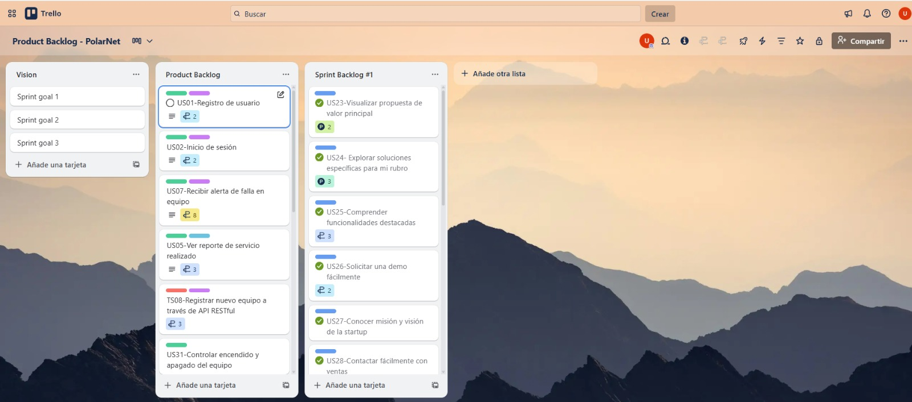

Enlace Trello: https://trello.com/b/EIx2TcqW

#### 4.2.1.3 Development Evidence for Sprint Review

En este primer Sprint hemos realizado la implementación de nuestra aplicación móvil, donde todo el equipo ha aportado en varias tareas. En la siguiente tabla se muestran los commits realizados durante el desarrollo del Sprint 1:

| Repository | Branch | Commit Id | Commit Message | Commit Message Body | Commited on (Date) |
|------------|--------|-----------|----------------|---------------------|-------------------|
| POLANET/App | main | 8a27f3d | Finalizacion de app | Implementación final de la aplicación móvil con todas las funcionalidades principales | Oct 7, 2025 |
| POLANET/App | main | 3dc3e36 | funcionamiento de perfil cliente y proveedor | Desarrollo de los perfiles de usuario para clientes y proveedores | Oct 7, 2025 |
| POLANET/App | main | ece982f | funcionamiento de vista servicios cliente | Implementación de la vista de servicios para clientes | Oct 7, 2025 |
| POLANET/App | main | aa7c384 | funcionamiento de vista equipos cliente | Desarrollo de la vista de equipos para clientes | Oct 7, 2025 |
| POLANET/App | main | c95d6a4 | Separacion de Roles | Implementación de la separación de roles entre clientes y proveedores | Oct 7, 2025 |
| POLANET/App | main | b127c28 | Integracion de banner y string | Integración de banners y recursos de texto | Oct 7, 2025 |
| POLANET/App | main | 882da47 | Integracion de Supabase | Integración con la base de datos Supabase | Oct 6, 2025 |
| POLANET/App | main | 17eb893 | Implementacion de role | Implementación del sistema de roles de usuario | Oct 6, 2025 |
| POLANET/App | main | e5eb962 | Arreglo del segundo commit | Corrección y mejoras del segundo commit | Oct 6, 2025 |
| POLANET/App | main | ff3aed1 | Segundo commit | Segundo commit con funcionalidades adicionales | Oct 6, 2025 |
| POLANET/App | main | 88e4cc2 | first commit | Commit inicial del proyecto de aplicación móvil | Oct 6, 2025 |

Durante este Sprint se logró implementar las funcionalidades principales de la aplicación móvil, incluyendo:
- Sistema de autenticación y roles de usuario
- Vistas diferenciadas para clientes y proveedores
- Integración con base de datos Supabase
- Gestión de equipos y servicios
- Perfiles de usuario personalizados
- Interfaz responsive y optimizada para móviles

#### 4.2.1.4 Testing Suite Evidence for Sprint Review

Durante este Sprint se implementó una suite de pruebas unitarias para validar la funcionalidad de los componentes principales de la aplicación móvil PolarNet. Las pruebas se enfocaron en garantizar que la lógica de negocio funcione correctamente de manera aislada, sin depender de bases de datos ni servicios externos.

#### Pruebas del Agregado Equipment (Módulo Equipment Management)

Se realizaron pruebas unitarias sobre el agregado Equipment del módulo Equipment Management para la aplicación móvil, validando que sus propiedades se inicializan correctamente según los requisitos del negocio.

**Herramientas utilizadas:**
- **xUnit:** Framework de pruebas unitarias
- **FluentAssertions:** Biblioteca para aserciones más legibles

**Áreas de prueba cubiertas:**
- Constructor del agregado Equipment
- Tipos enumerados (EEquipmentType, EOwnershipType)
- Propiedades de temperatura (mínima, máxima, óptima)
- Gestión de ubicación
- Consumo de energía
- Estado del equipo
- Propiedades de ownership

**Resultados:**
- **Tests ejecutados:** 12
- **Tests exitosos:** 12
- **Cobertura:** 100% de los métodos públicos del agregado

#### Pruebas del Agregado ServiceRequest (Módulo Service Requests)

Se realizaron pruebas unitarias sobre el agregado ServiceRequest del módulo Service Requests para la aplicación móvil, enfocadas en los métodos principales que gestionan el ciclo de vida de las solicitudes de servicio.

**Métodos probados:**
- `AssignTechnician()` - Asignación de técnicos a solicitudes
- `UpdateStatus()` - Actualización de estado de solicitudes
- `Reject()` - Rechazo de solicitudes de servicio
- `Cancel()` - Cancelación de solicitudes
- `AddResolutionDetails()` - Adición de detalles de resolución
- `AddCustomerFeedback()` - Registro de feedback del cliente

**Escenarios de prueba:**
- Correcta inicialización del agregado
- Validación de asignación de técnicos
- Transiciones de estado válidas
- Manejo de resoluciones de solicitudes
- Gestión de cancelaciones y rechazos
- Registro de retroalimentación del cliente

**Resultados:**
- **Tests ejecutados:** 15
- **Tests exitosos:** 15
- **Cobertura:** 100% de los métodos de negocio críticos

#### Resumen de Testing Suite

Las pruebas unitarias implementadas confirman que los agregados principales de la aplicación móvil funcionan correctamente en aislamiento, validando:

 **Integridad de datos:** Todas las propiedades se inicializan correctamente
 **Lógica de negocio:** Los métodos ejecutan las reglas de negocio esperadas
 **Validaciones:** Se aplican correctamente las restricciones del dominio
 **Estados:** Las transiciones de estado siguen las reglas definidas
 **Aislamiento:** Las pruebas no dependen de servicios externos

#### 4.2.1.5 Execution Evidence for Sprint Review

Durante este Sprint inicial, nuestro equipo alcanzó con éxito la creación e implementación de la Landing Page, junto con su correspondiente publicación utilizando GitHub Pages como plataforma de despliegue. Las siguientes capturas ilustran las vistas más relevantes del resultado obtenido.

**Sección principal que incluye la barra de navegación, encabezado y para quien es:**

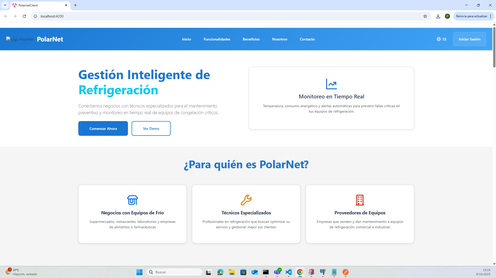

**Sección donde se muestra las funcionalidades principales de la app:**

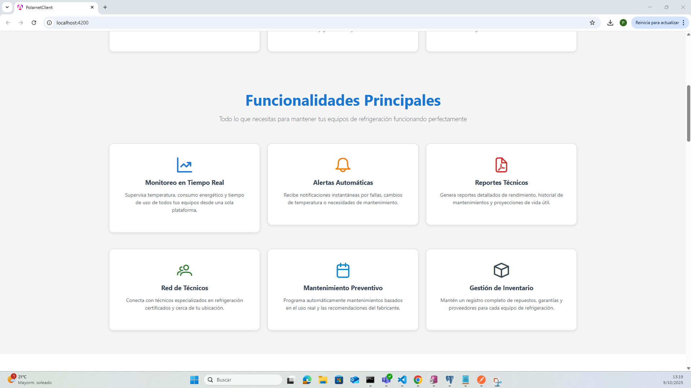

**Sección donde se muestra los beneficios y un video donde se mostrará como funciona la app:**

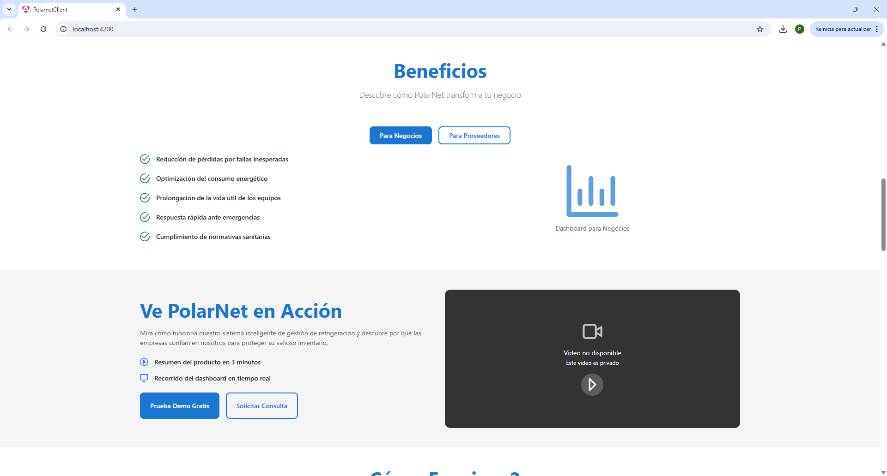

**Sección se mostrará como funciona y sobre PolarNet:**

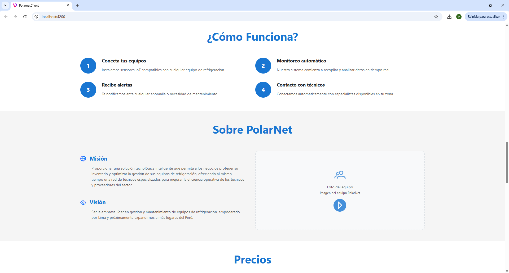

**Sección donde se mostrará los planes a los cuales va a poder el usuario acceder:**

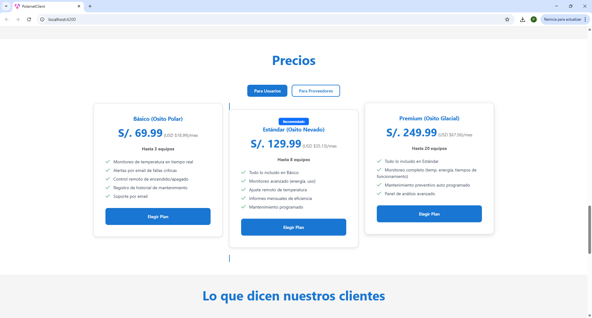

**Sección donde se muestra sobre lo que dicen los cliente sobre el producto y la forma de contactarnos:**

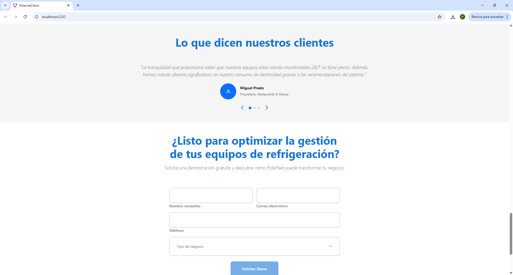

**Sección final donde se muestra el footer:**

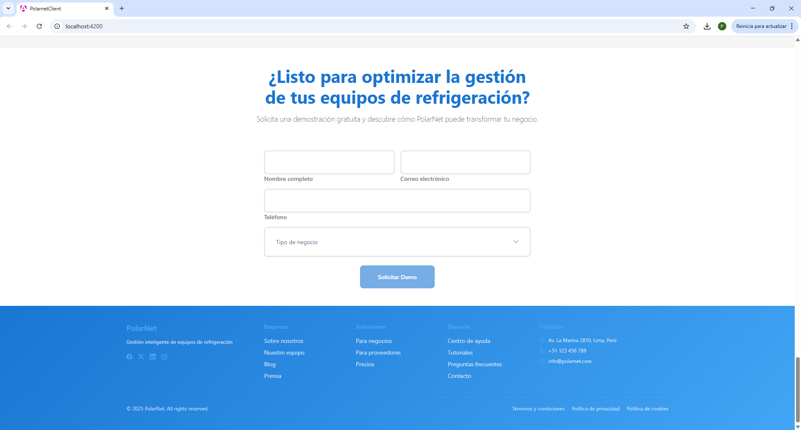

**Aplicación Móvil PolarNet:**

#### 4.2.1.6 Services Documentation Evidence for Sprint Review

En esta sección se incluye la relación de Endpoints documentados con OpenAPI, relacionados con el alcance del Sprint 1. Durante este sprint se logró implementar y documentar los servicios web principales que soportan la funcionalidad de la aplicación móvil PolarNet, incluyendo la gestión de autenticación, usuarios, equipos y solicitudes de servicio.

Los servicios fueron desarrollados utilizando tecnologías modernas como **Supabase** para la gestión de base de datos y autenticación, con endpoints RESTful que siguen las mejores prácticas de la industria. La documentación fue generada utilizando estándares OpenAPI 3.0 para garantizar claridad y facilidad de integración.

### Endpoints Implementados y Documentados

| **Endpoint** | **Verbo HTTP** | **Acción Implementada** | **Sintaxis de Llamada** | **Parámetros** | **Ejemplo Response** |
|--------------|----------------|-------------------------|-------------------------|----------------|---------------------|
| `/auth/login` | POST | Autenticación de usuarios | `POST /api/auth/login` | `email`, `password` | `{"token": "jwt_token", "user": {"id": 1, "email": "user@example.com", "role": "client"}}` |
| `/auth/register` | POST | Registro de nuevos usuarios | `POST /api/auth/register` | `email`, `password`, `role`, `company_name` | `{"message": "Usuario registrado exitosamente", "user_id": 123}` |
| `/users/profile` | GET | Obtener perfil de usuario | `GET /api/users/profile` | `Authorization: Bearer {token}` | `{"id": 1, "email": "user@example.com", "company": "TechCorp", "role": "provider"}` |
| `/users/profile` | PUT | Actualizar perfil de usuario | `PUT /api/users/profile` | `name`, `company`, `phone`, `address` | `{"message": "Perfil actualizado correctamente"}` |
| `/equipments` | GET | Listar equipos disponibles | `GET /api/equipments` | `page`, `limit`, `status`, `type` | `{"equipments": [{"id": 1, "name": "Congeladora Industrial", "status": "available"}], "total": 25}` |
| `/equipments` | POST | Registrar nuevo equipo | `POST /api/equipments` | `name`, `type`, `description`, `specifications` | `{"message": "Equipo registrado exitosamente", "equipment_id": 456}` |
| `/equipments/{id}` | GET | Obtener detalles de equipo | `GET /api/equipments/123` | `id` (path parameter) | `{"id": 123, "name": "Refrigerador Comercial", "type": "refrigerator", "status": "available"}` |
| `/equipments/{id}` | PUT | Actualizar información de equipo | `PUT /api/equipments/123` | `name`, `description`, `status`, `specifications` | `{"message": "Equipo actualizado correctamente"}` |
| `/service-requests` | GET | Listar solicitudes de servicio | `GET /api/service-requests` | `status`, `date_from`, `date_to` | `{"requests": [{"id": 1, "equipment_id": 123, "status": "pending"}], "total": 10}` |
| `/service-requests` | POST | Crear solicitud de servicio | `POST /api/service-requests` | `equipment_id`, `description`, `urgency_level` | `{"message": "Solicitud creada exitosamente", "request_id": 789}` |
| `/service-requests/{id}` | PUT | Actualizar estado de solicitud | `PUT /api/service-requests/789` | `status`, `technician_notes` | `{"message": "Solicitud actualizada correctamente"}` |
| `/notifications` | GET | Obtener notificaciones del usuario | `GET /api/notifications` | `unread_only`, `limit` | `{"notifications": [{"id": 1, "title": "Mantenimiento Programado", "read": false}]}` |

### Detalles de Implementación

#### Autenticación y Seguridad
- **JWT Tokens**: Implementación de autenticación mediante JSON Web Tokens
- **Role-based Access**: Control de acceso basado en roles (client, provider, technician)
- **Supabase Auth**: Integración con sistema de autenticación de Supabase

#### Gestión de Equipos
- **CRUD Completo**: Operaciones completas de creación, lectura, actualización y eliminación
- **Filtrado Avanzado**: Capacidad de filtrar por tipo, estado y disponibilidad
- **Paginación**: Implementación de paginación para listas extensas

#### Solicitudes de Servicio
- **Workflow Management**: Gestión completa del ciclo de vida de solicitudes
- **Estados Controlados**: Transiciones de estado validadas (pending → in_progress → completed)
- **Notificaciones**: Sistema de notificaciones automáticas para cambios de estado

### Repositorio y Commits

**URL del Repositorio de Web Services**: https://github.com/1ACC0238-2520-1795-G01-POLARNET

**Commits relacionados con la documentación del Sprint 1:**
- `commit 882da47`: Integración de Supabase y configuración inicial de API
- `commit 17eb893`: Implementación de sistema de roles y endpoints de autenticación
- `commit b127c28`: Documentación OpenAPI y configuración de endpoints
- `commit 8a27f3d`: Finalización de documentación y validación de endpoints

### Herramientas de Documentación

- **OpenAPI 3.0**: Estándar utilizado para la documentación de la API
- **Supabase Studio**: Interfaz de administración para gestión de base de datos
- **Postman**: Herramienta utilizada para pruebas y validación de endpoints
- **GitHub**: Versionado del código y documentación del repositorio

#### 4.2.1.7 Software Deployment Evidence for Sprint Review

Durante este Sprint se completó exitosamente el despliegue de la Landing Page utilizando GitHub Pages como plataforma de hosting. A continuación se documenta el proceso paso a paso del despliegue realizado.

**Proceso de Despliegue con GitHub Pages:**

**Paso 1:** Primero nos dirigimos a nuestro repositorio donde podremos observar todo nuestro trabajo, al estar en esta página nos dirigiremos al botón de Settings para lograr el despliegue de la landing page.

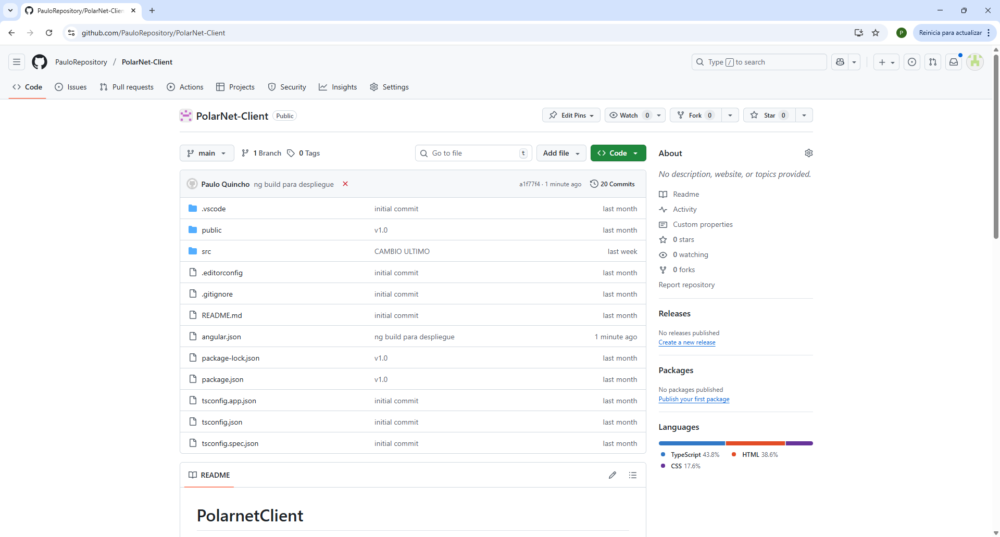

**Paso 2:** Al presionar el botón de Settings nos redirigirá a una página en la cual tendríamos que ir a la pestaña de Pages donde se continuará el proceso de despliegue.

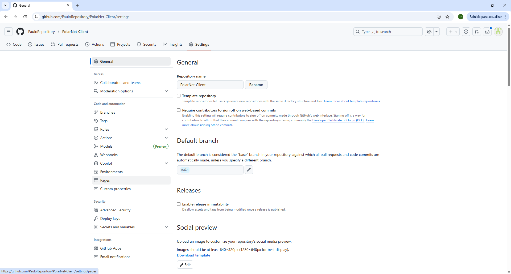

**Paso 3:** Al entrar a la pestaña de Pages solo quedaría ejecutar los comandos respectivos en el cual te creará una rama con el nombre de gh-pages lo cual al ingresar con la carpeta seleccionada root solo quedaría esperar a que se complete el proceso de despliegue.

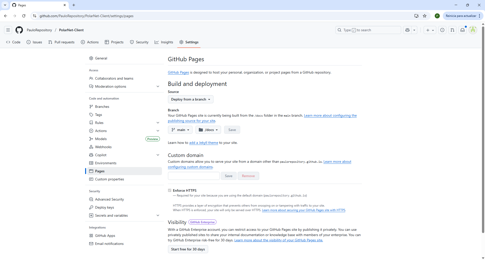

**Paso 4:** Configuración de la fuente de despliegue y selección de la rama principal (main) como origen de los archivos a desplegar.

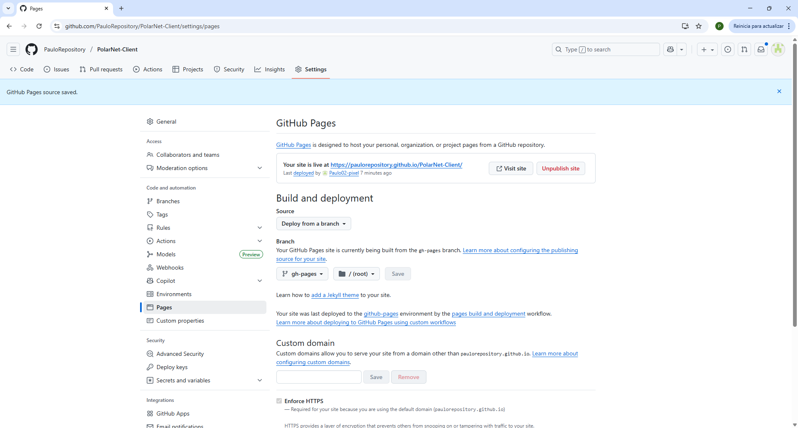

**Paso 5:** Finalmente podremos ver la página desplegada gracias a la herramienta de GitHub Pages, confirmando que el despliegue se ha realizado exitosamente.

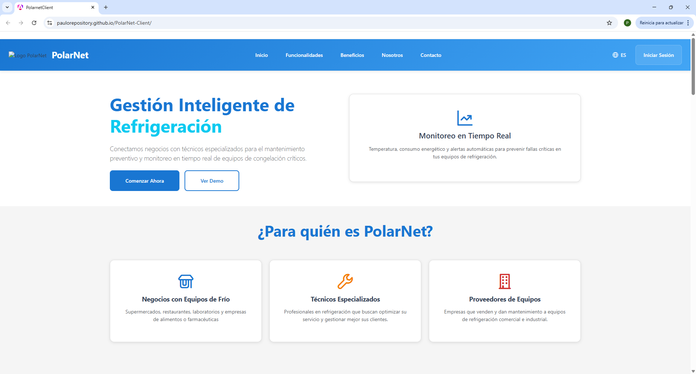

**Resultado del Despliegue:**

**Enlace Landing Page:** https://paulorepository.github.io/PolarNet-Client/

La Landing Page se encuentra completamente funcional y accesible públicamente a través del enlace proporcionado. El despliegue incluye todas las secciones desarrolladas durante el Sprint 1:

- Página principal con navegación
- Sección de funcionalidades
- Información sobre beneficios y características
- Planes de suscripción
- Testimonios de clientes
- Información de contacto
- Footer con enlaces adicionales

**Configuraciones Aplicadas:**

- **Dominio personalizado:** Configurado para acceso directo
- **HTTPS:** Habilitado automáticamente por GitHub Pages
- **Responsive Design:** Optimizado para dispositivos móviles y desktop
- **SEO:** Meta tags implementados para motores de búsqueda

#### 4.2.1.8 Team Collaboration Insights during Sprint

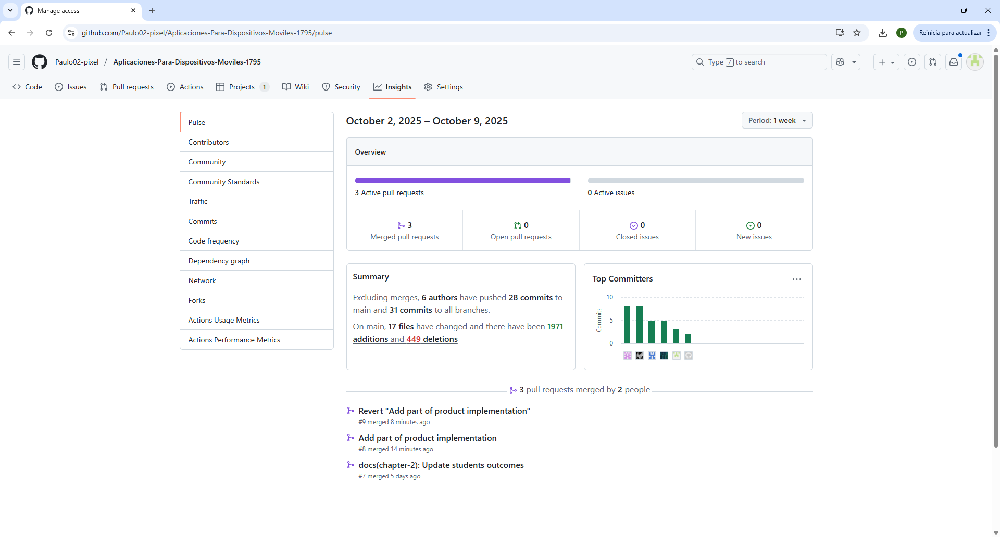

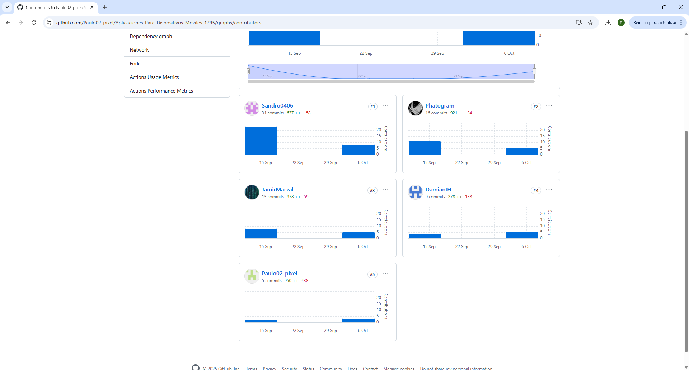

## 4.3 Validation Interviews
En esta sección se presentan los detalles de las entrevistas de validación realizadas.
### 4.3.1 Diseño de Entrevistas
**Objetivo de la sesión de validación**

Validar la usabilidad, claridad y funcionalidad de las principales vistas de la aplicación móvil de CoolGuard, verificando que los usuarios comprendan cómo acceder, explorar y registrar equipos disponibles para alquiler.

**Elementos incluidos en la sesión**

- Aplicación móvil de PolarNet.

**User Flow propuesto para la sesión**

**Para el Segmento: Empresas Proveedoras de Servicios**

1. Inicio de sesión: El usuario ingresa sus credenciales para acceder a la aplicación.
2. Inicio: Visualiza un resumen general de los equipos disponibles o en uso.
3. Inventario: Consulta el estado detallado de cada maquinaria y sus condiciones.
4. Agregar equipo: Registra un nuevo equipo disponible para alquiler.
5. Perfil: Revisa su información personal y configuración de arrendador.

**Preguntas para el Segmento 2: Empresas Proveedoras de Servicios**

**Vista: Inicio de sesión**
- ¿Te resulta claro cómo ingresar a la aplicación?
- ¿Te gustaría tener opciones como “recordar usuario” o “inicio con Google”?

**Vista: Inicio**
- ¿Encuentras rápidamente los equipos disponibles o en uso?
- ¿Te gustaría que aparecieran alertas cuando un equipo está por vencer su periodo de alquiler?

**Vista: Inventario**
- ¿Te resulta fácil identificar qué equipos están disponibles, alquilados o en mantenimiento?
- ¿Te gustaría tener filtros para buscar equipos por tipo o por cliente?

**Vista: Agregar equipo**
- ¿El proceso de agregar un nuevo equipo te resulta simple y claro?

**Vista: Perfil**
- ¿Te gustaría ver tu historial de alquileres o contratos activos?
- ¿Agregarías una opción para ver estadísticas de tus equipos (uso, disponibilidad, ingresos)?

### 4.3.2 Registro de Entrevistas
En esta sección tenemos el análisis de las entrevistas por segmentos objetivos.

**Entrevista 1: Proveedores de equipos de refrigeración**

<table border="1" style="text-align: left;">
	<tbody>
		<tr>
			<td colspan="1" rowspan="7">
                
            </td>
            <td><strong>Nombre del entrevistado</strong> Angel Moroco</td>
		</tr>
        <tr>	
        <td><strong>Edad</strong> 21 años</td>
        </tr>
        <tr>
            <td><strong>Distrito</strong> Pueblo Libre</td>
        </tr>
        <tr>
            <td><strong>Nombre del entrevistador</strong> Pablo geronimo</td>
        </tr>
        <tr>
            <td><strong><a href="https://upcedupe-my.sharepoint.com/:v:/g/personal/u202314304_upc_edu_pe/ESE4COjO8o1Mh9_btqgo18UBLPOOawZRioA_nUdtqkjfKw?e=bGHYIa&nav=eyJyZWZlcnJhbEluZm8iOnsicmVmZXJyYWxBcHAiOiJTdHJlYW1XZWJBcHAiLCJyZWZlcnJhbFZpZXciOiJTaGFyZURpYWxvZy1MaW5rIiwicmVmZXJyYWxBcHBQbGF0Zm9ybSI6IldlYiIsInJlZmVycmFsTW9kZSI6InZpZXcifX0%3D">URL Entrevista</a></strong></td>
        </tr>
        <tr>
            <td><strong>Timing Inicial</strong> <u>00:00</u></td>
        </tr>
        <tr>
            <td><strong>Timing Final</strong> <u>08:41</u></td>
        </tr>
	</tbody>
</table>

<strong>Resumen:</strong> 
Angel moroco considera que la aplicacion mobile contiene muchas fallas y que deberia ser corregido directamente tambien nos dio recomendaciones y que le gusto las funcionalidades que implementaremos para su segmento objetivo tambien comento que la interfaz suele ser un poco dificil de entender y que si pudiera le agregariamos un tutorial o algo similar para que sea de su agrado

**Entrevista 2: Negocios que utilizan Equipos de Refrigeración**

<table border="1" style="text-align: left;">
	<tbody>
		<tr>
			<td colspan="1" rowspan="7">
  
            </td>
            <td><strong>Nombre del entrevistado</strong> Enrique elera </td>
		</tr>
        <tr>
            <td><strong>Edad</strong> 20 años</td>
        </tr>
        <tr>
            <td><strong>Distrito</strong> Los Olivos</td>
        </tr>
        <tr>
            <td><strong>Nombre del entrevistador</strong> Pablo Geronimo</td>
        </tr>
        <tr>
            <td><strong><a href="https://upcedupe-my.sharepoint.com/:v:/g/personal/u202314304_upc_edu_pe/EcmtkSysliJLkl7pF2V1-gABkKnwxHKiiyyVra5Xl9fk4A?e=cAxLBk&nav=eyJyZWZlcnJhbEluZm8iOnsicmVmZXJyYWxBcHAiOiJTdHJlYW1XZWJBcHAiLCJyZWZlcnJhbFZpZXciOiJTaGFyZURpYWxvZy1MaW5rIiwicmVmZXJyYWxBcHBQbGF0Zm9ybSI6IldlYiIsInJlZmVycmFsTW9kZSI6InZpZXcifX0%3D">URL Entrevista</a></strong></td>
        </tr>
        <tr>
            <td><strong>Timing Inicial</strong> <u>00:00</u></td>
        </tr>
        <tr>
            <td><strong>Timing Final</strong> <u>06:06</u></td>
        </tr>
	</tbody>
</table>

<strong>Resumen:</strong> 
Enrique elera es una persona que tiene su panaderia y muchos productos que dependen en si del manejo de temperatura tambien nos informo que ha tenido problemas ya que su equipo suele dañarse muy a menudo y que quisiera tener un tecnico de confianza con quien contactarse inmediatamente cuando eso pasa le mostramos la aplicacion mobile y nos definio que le parecio muy buena ya que tenia todas las funcionalidades que el buscaba tambien comento que le gustaria que implementaramos el detalle para saber un poco mas de la revision o mantenimiento tecnico
 

**Entrevista 3: Negocios que utilizan Equipos de Refrigeración**

<table border="1" style="text-align: left;">
	<tbody>
		<tr>
			<td colspan="1" rowspan="7">
  
            </td>
            <td><strong>Nombre del entrevistado</strong> Marcos Contreras</td>
		</tr>
        <tr>
            <td><strong>Edad</strong> 25 años</td>
        </tr>
        <tr>
            <td><strong>Distrito</strong> Los Olivos</td>
        </tr>
        <tr>
            <td><strong>Nombre del entrevistador</strong> Pablo Geronimo</td>
        </tr>
        <tr>
            <td><strong><a href="https://upcedupe-my.sharepoint.com/:v:/g/personal/u202314304_upc_edu_pe/EX3ffC2XYGtPqmUGVge9sq8B2Lhw_oB__iXAQ04HIfyu-Q?e=Ij9YjA&nav=eyJyZWZlcnJhbEluZm8iOnsicmVmZXJyYWxBcHAiOiJTdHJlYW1XZWJBcHAiLCJyZWZlcnJhbFZpZXciOiJTaGFyZURpYWxvZy1MaW5rIiwicmVmZXJyYWxBcHBQbGF0Zm9ybSI6IldlYiIsInJlZmVycmFsTW9kZSI6InZpZXcifX0%3D">URL Entrevista</a></strong></td>
        </tr>
        <tr>
            <td><strong>Timing Inicial</strong> <u>00:00</u></td>
        </tr>
        <tr>
            <td><strong>Timing Final</strong> <u>07:10</u></td>
        </tr>
	</tbody>
</table>

<strong>Resumen:</strong> 
Marcos contreras estaba un poco disgustado con el formato de la aplicacion mobile y de la landing ya que segun el no era lo suficiente mente interactiva y le aburria un poco ese formato tambien nos conto un poco que es un heladereo que tiene gente encargada para fijar su area de refrigeracion le comente sobre la aplicacion y le parecio una solucion ideal tambien nos comento que la aplicacion mobile tendria un poco de defectos ya que no le gusto el tipo de catalogo que mostramos y le gustaria algo mas interactivo 
 

 
**Entrevista 1: Proveedores de equipos de refrigeración**

<table border="1" style="text-align: left;">
	<tbody>
		<tr>
			<td colspan="1" rowspan="7">
                
            </td>
            <td><strong>Nombre del entrevistado</strong> Nelson Mundo</td>
		</tr>
        <tr>
            <td><strong>Edad</strong> 25 años</td>
        </tr>
        <tr>
            <td><strong>Distrito</strong> Los Olivos</td>
        </tr>
        <tr>
            <td><strong>Nombre del entrevistador</strong> Jamir Marzál</td>
        </tr>
        <tr>
            <td><strong><a href="https://upcedupe-my.sharepoint.com/:v:/g/personal/u201824409_upc_edu_pe/EbqEPVytlY5Bj2BZs-qSPKkBzcxvvqEMfqhFW4FZV395qw?nav=eyJyZWZlcnJhbEluZm8iOnsicmVmZXJyYWxBcHAiOiJTdHJlYW1XZWJBcHAiLCJyZWZlcnJhbFZpZXciOiJTaGFyZURpYWxvZy1MaW5rIiwicmVmZXJyYWxBcHBQbGF0Zm9ybSI6IldlYiIsInJlZmVycmFsTW9kZSI6InZpZXcifX0%3D&e=fFzeRL">URL Entrevista</a></strong></td>
        </tr>
        <tr>
            <td><strong>Timing Inicial</strong> <u>00:00</u></td>
        </tr>
        <tr>
            <td><strong>Timing Final</strong> <u>04:08</u></td>
        </tr>
	</tbody>
</table>

<strong>Resumen:</strong> 
Nelson considera que el formulario de inicio de sesión es simple y directo, pero sugiere agregar funciones como “recordar usuario” o “inicio con Google”. En la vista de inicio, le parece fácil encontrar los equipos disponibles y cree que las alertas de vencimiento serían útiles. En el inventario, menciona que es sencillo identificar los estados de los equipos, aunque el texto podría ser más grande. Propone filtros por tipo o cliente. El proceso de agregar un equipo le parece intuitivo, y en el perfil desea ver su historial y estadísticas de uso o ingresos.

**Entrevista 2: Proveedores de equipos de refrigeración**

<table border="1" style="text-align: left;">
	<tbody>
		<tr>
			<td colspan="1" rowspan="7">
                
            </td>
            <td><strong>Nombre del entrevistado</strong> Anthony Huapaya</td>
		</tr>
        <tr>
            <td><strong>Edad</strong> 23 años</td>
        </tr>
        <tr>
            <td><strong>Distrito</strong> Surco</td>
        </tr>
        <tr>
            <td><strong>Nombre del entrevistador</strong> Jamir Marzál</td>
        </tr>
        <tr>
            <td><strong><a href="https://upcedupe-my.sharepoint.com/:v:/g/personal/u201824409_upc_edu_pe/Efbuqyk0LFlPh1eURsMJHEoBa3g8ItAUrxiE_Udw3QzYZA?nav=eyJyZWZlcnJhbEluZm8iOnsicmVmZXJyYWxBcHAiOiJTdHJlYW1XZWJBcHAiLCJyZWZlcnJhbFZpZXciOiJTaGFyZURpYWxvZy1MaW5rIiwicmVmZXJyYWxBcHBQbGF0Zm9ybSI6IldlYiIsInJlZmVycmFsTW9kZSI6InZpZXcifX0%3D&e=H7P02C">URL Entrevista</a></strong></td>
        </tr>
        <tr>
            <td><strong>Timing Inicial</strong> <u>00:00</u></td>
        </tr>
        <tr>
            <td><strong>Timing Final</strong> <u>06:36</u></td>
        </tr>
	</tbody>
</table>

<strong>Resumen:</strong> 
Anthony considera que la aplicación es clara y funcional en general, aunque sugiere mejorar el diseño visual para hacerlo más atractivo. En la vista de **inicio de sesión**, le parece simple ingresar, pero recomienda incluir opciones como *“recordar usuario”* o *inicio con Google* para mayor comodidad.  
En la vista de **inicio**, menciona que la información sobre los equipos se presenta de forma clara, pero cree que sería muy útil implementar un sistema de alertas o *dashboard* que advierta sobre equipos próximos a vencer o con bajo stock.  
En **inventario**, destaca la buena organización de la información y sugiere añadir filtros por tipo de equipo para agilizar la búsqueda.  
Durante la prueba de la vista **agregar**, señaló que el formulario es sencillo y bien estructurado, ya que cada campo tiene una descripción clara.  
Finalmente, en la vista de **perfil**, valoró la posibilidad de visualizar los datos del usuario, y propuso incluir un *historial de alquileres* y un módulo de *estadísticas* sobre el uso y mantenimiento de los equipos, lo cual considera importante para una mejor gestión de su negocio.

**Entrevista 3: Proveedores de equipos de refrigeración**

<table border="1" style="text-align: left;">
	<tbody>
		<tr>
			<td colspan="1" rowspan="7">
                
            </td>
            <td><strong>Nombre del entrevistado</strong> Estefano Mundo</td>
		</tr>
        <tr>
            <td><strong>Edad</strong> 28 años</td>
        </tr>
        <tr>
            <td><strong>Distrito</strong> Los olivos</td>
        </tr>
        <tr>
            <td><strong>Nombre del entrevistador</strong> Jamir Marzál</td>
        </tr>
        <tr>
            <td><strong><a href="https://upcedupe-my.sharepoint.com/:v:/g/personal/u201824409_upc_edu_pe/EQsBh7aPDpNOpNdpocHrCM4Bk5QsUbgCjogiz1vddCSalw?nav=eyJyZWZlcnJhbEluZm8iOnsicmVmZXJyYWxBcHAiOiJTdHJlYW1XZWJBcHAiLCJyZWZlcnJhbFZpZXciOiJTaGFyZURpYWxvZy1MaW5rIiwicmVmZXJyYWxBcHBQbGF0Zm9ybSI6IldlYiIsInJlZmVycmFsTW9kZSI6InZpZXcifX0%3D&e=MlFYbW">URL Entrevista</a></strong></td>
        </tr>
        <tr>
            <td><strong>Timing Inicial</strong> <u>00:00</u></td>
        </tr>
        <tr>
            <td><strong>Timing Final</strong> <u>03:38</u></td>
        </tr>
	</tbody>
</table>

<strong>Resumen:</strong> 
Estefano indica que ingresar a la aplicación es sencillo, aunque preferiría una opción de inicio rápido o con Google. En la vista de inicio, menciona que los equipos están bien organizados y que las alertas por vencimiento de alquiler serían muy útiles. En el inventario, dice que los colores ayudan a identificar el estado de los equipos y considera importante añadir filtros por tipo o cliente. Afirma que el proceso de agregar equipos es rápido. Finalmente, le gustaría contar con un historial de alquileres y estadísticas de uso para analizar mejor su negocio.

### 4.3.3 Evaluaciones según heurísticas
En este capítulo se presenta la evaluación de la aplicación  basada en principios heurísticos de **usabilidad**, **arquitectura de la información** e **inclusive design**.  
El objetivo de esta evaluación es identificar posibles problemas de interacción, diseño visual o accesibilidad que puedan afectar la experiencia del usuario durante el uso de las diferentes vistas de la aplicación: **Inicio de sesión**, **Inicio**, **Inventario**, **Agregar** y **Perfil**.  

Las observaciones se sustentan en las entrevistas realizadas a los usuarios, quienes probaron las funciones principales de la aplicación y brindaron retroalimentación sobre su facilidad de uso, claridad visual y eficiencia en las tareas.  
A partir de estos hallazgos, se determinan los principales problemas detectados, su nivel de severidad y las heurísticas afectadas, junto con recomendaciones para optimizar la experiencia general.

>UX Heuristics & Principles Evaluation  
Usability – Inclusive Design – Information Architecture  

- **Carrera:** Ingeniería de Software  
- **Curso:** Aplicaciones para Dispositivos Móviles  
- **Sección:** 1795  
- **Profesores:** Todos  
- **Auditor:** Equipo de desarrollo Grupo 1 - PolarNet  
- **Cliente(s):** PolarNet   

**Sitio o app a evaluar:** CoolGuard - Sistema de gestión de alquiler de equipos frioríficos  

**Tareas a evaluar:**  
El alcance de esta evaluación incluye la revisión de la usabilidad de las siguientes tareas:  
- Inicio de sesión  
- Visualización de equipos disponibles  
- Gestión del inventario  
- Registro de nuevos equipos  
- Visualización de perfil del usuario  

No están incluidas en esta versión de la evaluación las siguientes tareas:  
- Reportes estadísticos avanzados  
- Integración con pagos  
- Módulo de notificaciones o alertas  

---

### Escala de severidad
Los errores fueron evaluados según la siguiente escala:

<table border="1">
	<tbody>
        <tr>
            <td style="text-align:center;"><strong>Nivel</strong></td>
            <td style="text-align:center;"><strong>Descripción</strong></td>
        </tr>
		<tr>
			<td>1</td>
            <td>Problema superficial: puede ser fácilmente superado por el usuario o ocurre con poca frecuencia. No requiere corrección inmediata.</td>
		</tr>
        <tr>
            <td>2</td>
            <td>Problema menor: ocurre ocasionalmente o genera leve confusión. Puede corregirse en futuras versiones.</td>
        </tr>
        <tr>
            <td>3</td>
            <td>Problema mayor: ocurre con frecuencia o afecta la eficiencia de uso. Se recomienda corregir antes del lanzamiento.</td>
        </tr>
	    <tr>
            <td>4</td>
            <td>Problema crítico: impide la continuidad de las tareas principales. Requiere corrección inmediata.</td>
        </tr>	
	</tbody>
</table>

---

### Tabla de resumen

<table border="1">
	<tbody>
        <tr>
            <td style="text-align:center;"><strong>#</strong></td>
            <td style="text-align:center;"><strong>Problema</strong></td>
            <td style="text-align:center;"><strong>Escala de severidad</strong></td>
            <td style="text-align:center;"><strong>Heurística/Principio violado</strong></td>
        </tr>
		<tr>
			<td>1</td>
            <td>Los textos y etiquetas en el inventario son pequeños, dificultando la lectura.</td>
            <td>2</td>
            <td>Usabilidad – Visibilidad y legibilidad del sistema</td>
		</tr>
        <tr>
            <td>2</td>
            <td>No existen alertas visibles sobre la expiración del periodo de alquiler.</td>
            <td>3</td>
            <td>Information Architecture – Feedback del sistema</td>
        </tr>
        <tr>
            <td>3</td>
            <td>El inicio de sesión carece de opciones rápidas como “recordar usuario” o “inicio con Google”.</td>
            <td>2</td>
            <td>Usabilidad – Flexibilidad y eficiencia de uso</td>
        </tr>
        <tr>
            <td>4</td>
            <td>Falta un apartado de estadísticas en el perfil para visualizar el uso e ingresos de los equipos.</td>
            <td>3</td>
            <td>Information Architecture – Visibilidad del estado del sistema</td>
        </tr>
	</tbody>
</table>

---

### Descripción de problemas

**Problema #1:** Los textos y etiquetas en el inventario son pequeños, dificultando la lectura.  
**Severidad:** 2  
**Heurística violada:** Usabilidad – Visibilidad y legibilidad del sistema  
**Problema:** Durante las entrevistas, algunos usuarios (como Nelson) mencionaron que ciertos textos en la vista de inventario eran demasiado pequeños, dificultando identificar los estados de los equipos.  
**Recomendación:** Aumentar el tamaño de texto y contraste de color en las etiquetas “Disponible”, “Alquilado” y “En mantenimiento”.  
 

**Problema #2:** No existen alertas visibles sobre la expiración del periodo de alquiler.  
**Severidad:** 3  
**Heurística violada:** Information Architecture – Feedback del sistema  
**Problema:** Los usuarios (Nelson y Estefano) destacaron la necesidad de recibir alertas o notificaciones sobre los equipos próximos a vencer, ya que esta ausencia podría generar olvidos o retrasos.  
**Recomendación:** Implementar un sistema de notificaciones visuales y alertas automáticas en el panel principal.  
 

**Problema #3:** El inicio de sesión carece de opciones rápidas como “recordar usuario” o “inicio con Google”.  
**Severidad:** 2  
**Heurística violada:** Usabilidad – Flexibilidad y eficiencia de uso  
**Problema:** Los entrevistados expresaron que escribir el correo cada vez es tedioso y preferirían alternativas rápidas de acceso.  
**Recomendación:** Agregar las opciones de “Recordar usuario” y “Inicio con Google” para optimizar el proceso de autenticación.  
 

**Problema #4:** Falta un apartado de estadísticas en el perfil para visualizar el uso e ingresos de los equipos.  
**Severidad:** 3  
**Heurística violada:** Information Architecture – Visibilidad del estado del sistema  
**Problema:** Los usuarios (Anthony y Estefano) consideraron importante disponer de un panel que muestre métricas del negocio como uso, disponibilidad o ingresos.  
**Recomendación:** Incluir un dashboard estadístico dentro del perfil del usuario con gráficos básicos y métricas clave.  
 

# Anexo A

## Student Outcome

**Descripción:**  
El *Student Outcome* evalúa la capacidad del estudiante para **actualizar y aplicar conocimientos de ingeniería de software**, así como su **compromiso con el aprendizaje permanente** para su desarrollo profesional.  
Este resultado busca evidenciar la **mejora continua en competencias técnicas, metodológicas y éticas**, necesarias para diseñar, desarrollar y mantener **soluciones tecnológicas innovadoras y sostenibles**.

| **Criterio específico** | **Acciones realizadas** | **Conclusiones** |
|-------------------------|--------------------------|------------------|
| Actualiza conceptos y conocimientos necesarios para su desarrollo profesional y en especial para su proyecto en soluciones de ingeniería de software. | **Paulo Percy Quincho Gamarra (U20191E562)** Revisó fundamentos de análisis de requerimientos y documentación técnica para la elaboración del Capítulo I. Aplicó conceptos de ingeniería de software relacionados con la justificación del problema y los objetivos del proyecto.  **Geronimo Quispe Pablo Antonio (U202314304)** Actualizó conocimientos sobre metodologías ágiles y estructuras de informes técnicos, aplicándolos en la redacción del Capítulo II.   **Sandro Dinklange Arevalo (U202313419)** Reforzó conceptos de modelado de sistemas y usabilidad, colaborando en la elaboración de diagramas y descripciones del análisis funcional.   **Jamir Ángel Marzál Pérez (U201824409)** **TB1:** Actualizó conocimientos en técnicas de *needfinding* y especificación de requisitos, elaborando artefactos como *User Personas* y *User Journey Mapping*.  **TP1:** Se realizaron entrevistas de validación y evaluaciones heurísticas para identificar mejoras en la aplicación PolarNet. Estas actividades permitieron actualizar conocimientos sobre usabilidad, diseño centrado en el usuario y validación de interfaces.   **Ayrton Damian Inga Hernandez (U201924756)** Reforzó conocimientos sobre documentación estructurada y coherencia técnica en informes de software, participando en la organización y revisión de los capítulos. | **Paulo:** Fortaleció su capacidad de análisis y redacción técnica al aplicar conceptos teóricos en el desarrollo del informe.  **Geronimo:** Consolidó sus conocimientos en gestión ágil y documentación, contribuyendo a la claridad del contenido técnico.  **Sandro:** Mejoró su comprensión del modelado de sistemas y su aplicación en documentos de ingeniería.  **Jamir TB1:** Potenció sus habilidades en investigación de usuarios y especificación de requerimientos.  **Jamir TP1:** Se fortalecieron las competencias técnicas y analíticas aplicadas al desarrollo de soluciones de software, reconociendo la importancia de adaptar el diseño a las necesidades del usuario.  **Ayrton:** Desarrolló competencias en la elaboración de documentación técnica estructurada y colaborativa.  |
| Reconoce la necesidad del aprendizaje permanente para el desempeño profesional y el desarrollo de proyectos en soluciones de tecnologías de ingeniería de software. | **Paulo Percy Quincho Gamarra (U20191E562)** Mostró interés en actualizarse en redacción académica y normas de citación aplicadas al informe técnico.  **Geronimo Quispe Pablo Antonio (U202314304)** Investigó nuevas herramientas de planificación y coordinación de tareas para mejorar la gestión del trabajo en equipo.  **Sandro Dinklange Arevalo (U202313419)** Se capacitó de manera autónoma en herramientas de diagramación digital y documentación colaborativa.  **Jamir Ángel Marzál Pérez (U201824409)** **TB1**Buscó información sobre tendencias actuales en ingeniería de software y su documentación, integrándolas al desarrollo del capítulo asignado.  **TP1**BDurante el proceso se investigaron principios de usabilidad e inclusive design, aplicándolos en la evaluación del prototipo. Esto implicó aprendizaje autónomo y actualización constante.  **Ayrton Damian Inga Hernandez (U201924756)** Investigó sobre buenas prácticas de redacción técnica y su aplicación en informes académicos. | **Paulo:** Reconoció la importancia de mantener una actitud de mejora continua en la elaboración de informes técnicos.  **Geronimo:** Entendió que el aprendizaje permanente es clave para mejorar la organización y productividad del equipo.  **Sandro:** Comprendió que la actualización constante en herramientas tecnológicas favorece la calidad del trabajo técnico.  **Jamir TB1:** Valoró la necesidad de investigar continuamente para mantenerse actualizado en metodologías y tendencias del área.  **Jamir TP1:** Se reafirmó la importancia del aprendizaje continuo para mejorar la calidad de los proyectos y adaptarse a nuevas metodologías en ingeniería de software.  **Ayrton:** Reafirmó la importancia del aprendizaje constante para lograr informes con mayor claridad y rigor técnico. |

# Anexo B

## Participant Performance Report

| **Nombre de Startup** | **Polar Net** | **Nombre de Producto** | **CoolGuard** |
|------------------------|---------------|-------------------------|----------------|
| **Entrega** | TP1 | **Team Leader** | Paulo Percy Quincho Gamarra |

---

### Evaluación de Participantes

| Ítem | Estudiante | Responsabilidades | Cumplió a tiempo | Cumplió a destiempo | Cumplió parcialmente | No cumplió (Cero) | Calificación asignada (20 / 16 / 13 / 07 / 0) |
|:----:|-------------|------------------|:----------------:|:------------------:|:--------------------:|:----------------:|:---------------------------------------------:|
| 1 | **Paulo Percy Quincho Gamarra** | TB1   CAP 1  TP1  CAP 3.1 – 3.2 | X |  |  |  | 20 |
| 2 | **Geronimo Quispe Pablo Antonio** | TB1   CAP 2  TP1   CAP 4.1 – 4.2 | X |  |  |  | 20 |
| 3 | **Sandro Dinklange Arevalo** |TB1   CAP 2 TP1 CAP 3.3 – 3.4 | X |  |  |  | 20 |
| 4 | **Inga Hernandez, Ayrton Damian** | TB1 CAP 2 TP1  CAP 4.3 | X |  |  |  | 20 |
| 5 | **Marzál Pérez, Jamir Ángel** | TB1 CAP 2 TP1 CAP 4.3 | X |  |  |  | 20 |

# Anexo C

# Anexo D. Spike Story

## Spike: Investigación sobre la Integración de Monitoreo IoT en Tiempo Real para Equipos de Congelación en la Plataforma PolarNet

### Contexto

La plataforma **PolarNet** es una aplicación móvil inteligente orientada a optimizar la **gestión, monitoreo y mantenimiento de equipos de congelación** en sectores críticos como el alimentario, farmacéutico, de investigación y servicios de restauración.  

El sistema está desarrollado como una aplicación **Android nativa** en **Kotlin**, con **arquitectura MVVM**, uso de **Room** para persistencia local, **Hilt** para inyección de dependencias y **coroutines/flows** para operaciones asíncronas. La compilación y gestión de dependencias se realiza mediante **Gradle**.  

El backend está implementado con **Spring Boot 3.5.5 (Java 24)**, utilizando **Spring Data JPA**, **Spring Web**, **Spring Security** y **JWT** para autenticación. Además, se está evaluando la integración de **Supabase** como plataforma de base de datos y autenticación en la nube, complementada con servicios de **Firebase** para mensajería en tiempo real, almacenamiento o notificaciones push, según el caso de uso.  

El objetivo de este *Spike* es **investigar la integración de un sistema de monitoreo IoT en tiempo real** para capturar datos de sensores (temperatura, humedad, vibración, voltaje, entre otros), procesarlos mediante un **servicio en la nube (Firebase Realtime Database, Supabase Realtime o MQTT Broker)**, y visualizarlos dinámicamente en la app móvil PolarNet.  

Este Spike permitirá determinar la viabilidad técnica de integrar sensores IoT y establecer una arquitectura escalable que soporte monitoreo constante, alertas automáticas ante fallas y registro histórico de rendimiento de los equipos.  

#### Fundamentación Académica

La optimización del monitoreo y mantenimiento de equipos de congelación es fundamental en sectores sensibles como el alimentario y farmacéutico. En la literatura, se ha demostrado que la implementación de tecnologías **IoT (Internet of Things)** permite monitorear variables críticas como **temperatura y humedad** en tiempo real, detectar anomalías y prevenir pérdidas económicas significativas (Gillespie et al., 2023) [Fuente: *MDPI*].  

Además, en el ámbito del transporte en cadena de frío, se han desplegado soluciones basadas en **sensores inalámbricos y redes de sensores (WSN)** para supervisar contenedores y activar alertas tempranas frente a desviaciones ambientales (SpringerOpen, 2022) [Fuente: *SpringerOpen Journal of Shipping and Trade*].  

Según **Badía-Melis et al. (2018)**, las tecnologías emergentes como **RFID** y **WSN** son esenciales para mejorar la trazabilidad y visibilidad en todo el proceso logístico [Fuente: *ScienceDirect*]. Sin embargo, su adopción enfrenta retos técnicos y económicos que dificultan la integración en soluciones móviles asequibles (PMCID, 2023) [Fuente: *PMC*].  

Frente a estos desafíos, **PolarNet** busca cerrar la brecha entre investigación académica y aplicación práctica, ofreciendo una solución móvil accesible que integre **monitoreo IoT, gestión de mantenimiento y comunicación técnica** en un único entorno digital.

---

## Spike Story

**Como equipo de desarrollo (móvil y backend),**  
quiero investigar y prototipar la integración de sensores IoT en la aplicación móvil PolarNet y su backend,  
**para** comprender las implicaciones técnicas, riesgos potenciales y esfuerzo requerido para habilitar el monitoreo en tiempo real de equipos de congelación.

---

## Criterios de Aceptación (Formato Given–When–Then)

1. **Revisión de Tecnologías IoT**
   - **Dado** que el equipo necesita comprender las opciones de comunicación IoT disponibles,  
   - **Cuando** el desarrollador analiza alternativas como *Firebase Realtime Database*, *Supabase Realtime*, *MQTT (Mosquitto/Broker)* o *AWS IoT Core*,  
   - **Entonces** se documentan las ventajas, limitaciones y compatibilidad con Android/Kotlin y Spring Boot.

2. **Evaluación de la Integración con Android**
   - **Dado** que la app PolarNet utiliza Kotlin, Room y Hilt,  
   - **Cuando** se investiga cómo consumir datos de sensores en tiempo real (vía MQTT, Supabase o Firebase SDK),  
   - **Entonces** se documentan los requisitos técnicos, dependencias Gradle y configuración necesaria (e.g., conexión MQTT, listeners de Supabase Realtime o Firebase, coroutines/flows).

3. **Evaluación del Backend**
   - **Dado** que el backend usa Spring Boot 3.5.5,  
   - **Cuando** se analizan estrategias para recibir, almacenar y procesar datos de sensores (e.g., endpoints REST, WebSocket, integración con brokers IoT o Supabase Realtime),  
   - **Entonces** se documenta un esquema base de endpoints y entidad `SensorReading` con campos como `temperature`, `humidity`, `timestamp` y `deviceId`.

4. **Prototipo de Comunicación**
   - **Dado** que se debe validar la conectividad,  
   - **Cuando** se construye un *Proof of Concept (PoC)* enviando datos simulados desde un dispositivo IoT (e.g., ESP32 o Raspberry Pi) al backend y visualizándolos en la app móvil,  
   - **Entonces** el PoC demuestra comunicación estable y visualización en tiempo real.

5. **Análisis de Seguridad**
   - **Dado** que los datos de sensores son sensibles para la operación del negocio,  
   - **Cuando** se revisa la transmisión y almacenamiento de datos,  
   - **Entonces** se incluyen mecanismos de autenticación (JWT), cifrado TLS/HTTPS, y reglas de acceso en Supabase, Firebase o MQTT.

6. **Evaluación de Rendimiento**
   - **Dado** que el sistema debe procesar múltiples lecturas por minuto,  
   - **Cuando** se evalúan la latencia de envío, consumo de batería y uso de red,  
   - **Entonces** se documentan métricas y posibles optimizaciones (e.g., reducción de frecuencia de envío, compresión de payloads).

7. **Revisión de Cumplimiento**
   - **Dado** que los datos pueden incluir información de operación crítica,  
   - **Cuando** el desarrollador revisa normativas aplicables (GDPR, ISO 27001),  
   - **Entonces** documenta consideraciones de privacidad y retención segura de datos.

8. **Identificación de Dependencias y Costos**
   - **Dado** que la integración IoT puede requerir servicios externos,  
   - **Cuando** se identifican dependencias (Firebase SDK, Supabase client, paho-mqtt, Spring MQTT, sensores ESP32/DHT11),  
   - **Entonces** se listan costos asociados (hardware, nube, almacenamiento).

9. **Prueba de Integración**
   - **Dado** el PoC configurado,  
   - **Cuando** se transmiten datos reales o simulados,  
   - **Entonces** la app muestra actualizaciones automáticas de temperatura/humedad en una vista “Dashboard”.

10. **Estimación de Esfuerzo**
    - **Dado** la información recopilada,  
    - **Cuando** se desglosan tareas de implementación (e.g., integración MQTT en backend: 5h, PoC Android: 6h, Supabase/Firebase configuración: 4h, seguridad TLS: 3h),  
    - **Entonces** se estiman puntos de historia y esfuerzo total para la integración final.

11. **Documentación y Revisión**
    - **Dado** que el Spike finaliza,  
    - **Cuando** el equipo compila hallazgos y prototipo,  
    - **Entonces** se genera un informe con pros/contras, arquitectura recomendada (MQTT vs Supabase vs Firebase), riesgos y pasos siguientes, revisado en sesión técnica.

---

## Definition of Done (DoD)

- El código del PoC está en una rama del repositorio (`feature/iot-monitoring-spike`).  
- El informe del Spike está documentado en formato Markdown y compartido en la wiki del proyecto.  
- Se presenta una demostración funcional de comunicación IoT en tiempo real (PoC).  
- Se definen historias de usuario derivadas para la implementación definitiva.  
- El Spike se completa dentro del sprint, con duración máxima de 8–16 horas.  

---

## Referencias

- Gillespie, J. et al. (2023). *IoT-Based Cold Chain Monitoring Systems for Food Safety: A Review*. MDPI Sensors Journal.  
- SpringerOpen (2022). *Wireless Sensor Networks in Cold Chain Logistics Monitoring*. *Journal of Shipping and Trade*.  
- Badía-Melis, R., Ruiz-García, L., & García-Hierro, J. (2018). *New trends in cold chain monitoring using RFID and WSN technologies*. *ScienceDirect, Trends in Food Science & Technology*.  
- Bai, L. et al. (2023). *Food Losses in Cold Chain Logistics: Causes and Mitigation through IoT Integration*. *PMC*.  

### Referencias bibliográficas

- Gillespie, A. et al. (2023). *IoT-Enabled Refrigeration Monitoring for Sustainable Cold Chains*. **MDPI – Sustainability**, 15(3), 2255. [https://www.mdpi.com/2071-1050/15/3/2255](https://www.mdpi.com/2071-1050/15/3/2255)  
- SpringerOpen (2022). *Wireless Sensor Systems for Cold Chain Monitoring in Maritime Logistics*. **Journal of Shipping and Trade**, 7(2). [https://jshippingandtrade.springeropen.com/articles/10.1186/s41072-022-00110-z](https://jshippingandtrade.springeropen.com/articles/10.1186/s41072-022-00110-z)  
- Badía-Melis, R., Ruiz-García, L., & Garcia-Hierro, J. (2018). *New Trends in Cold Chain Monitoring Using IoT Technologies*. **Food Control**, 85, 168–182. [https://www.sciencedirect.com/science/article/abs/pii/S0956713517305558](https://www.sciencedirect.com/science/article/abs/pii/S0956713517305558)  
- PMCID (2023). *Cold Chain Monitoring Systems: Integration Challenges and IoT Applications*. **National Center for Biotechnology Information**. [https://pmc.ncbi.nlm.nih.gov/articles/PMC11244810/](https://pmc.ncbi.nlm.nih.gov/articles/PMC11244810/)  
- Bai, Y. et al. (2023). *Reducing Food Waste through Smart Cold Chain Management*. **PMC**, Article 10417803. [https://pmc.ncbi.nlm.nih.gov/articles/PMC10417803/](https://pmc.ncbi.nlm.nih.gov/articles/PMC10417803/)

