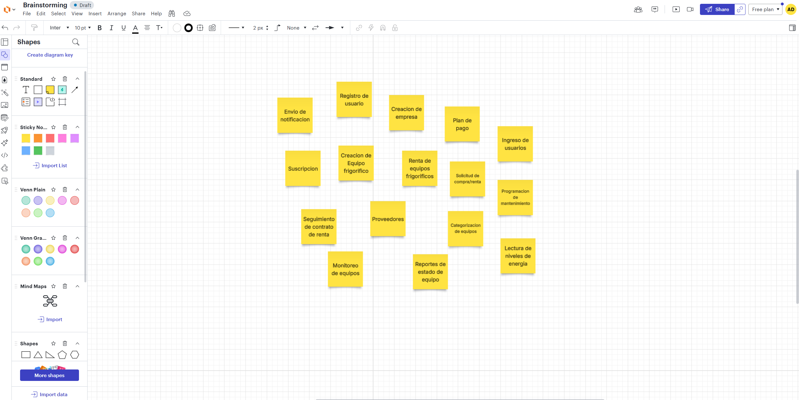
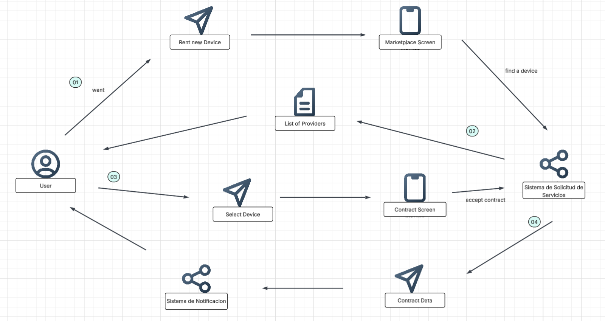

<strong>Universidad Peruana de Ciencias Aplicadas</strong>

<strong>Ingeniería de Software</strong> 
Aplicaciones para Dispositivos Móviles 
<strong>Profesor:</strong> Jorge Luis Mayta  

<h3 align="center">Seccion: 1795  </h3>

<h2 align="center">INFORME</h2>
<h2 align="center">2025 - 20</h2>

<h3 align="center">Startup: PolarNet</h3>

<strong>Producto: CoolGuard </strong>

<h3 align="center">Team Members:</h3>

| **Member**                           | **Code**     |
|--------------------------------------|--------------|
|  Paulo Percy Quincho Gamarra     |   U20191E562 |
|   Geronimo Quispe Pablo Antonio     | u202314304  |
|    Sandro Dinklange Arevalo   |  u202313419 |
|   Marzál Pérez, Jamir Ángel     |  u201824409 |
|  Ayrton Damian Inga Hernandez     | u201924756   |

<strong>Julio 2025</strong>

# Registro de Versiones del Informe
| Versión | Fecha       | Autor(es)                                                              | Descripción                                                                                                                                         |
|---------|-------------|------------------------------------------------------------------------|-----------------------------------------------------------------------------------------------------------------------------------------------------|
| TB1     | 13/09/2025  | Paulo Percy Quincho Gamarra       | Desarrollo del capítulo I: Introducción                                                                                                             |
| TB1     | 14/09/2025  | Geronimo Quispe Pablo Antonio       | Desarrollo del capítulo II                                                                                                            |
| TB1     | 15/09/2025  | Sandro Dinklange Arevalo      | Desarrollo del capítulo II                                                                                                               |
| TB1     | 16/09/2025  | Marzál Pérez, Jamir Ángel      | Desarrollo del capítulo II                                                                                                               |
| TB1     | 17/09/2025  | Ayrton Damian Inga Hernandez      | Desarrollo del capítulo II                              |

# Project Report Collaboration Insights
Link del repositorio: https://github.com/Paulo02-pixel/Aplicaciones-Para-Dispositivos-Moviles-1795.git

# Tabla de Contenidos

- [Capítulo I: Presentación](#capítulo-i-presentación)  
  - [1.1. Startup Profile](#11-startup-profile)  
    - [1.1.1. Descripción de la Startup](#111-descripción-de-la-startup)  
    - [1.1.2. Perfiles de integrantes del equipo](#112-perfiles-de-integrantes-del-equipo)  
  - [1.2. Solution Profile](#12-solution-profile)  
    - [1.2.1. Antecedentes y problemática](#121-antecedentes-y-problemática)  
    - [1.2.2. Lean UX Process](#122-lean-ux-process)  
      - [1.2.2.1. Lean UX Problem Statements](#1221-lean-ux-problem-statements)  
      - [1.2.2.2. Lean UX Assumptions](#1222-lean-ux-assumptions)  
      - [1.2.2.3. Lean UX Hypothesis Statements](#1223-lean-ux-hypothesis-statements)  
      - [1.2.2.4. Lean UX Canvas](#1224-lean-ux-canvas)  
  - [1.3. Segmentos objetivo](#13-segmentos-objetivo)  

- [Capítulo II: Requirements Development and Software Solution Design](#capítulo-ii-requirements-development-and-software-solution-design)  
  - [2.1. Competidores](#21-competidores)  
    - [2.1.1. Análisis competitivo](#211-análisis-competitivo)  
    - [2.1.2. Estrategias y tácticas frente a competidores](#212-estrategias-y-tácticas-frente-a-competidores)  
  - [2.2. Entrevistas](#22-entrevistas)  
    - [2.2.1. Diseño de entrevistas](#221-diseño-de-entrevistas)  
    - [2.2.2. Registro de entrevistas](#222-registro-de-entrevistas)  
    - [2.2.3. Análisis de entrevistas](#223-análisis-de-entrevistas)  
  - [2.3. Needfinding](#23-needfinding)  
    - [2.3.1. User Personas](#231-user-personas)  
    - [2.3.2. User Task Matrix](#232-user-task-matrix)  
    - [2.3.3. User Journey Mapping](#233-user-journey-mapping)  
    - [2.3.4. Empathy Mapping](#234-empathy-mapping)  
    - [2.3.5. Ubiquitous Language](#235-ubiquitous-language)  
  - [2.4. Requirements specification](#24-requirements-specification)  
    - [2.4.1. User Stories](#241-user-stories)  
    - [2.4.2. Impact Mapping](#242-impact-mapping)  
    - [2.4.3. Product Backlog](#243-product-backlog)  
  - [2.5. Strategic-Level Domain-Driven Design](#25-strategic-level-domain-driven-design)  
    - [2.5.1. EventStorming](#251-eventstorming)  
      - [2.5.1.1. Candidate Context Discovery](#2511-candidate-context-discovery)  
      - [2.5.1.2. Domain Message Flows Modeling](#2512-domain-message-flows-modeling)  
      - [2.5.1.3. Bounded Context Canvases](#2513-bounded-context-canvases)  
    - [2.5.2. Context Mapping](#252-context-mapping)  
    - [2.5.3. Software Architecture](#253-software-architecture)  
      - [2.5.3.1. Context Level Diagrams](#2531-software-architecture-context-level-diagrams)  
      - [2.5.3.2. Container Level Diagrams](#2532-software-architecture-container-level-diagrams)  
      - [2.5.3.3. Deployment Diagrams](#2533-software-architecture-deployment-diagrams)  
  - [2.6. Tactical-Level Domain-Driven Design](#26-tactical-level-domain-driven-design)  
    - [2.6.x. Bounded Context](#26x-bounded-context)  
      - [2.6.x.1. Domain Layer](#26x1-domain-layer)  
      - [2.6.x.2. Interface Layer](#26x2-interface-layer)  
      - [2.6.x.3. Application Layer](#26x3-application-layer)  
      - [2.6.x.4. Infrastructure Layer](#26x4-infrastructure-layer)  
      - [2.6.x.5. Component Level Diagrams](#26x5-bounded-context-software-architecture-component-level-diagrams)  
      - [2.6.x.6. Code Level Diagrams](#26x6-bounded-context-software-architecture-code-level-diagrams)  
        - [2.6.x.6.1. Domain Layer Class Diagrams](#26x61-bounded-context-domain-layer-class-diagrams)  
        - [2.6.x.6.2. Database Design Diagram](#26x62-bounded-context-database-design-diagram)  

- [Capítulo III: Solution UI/UX Design](#capítulo-iii-solution-uiux-design)  
  - [3.1. Product design](#31-product-design)  
    - [3.1.1. Style Guidelines](#311-style-guidelines)  
      - [3.1.1.1. General Style Guidelines](#3111-general-style-guidelines)  
    - [3.1.2. Information Architecture](#312-information-architecture)  
      - [3.1.2.1. Organization Systems](#3121-organization-systems)  
      - [3.1.2.2. Labelling Systems](#3122-labelling-systems)  
      - [3.1.2.3. SEO Tags and Meta Tags](#3123-seo-tags-and-meta-tags)  
      - [3.1.2.4. Searching Systems](#3124-searching-systems)  
      - [3.1.2.5. Navigation Systems](#3125-navigation-systems)  
    - [3.1.3. Landing Page UI Design](#313-landing-page-ui-design)  
      - [3.1.3.1. Wireframe](#3131-landing-page-wireframe)  
      - [3.1.3.2. Mock-up](#3132-landing-page-mock-up)  
    - [3.1.4. Mobile Applications UX/UI Design](#314-mobile-applications-uxui-design)  
      - [3.1.4.1. Wireframes](#3141-mobile-applications-wireframes)  
      - [3.1.4.2. Wireflow Diagrams](#3142-mobile-applications-wireflow-diagrams)  
      - [3.1.4.3. Mock-ups](#3143-mobile-applications-mock-ups)  
      - [3.1.4.4. User Flow Diagrams](#3144-mobile-applications-user-flow-diagrams)  
      - [3.1.4.5. Prototyping](#3145-mobile-applications-prototyping)  

- [Capítulo IV: Product Implementation & Validation](#capítulo-iv-product-implementation--validation)  
  - [4.1. Software Configuration Management](#41-software-configuration-management)  
    - [4.1.1. Development Environment Configuration](#411-software-development-environment-configuration)  
    - [4.1.2. Source Code Management](#412-source-code-management)  
    - [4.1.3. Source Code Style Guide & Conventions](#413-source-code-style-guide--conventions)  
    - [4.1.4. Deployment Configuration](#414-software-deployment-configuration)  
  - [4.2. Landing Page & Mobile Application Implementation](#42-landing-page--mobile-application-implementation)  
    - [4.2.1. Sprint n](#421-sprint-n)  
      - [4.2.1.1. Sprint Planning n](#4211-sprint-planning-n)  
      - [4.2.1.2. Sprint Backlog n](#4212-sprint-backlog-n)  
      - [4.2.1.3. Development Evidence](#4213-development-evidence-for-sprint-review)  
      - [4.2.1.4. Testing Suite Evidence](#4214-testing-suite-evidence-for-sprint-review)  
      - [4.2.1.5. Execution Evidence](#4215-execution-evidence-for-sprint-review)  
      - [4.2.1.6. Services Documentation](#4216-services-documentation-evidence-for-sprint-review)  
      - [4.2.1.7. Software Deployment Evidence](#4217-software-deployment-evidence-for-sprint-review)  
      - [4.2.1.8. Team Collaboration Insights](#4218-team-collaboration-insights-during-sprint)  
  - [4.3. Validation Interviews](#43-validation-interviews)  
    - [4.3.1. Diseño de Entrevistas](#431-diseño-de-entrevistas)  
    - [4.3.2. Registro de Entrevistas](#432-registro-de-entrevistas)  
    - [4.3.3. Evaluaciones según heurísticas](#433-evaluaciones-según-heurísticas)  

## Anexos

# Student Outcome

| **Criterio específico** | **Acciones realizadas** | **Conclusiones** |
|-------------------------|--------------------------|------------------|
| Actualiza conceptos y conocimientos necesarios para su desarrollo profesional y en especial para su proyecto en soluciones de ingeniería de software. | **TB1: Paulo Percy Quincho Gamarra (U20191E562)**   Investigó y aplicó conceptos de programación backend con Python y Node.js, reforzando conocimientos en bases de datos SQL y NoSQL.    **TB1: Geronimo Quispe Pablo Antonio (U202314304)**   Estudió metodologías ágiles y las aplicó en la organización del proyecto, mejorando la planificación de tareas y la coordinación del equipo.    **TB1: Sandro Dinklange Arevalo (U202313419)**   Actualizó sus conocimientos en arquitectura de software y modelado de base de datos, contribuyendo al diseño estructurado de la solución.    **TB1: Jamir Ángel Marzál Pérez (U201824409)**   Reforzó conocimientos en programación orientada a objetos y patrones de diseño, aplicándolos en la implementación de módulos del sistema.    **TB1: Ayrton Damian Inga Hernandez (U201924756)**   Aplicó los métodos de Domain Driven Design en la elaboración de los Bounded Context Canvases.  | Cada integrante actualizó y aplicó conceptos clave de software en el proyecto, asegurando un mejor entendimiento técnico y fortaleciendo sus competencias profesionales para proyectos reales.  |
| Reconoce la necesidad del aprendizaje permanente para el desempeño profesional y el desarrollo de proyectos en soluciones de tecnologías de ingeniería de software. | **TB1: Paulo Percy Quincho Gamarra (U20191E562)**   Participó en la revisión de nuevas herramientas y frameworks, demostrando apertura al aprendizaje continuo para fortalecer el backend del proyecto.    **TB1: Geronimo Quispe Pablo Antonio (U202314304)**   Investigó sobre herramientas de gestión colaborativa como Trello y GitHub, mostrando interés en ampliar su experiencia en entornos profesionales.    **TB1: Sandro Dinklange Arevalo (U202313419)**   Estudió sobre servicios en la nube y su impacto en aplicaciones móviles, comprendiendo la importancia de actualizarse en nuevas tecnologías.    **TB1: Jamir Ángel Marzál Pérez (U201824409)**   Reconoció la necesidad de mejorar constantemente en lenguajes modernos como TypeScript y frameworks frontend, buscando aplicarlos en futuros proyectos.    **TB1: Ayrton Damian Inga Hernandez (U201924756)**   Investigó la herramienta designada para la elaboración del software architecture y lo desarrolló.| Los integrantes demostraron compromiso con el aprendizaje permanente, entendiendo que la actualización constante es clave para desenvolverse en proyectos de software y adaptarse a los cambios tecnológicos. |

# Capítulo I: Introducción

## 1.1 Startup Profile

### 1.1.1 Descripción de la Startup
**PolarNet** es una aplicación móvil desarrollada para optimizar la gestión y el mantenimiento de sistemas de refrigeración en negocios que dependen del frío de manera crítica, como supermercados, minimarkets, laboratorios, restaurantes y empresas de los sectores alimentario o farmacéutico.  

La app permite a los usuarios mantenerse conectados en todo momento con sus equipos y con técnicos o proveedores especializados, ofreciendo una administración integral, preventiva y automatizada desde la comodidad del celular.  

De igual manera, **PolarNet** incluye un módulo especializado para técnicos y proveedores, donde pueden visualizar todos los equipos que atienden, organizar visitas de servicio, consultar historiales técnicos y generar reportes de manera ágil y eficiente, directamente desde la app.  

**Misión:** En PolarNet, nuestra misión es proporcionar una solución móvil inteligente que proteja el inventario de los negocios y potencie la gestión de sus sistemas de refrigeración, al mismo tiempo que brinda herramientas prácticas para mejorar la productividad de técnicos y proveedores.  

**Visión:** Convertirnos en la aplicación líder en gestión y mantenimiento de equipos de refrigeración, iniciando en Lima y expandiéndonos a nivel nacional, facilitando el acceso móvil a la tecnología en todo el Perú.  

---

### 1.1.2 Perfiles de integrantes del equipo

<table border="1" cellspacing="0" cellpadding="8">
  <tr>
    <td style="text-align: center" align="center">
      

        Paulo Percy Quincho Gamarra - U20191E562  
         
        
      

    </td>
    <td style="text-align: center" align="center">
      Soy una persona responsable, comprometida con mis objetivos y soy puntual, lo que me permite realizar todos los trabajos a tiempo. Me gusta tener buena comunicación con el equipo. 
    </td>
    <td style="text-align: center" align="center">
      Conocimientos en Python, JavaScript, TypeScript, SQL y NoSQL. Disfruto entregar los mejores resultados posibles y fomentar la buena comunicación en grupo.
    </td>
  </tr>
  
  <tr>
    <td style="text-align: center" align="center">
      

        Geronimo Quispe Pablo Antonio - U202314304  
         
        
      

    </td>
    <td style="text-align: center" align="center">
      Mi nombre es Pablo,tengo 20 años y soy estudiante de Ingeniería de Software en la UPC, sede San Miguel. Soy una persona decidida, confiable, responsable y honesta con mi grupo de trabajo ,siendo lo más útil posible.
    </td>
    <td style="text-align: center" align="center">
      Tengo conocimientos en C++,C# y php. Cada día trato de dar una mejor versión de mi y aprender de mis errores.
    </td>
  </tr>
  
  <tr>
    <td style="text-align: center" align="center">
      

        Sandro Dinklange Arevalo - U202313419  
         
        
      

    </td>
    <td style="text-align: center" align="center">
      Soy un estudiante de 18 años que cursa la carrera de Ingeniería de Software, en sexto ciclo, en la Universidad Peruana de Ciencias Aplicadas (UPC).
    </td>
    <td style="text-align: center" align="center">
      Cuento con conocimientos en C++.
    </td>
  </tr>
  
  <tr>
    <td style="text-align: center" align="center">
      

        Jamir Ángel Marzál Pérez - U201824409  
         
        
      

    </td>
    <td style="text-align: center" align="center">
      Me gusta colaborar con mis compañeros, aportar ideas y trabajar de forma organizada para lograr objetivos comunes.
    </td>
    <td style="text-align: center" align="center">
      Conocimientos en Python, C#, Java y SQL. Enfocado en mejorar continuamente mis habilidades técnicas.
    </td>
  </tr>
  
  <tr>
    <td style="text-align: center" align="center">
      

        Ayrton Damian Inga Hernandez - U201924756  
         
        
      

    </td>
    <td style="text-align: center" align="center">
      Me considero una persona que se esfuerza para seguir adelante en mis estudios mientras intento equilibrar mi vida laboral.
    </td>
    <td style="text-align: center" align="center">
      Cuento con conocimientos de Python, JavaScript, C++ y base de datos.
    </td>
  </tr>
</table>

## 1.2 Solution Profile

**Nombre del producto:** PolarNet  

**Descripción:**  
PolarNet es una aplicación móvil innovadora y eficiente, creada para optimizar la gestión y el mantenimiento de equipos de congelación en negocios que dependen críticamente del frío, como supermercados, laboratorios, restaurantes y compañías de los sectores alimentario y farmacéutico.  

Desde el celular, los usuarios pueden acceder a un monitoreo constante en tiempo real, recibir alertas automáticas ante fallos, programar mantenimientos inteligentes y consultar reportes detallados del rendimiento de los equipos, todo desde una sola app.  

La solución centraliza la gestión en el dispositivo móvil y facilita la conexión directa entre negocios, técnicos y proveedores especializados, permitiendo una operación más segura, económica y sostenible en cualquier momento y lugar.  

**Monetización:**  
PolarNet monetiza su aplicación móvil a través de un modelo de suscripciones y tarifas por servicio. Los negocios podrán elegir entre diferentes planes mensuales.  

Por otro lado, los proveedores de servicios y técnicos podrán pagar una suscripción mensual para usar un módulo centralizado dentro de la aplicación, donde gestionan solicitudes de mantenimiento, organizan su flujo de trabajo y mejoran la calidad de la atención desde su dispositivo móvil.  

Además, la app permitirá habilitar tarifas por transacción para intervenciones técnicas no incluidas en el plan de suscripción, garantizando flexibilidad y nuevas oportunidades de ingresos.  

---

### 1.2.1 Antecedentes y problemática
PolarNet busca dar solución a los principales desafíos que enfrentan los negocios en la gestión de equipos de congelación, como supermercados, restaurantes y empresas del sector farmacéutico, que deben mantener la cadena de frío de manera constante.  

Estos negocios suelen lidiar con la falta de soluciones móviles accesibles, la dificultad de realizar mantenimientos preventivos efectivos y la ausencia de herramientas que permitan monitorear y gestionar el rendimiento de los equipos en tiempo real.  

Con su aplicación móvil, PolarNet pone todo este control en la palma de la mano del usuario, ofreciendo monitoreo constante, alertas inmediatas y una gestión automatizada que facilita la prevención de fallos y mejora la eficiencia operativa desde cualquier lugar.

## 5Ws y 2Hs

| Pregunta   | Descripción |
|------------|-------------|
| **What?**   ¿Cuál es el problema? | Los negocios que dependen de sistemas de congelación enfrentan grandes retos operativos por fallas imprevistas y la falta de un mantenimiento adecuado. La ausencia de monitoreo constante, el consumo energético elevado no detectado a tiempo y los problemas de temperatura pueden ocasionar pérdidas de productos, afectar la calidad del servicio y generar importantes costos económicos. |
| **When?**   ¿Cuándo ocurre este problema? | Estas situaciones suelen presentarse durante la operación continua de los equipos, en especial cuando no hay técnicos disponibles de inmediato o no se realiza un seguimiento periódico del estado de los sistemas. |
| **Where?**   ¿Dónde sucede este problema? | Este tipo de inconvenientes se da en negocios a nivel nacional, con mayor incidencia en Lima, donde mantener la cadena de frío es crítico en sectores como el alimentario, farmacéutico y logístico. Asimismo, impacta a las empresas proveedoras de refrigeración que atienden a múltiples clientes sin una herramienta centralizada para la gestión. |
| **Who?**   ¿Quiénes están implicados? | El problema afecta tanto a los dueños y administradores de negocios que utilizan congeladoras como a los técnicos y proveedores responsables del mantenimiento de estos equipos. |
| **Why?**   ¿Qué origina este problema? | La causa principal es la falta de soluciones tecnológicas integrales y accesibles que combinen funciones como monitoreo, alertas, historial de uso y planificación de mantenimientos. Muchas empresas aún dependen de procesos manuales o carecen de controles preventivos, quedando vulnerables a fallas críticas. |
| **How?**   ¿Cómo se llegó a esta situación? | Esta situación se ha generado por la acumulación de incidentes inesperados y la poca digitalización del mantenimiento preventivo. Como resultado, los negocios dependen en gran medida de acciones reactivas en lugar de planes anticipados, lo que incrementa los costos, retrasa las atenciones y aumenta la carga operativa. |
| **How much?**   ¿Cuál es el impacto económico? | Las pérdidas económicas varían según el tipo de negocio, pero una falla en un sistema de congelación puede representar desde cientos hasta miles de soles en productos dañados. A esto se suman los tiempos de inactividad, la insatisfacción de clientes y los gastos derivados de reparaciones o sustituciones de equipos. |

---

## 1.2.2 Lean UX Process

### 1.2.2.1 Lean UX Problem Statement
El sector de la refrigeración comercial y técnica enfrenta grandes retos en la administración, el mantenimiento y la trazabilidad de los equipos de congelación. Negocios que dependen críticamente del frío como supermercados, minimarkets, restaurantes, laboratorios y empresas del rubro alimentario o farmacéutico aún operan sin un monitoreo en tiempo real y con mantenimientos mayormente reactivos, lo que genera pérdidas económicas, consumo energético ineficiente y riesgo constante sobre el inventario.  

Las soluciones disponibles no cubren la necesidad de una aplicación confiable y automatizada que centralice la gestión y ofrezca un enfoque predictivo y transparente tanto para negocios como para técnicos y proveedores. La falta de historial técnico digital, reportes accesibles y alertas preventivas limita la capacidad de reacción frente a fallas y afecta la calidad del servicio.  

**PolarNet** responde a este escenario con una aplicación móvil integral que conecta a negocios y técnicos especializados, brindando funciones como monitoreo en tiempo real de temperatura y consumo, programación inteligente de mantenimientos, notificaciones instantáneas por fallos, reportes automáticos y trazabilidad completa de cada equipo.  

Además, ofrece a los proveedores de servicios un módulo dentro de la app para gestionar equipos atendidos, planificar visitas y consultar historiales técnicos de manera ágil. La primera etapa de implementación se enfocará en Lima, apoyando a negocios que requieren garantizar el rendimiento de sus sistemas de congelación y a proveedores que buscan modernizar sus operaciones con herramientas digitales avanzadas.  

El éxito se medirá en la reducción de fallas inesperadas, la optimización del consumo energético, la mejora en la eficiencia de los técnicos y el aumento de la satisfacción de los clientes, asegurando continuidad operativa y fidelización de los usuarios de la app.

---

### 1.2.2.2 Lean UX Assumptions

**Business Outcomes**

- Incrementar en un 15% los usuarios activos de la aplicación móvil PolarNet, consolidando su presencia en el mercado.  
- Potenciar la visibilidad en redes sociales, especialmente en sectores como alimentos y técnicos en refrigeración, destacando la app como herramienta innovadora.  
- Generar confianza en la efectividad del monitoreo y mantenimiento automatizado, mostrando la app como un aliado confiable para proteger inventario y optimizar operaciones.  
- Mantener informados a los usuarios mediante notificaciones móviles en tiempo real, sobre fallas térmicas, cortes de energía o anomalías en los equipos.  
- Consolidar una base de usuarios dispuestos a adquirir membresías premium desde la app, con beneficios como mantenimiento predictivo, reportes personalizados y soporte técnico prioritario.  
- Establecer alianzas con plataformas de geolocalización como Google Maps, para mejorar el alcance y la programación de visitas técnicas desde dispositivos móviles.  
- Fomentar la participación activa de los usuarios en la app, a través de encuestas, valoraciones de técnicos y comentarios sobre el desempeño de los equipos.  
- Diseñar una interfaz sencilla, intuitiva y pensada para móvil, que ofrezca una experiencia atractiva sin sobrecargar de información.  
- Implementar inteligencia artificial en la aplicación, para optimizar mantenimientos inteligentes, rutas de técnicos y recomendaciones preventivas frente a posibles fallos.  

## User Outcomes

### ¿Quién será nuestro usuario?
- Negocios que dependen de manera crítica de sistemas de refrigeración, como supermercados, minimarkets, restaurantes, laboratorios y empresas en los sectores alimentario y farmacéutico.  
- Técnicos especializados en refrigeración encargados del mantenimiento de estos equipos.  
- Proveedores de equipos de refrigeración que desean ofrecer un servicio postventa más eficiente.  

---

### ¿Dónde encaja nuestro producto en su vida?
- En situaciones donde los negocios deben garantizar el funcionamiento continuo de sus sistemas de frío para evitar pérdidas económicas por fallas imprevistas.  
- En la rutina diaria de los técnicos, quienes gestionan múltiples clientes, visitas y tareas de mantenimiento.  
- En las operaciones diarias de los negocios que requieren registros detallados y reportes precisos sobre el rendimiento de sus sistemas de refrigeración.  

---

### ¿Qué problemas tiene nuestro producto y cómo se pueden resolver?
- **Problema:** Garantizar que los datos de monitoreo (temperatura, consumo energético, fallas, etc.) sean precisos y confiables.  
  **Solución:** Integrar sensores calibrados y sistemas automáticos de verificación de datos antes de almacenarlos.  

- **Problema:** La adopción inicial por parte de usuarios no familiarizados con la tecnología.  
  **Solución:** Ofrecer una interfaz sencilla, guías paso a paso y soporte técnico accesible para facilitar el uso.  

---

### ¿Cómo y cuándo se utiliza nuestro producto?
- Se accede a través de la aplicación web, disponible tanto para computadoras como dispositivos móviles.  
- Se usa a diario para monitorear los equipos de refrigeración, recibir alertas, programar mantenimientos y revisar historiales técnicos.  
- También se activa automáticamente en segundo plano al integrar sensores de monitoreo con la plataforma.  

---

### ¿Qué problemas tiene nuestro producto?
- En sus fases iniciales, podría carecer de integraciones con algunos dispositivos de terceros.  
- Algunos usuarios necesitarán formación para aprovechar al máximo las funcionalidades avanzadas.  
- Los técnicos tradicionales pueden resistirse al cambio hacia un sistema digital.  

---

### ¿Qué características son esenciales para la app?
- Monitoreo en tiempo real de temperatura, consumo energético y tiempo de uso.  
- Alertas automáticas ante fallos en los equipos.  
- Historial técnico completo con reportes exportables en PDF.  
- Calendario de mantenimiento preventivo con notificaciones programadas.  
- Módulo exclusivo para técnicos con gestión de visitas y clientes.  
- Soporte técnico inteligente y recomendaciones predictivas mediante IA.  
- Registro de múltiples ubicaciones y usuarios con distintos roles.  
- Interfaz minimalista e intuitiva para facilitar la adopción.  

---

### ¿Cómo debe verse y comportarse nuestro producto?
- **Interfaz amigable y confiable:** clara, ordenada y fácil de navegar, con gráficos e indicadores intuitivos.  
- **Diseño centrado en tareas críticas:** acceso rápido a fallos, próximas visitas y reportes de equipos.  
- **Accesibilidad multiplataforma:** disponible en web y móvil, adaptada para oficina y campo, con notificaciones inmediatas.  
- **Simplicidad:** panel centralizado para ver clientes, equipos en riesgo y visitas programadas, con generación de reportes rápida y fácil.  

---

### ¿Qué valor busca el cliente?
- **Gestión técnica simplificada:** mantenimiento predictivo, historiales claros y clientes organizados.  
- **Seguridad operativa y sin sorpresas:** monitoreo constante, alertas automáticas y control total.  
- **Eficiencia energética y trazabilidad:** detección anticipada de problemas, identificación de equipos en riesgo.  

---

### ¿Qué beneficios adicionales obtendrá el cliente?
- Visibilidad total del estado de sus equipos desde cualquier lugar y en cualquier momento.  
- Soporte técnico ágil gracias al historial detallado y alertas automáticas.  
- Reducción de costos operativos mediante mantenimientos preventivos y mayor eficiencia energética.  
- Reportes personalizados y exportables.  
- Automatización de visitas técnicas al detectar patrones de fallas.  

---

### ¿Cómo atraeremos usuarios?
- Marketing dirigido a nichos clave: supermercados, restaurantes y empresas del sector frío mediante LinkedIn, correos y llamadas estratégicas.  
- Alianzas con proveedores de equipos para incluir PolarNet en sus paquetes postventa.  
- Prueba gratuita de 14 días de versiones premium, con monitoreo limitado, para mostrar el valor en tiempo real.  

---

### ¿Cómo generaremos ingresos?
- **Suscripción mensual para negocios:** según número de equipos, tipos de reportes y funcionalidades.  
- **Modelo freemium:** versión gratuita con funciones limitadas y anuncios.  
- **Publicidad dirigida (opcional):** visibilidad para marcas de refrigeración dentro de la plataforma.  

---

### ¿Cuál es nuestra competencia y cómo la superamos?
- **Competencia:** Otras aplicaciones centradas en gestión de datos y mantenimiento de equipos de refrigeración.  
- **Nuestra ventaja:** PolarNet está diseñado exclusivamente para negocios que dependen del frío, detecta anomalías en tiempo real, genera alertas y automatiza acciones.  

---

### ¿Cuál es el mayor riesgo para el producto?
- **Adopción lenta:** proveedores que aún usan agendas físicas o Excel.  
- **Falta de adopción inicial:** convencer a los primeros usuarios de la utilidad y confiabilidad de la app.  
- **Desconfianza en la precisión de los sensores:** riesgo de perder valor si los datos no son precisos.  

---

### ¿Cómo lo resolveremos?
- **Algoritmos de validación:** IA para verificar precisión y filtrar información incorrecta.  
- **Capacitación y soporte:** tutoriales, videos y soporte técnico accesible.  
- **Estrategia progresiva de integraciones:** empezar con los equipos más utilizados y luego ampliar compatibilidad con APIs.  
- **Sensores certificados:** integrar solo dispositivos validados para garantizar precisión.  

---

## 1.2.2.3 Lean UX Hypothesis

1. **Hipótesis 1: Mejora en la eficiencia operativa y reducción de fallas inesperadas**  
   Al centralizar en una sola app todas las funciones de monitoreo, mantenimiento y gestión de equipos de refrigeración, los negocios y proveedores podrán operar con mayor eficiencia, simplificando procesos y reduciendo el riesgo de fallas inesperadas.  
   Validación: reducción en reportes de fallas térmicas y mejor organización de mantenimientos preventivos.  

2. **Hipótesis 2: Control de pérdidas operativas y consumo energético**  
   Si ofrecemos herramientas de análisis en tiempo real y alertas automáticas, los usuarios podrán anticiparse a fallas, reducir pérdidas y optimizar su consumo energético.  
   Validación: incremento en el uso de estas funciones y reducción de costos por interrupciones.  

3. **Hipótesis 3: Mejora en el servicio técnico predictivo y personalizado**  
   Con reportes automáticos e históricos de cada equipo, los técnicos podrán brindar un servicio más predictivo y personalizado.  
   Validación: técnicos valoran la utilidad de los reportes y clientes expresan mayor satisfacción.  

4. **Hipótesis 4: Trazabilidad y seguridad de la información técnica**  
   Si garantizamos trazabilidad en cada acción y protegemos la información técnica, generaremos confianza en negocios y proveedores.  
   Validación: mayor fidelidad de usuarios y reducción en incidencias por pérdida de datos.  

5. **Hipótesis 5: Transición a una gestión moderna y digitalizada de refrigeración**  
   Al ofrecer una solución digital sencilla y especializada, ayudaremos a negocios y técnicos a migrar hacia una gestión moderna.  
   Validación: rápida adopción, baja tasa de abandono y uso frecuente de funciones clave.  

## 1.2.2.4 Lean UX Canvas

  

## 1.3 Segmentos objetivo

### Segmento Objetivo #1: Negocios que utilizan sistemas de refrigeración

**Aspectos demográficos:**
- Tipo de negocio: Empresas de diferentes tamaños, desde pequeñas hasta grandes.  
- Sectores: Alimentación, farmacéutico, restauración y comercio minorista.  
- Nivel de necesidad: Alta dependencia de equipos de refrigeración.  

**Aspectos geográficos:**
- Nacionalidad: Peruana.  
- Ubicación: Áreas urbanas.  
- Región: Lima, con planes de expansión a nivel nacional.  

**Aspectos psicográficos:**
- Empresas que buscan evitar pérdidas económicas debido a fallas en los sistemas de refrigeración.  
- Negocios que necesitan un control eficiente del consumo energético.  
- Administradores interesados en implementar soluciones tecnológicas para optimizar operaciones y preservar la calidad del inventario.  

---

### Segmento Objetivo #2: Proveedores de servicios y equipos de refrigeración

**Aspectos demográficos:**
- Tipo de empresa: Técnicos independientes, pequeñas y medianas empresas (PYMES), y proveedores especializados en refrigeración.  
- Rol: Técnicos de mantenimiento, instaladores y empresas de soporte técnico.  

**Aspectos geográficos:**
- Nacionalidad: Peruana.  
- Ubicación: Áreas urbanas.  
- Región: Lima, con planes de expansión a nivel nacional.  

**Aspectos psicográficos:**
- Técnicos que desean organizar y gestionar sus visitas de manera más eficiente y centralizada.  
- Empresas que buscan mejorar la trazabilidad de sus servicios, con la capacidad de generar reportes automáticos.  
- Profesionales que desean ofrecer un servicio más personalizado y predictivo a sus clientes.  
=======
## Capítulo II: Requirements Elicitation & Analysis 

### 2.1. Competidores

**Competidor 1: Infraspeak**
Infraspeak: Es uno de los softwares de mantenimiento y gestión de órdenes de trabajo, con buen reconocimiento puesto que cuenta con módulos robustos, tareas preventivas y un buen soporte

---

**Competidor 2: Persat**
Con sedes en Latinoamérica, sus funciones más relevantes cuentan con asignación de tareas de servicio, una buena localización regional así como un gran enfoque al servicio técnico

---

**Competidor 3: Kiconex**
 Este software basado en el control remoto en la nube para equipos de refrigeración cuenta con fuertes monitorios, sensores, iot y un buen soporte de hardware profesional, dedicados mayormente en Europa.
#### 2.1.1. Análisis competitivo

<table> 
  <tr>
    <th colspan="7"> Competitive Analysis Landscape </th>
  </tr>
  <tr>
    <td colspan="2" rowspan="2">¿Por qué llevar acabo este análisis? </td>
    <td colspan="5"> Pregunta </td>
  </tr>
  <tr>
    <td colspan="5"> Para poder evaluar el posicionamiento competitivo de nuestra app frente a competidores perfecto para identificar fortalezas, debilidades, oportunidades y amenazas en el mercado peruano de gestión y monitoreo de refrigeración. </td>
  </tr>
  <tr>
    <td colspan="2"> Productos </td>
    <td> PolarNet  </td>
    <td> Infraspeak </td>
    <td> Persat </td>
    <td> Kiconex </td>
  </tr>
  <tr>
    <td rowspan="2">Perfil</td>
    <td>Overview</td>
    <td>App móvil enfocada en monitoreo y mantenimiento preventivo de refrigeración comercial. </td>
    <td> Plataforma internacional para mantenimiento y monitoreo.. </td>
    <td> App de gestión de equipos de campo y mantenimiento. </td>
    <td> App de refrigeración industrial con sistema. </td>
  </tr>
  <tr>
    <td>Ventaja competitiva ¿Qué valor ofrece a los clientes?</td>
    <td> Interfaz simple, costos accesibles, soporte local, alertas predictivas en tiempo real. </td>
    <td> Solución integral con muchos módulos y certificaciones internacionales. </td>
    <td> Amplia red de técnicos y logística integrada.. </td>
    <td> Experiencia técnica en refrigeración industrial y hardware especializado.. </td>
  </tr>
  <tr>
    <td rowspan="2">Perfil de Marketing</td>
    <td> Mercado Objetivo </td>
    <td> Supermercados, restaurantes y cadenas minoristas. </td>
    <td> Grandes empresas y facilities. </td>
    <td> Empresas de servicios técnicos, distribuidores. </td>
    <td> Plantas industriales, exportadoras. </td>
  </tr>
  <tr>
    <td> Estrategias de Marketing </td>
    <td> Marketing digital, alianzas con proveedores, asociaciones locales,etc. </td>
    <td> Ventas consultivas a grandes cuentas, partners globales. </td>
    <td> Marketing basado en casos de éxito y distribuidores. </td>
    <td> Promoción a través de fabricantes e instaladores, ferias industriales. </td>
  </tr>
  <tr>
    <td rowspan="3">Perfil de Producto</td>
    <td> Productos & Servicios </td>
    <td> App móvil, IoT para monitoreo, reportes automáticos. </td>
    <td> Plataforma modular, integraciones con IoT. </td>
    <td> App móvil y web para gestión de técnicos y mantenimiento. </td>
    <td> Sistemas de refrigeración y hardware para control remoto. </td>
  </tr>
  <tr>
    <td> Precios & Costos </td>
    <td> Modelo mensual accesible, pago por equipo monitoreado. </td>
    <td> Modelo empresarial con precios premium. </td>
    <td> Suscripción mensual media, pago por usuario técnico. </td>
    <td> Precios altos ligados al hardware e instalación. </td>
  </tr>
  <tr> 
    <td>Canales de distribución (Web y/o Móvil)</td>
    <td> App móvil y dashboard web con soporte local. </td>
    <td> Web, app móvil, integraciones API. </td>
    <td> App móvil y web, CRM integrado. </td>
    <td> Hardware y software propio, canal de distribuidores. </td>
  </tr>
  <tr>
    <td rowspan="4"> Análisis SWOT </td>
    <td> Fortalezas </td>
    <td> Soporte local, precios competitivos, adaptación rápida a normativas, UI amigable. </td>
    <td> Amplia trayectoria, reputación internacional, plataforma completa. </td>
    <td> Experiencia en gestión de técnicos y logística integrada. </td>
    <td> Hardware especializado en refrigeración industrial. </td>
  </tr>
  <tr>
    <td> Debilidades </td>
    <td> Marca nueva, menos funcionalidades avanzadas que otras empresas internacionales. </td>
    <td> Costos elevados, menor flexibilidad. </td>
    <td> Poca especialización en refrigeración crítica. </td>
    <td> Requiere inversión inicial alta y poca presencia local en Perú. </td>
  </tr>
  <tr>
    <td> Oportunidades </td>
    <td> Creciente necesidad de monitoreo y cumplimiento normativo en Perú, alianzas con proveedores de equipos. </td>
    <td> Expansión a mercados emergentes con soluciones más accesibles. </td>
    <td> Especializarse en nichos críticos </td>
    <td> Ampliar servicios en Latam con soporte remoto. </td>
  </tr>
  <tr>
    <td> Amenazas </td>
    <td> Entrada de competidores internacionales con precios agresivos o alianzas locales.</td>
    <td> Startups locales más baratas y ágiles. </td>
    <td> Competidores globales con más capital. </td>
    <td> Sustitución tecnológica por soluciones puras sin hardware. </td>
  </tr>
</table>
#### 2.1.2. Estrategias y tácticas frente a competidores

Hemos identificado diversas estrategias y tácticas para diferenciarse y competir efectivamente con otros actores del mercado de la gestión y monitoreo de sistemas de refrigeración. A continuación se detallan las principales:

---

**1. Estrategias de Diferenciación:**

- **Automatización y Mantenimiento Preventivo**: A diferencia de los competidores identificados, PolarNet se enfoca en ofrecer una solución integral y especializada para refrigeración, con monitoreo en tiempo real, alertas automáticas y programación inteligente de mantenimientos. Esto permite a los negocios reducir incidencias y gestionar sus equipos de manera proactiva.

- **Experiencia del usuario como ventaja competitiva**: Se invertirá en una interfaz y procesos extremadamente simples y agradables para el usuario. El objetivo es que cada interacción genere confianza y sensación de control, reduciendo la fricción en comparación con los competidores.

- **Construcción de comunidad y fidelización**: Crear foros, newsletters, o espacios exclusivos donde proveedores y clientes intercambien experiencias y recomendaciones. Esto genera una comunidad difícil de replicar por la competencia.

---

**2. Tácticas de Marketing:**

- **Aumento de usuarios fieles**: Mostrar funcionalidades clave del sistema en fepublicar historias reales de reducción de costos y tiempos gracias al uso de la plataforma para reforzar la credibilidad.ias industriales y eventos del sector alimentario y farmacéutico.

---

**3. Estrategias de Precios:**

- **Modelo Freemium**: Versión gratuita para registro de equipos y mantenimientos básicos, con servicios avanzados (diagnóstico predictivo, analítica, reportes) en planes de pago.

- **Planes escalonados para técnicos y proveedores**: Desde un plan básico para pequeños talleres hasta uno premium para grandes distribuidores.

---

**4. Expansión y Adaptabilidad:**

- **Foco inicial en Lima y principales ciudades del Perú**: Implementar pilotos locales para adaptar procesos a necesidades reales del mercado antes de escalar.

- **Colaboraciones con Proveedores Locales**: Estableceremos alianzas estratégicas con proveedores de equipos de refrigeración y servicios técnicos en Perú, lo que nos distinguirá de la competencia al tener un sistema sólido y diseñado especialmente para el mercado peruano
---

### 2.2. Entrevistas.

#### 2.2.1. Diseño de entrevistas

**Segmento Objetivo #1: Negocios que utilizan sistemas de refrigeración**

1. ¿Qué marcas o empresas relacionadas con refrigeración/servicios técnicos te inspiran confianza? 
2. ¿Qué factores te hacen elegir una marca sobre otra (precio, calidad, soporte, reputación)? 
3. ¿Qué dispositivos usas con mayor frecuencia para tu trabajo (smartphone, laptop, tablet)? 
4. ¿Qué características consideras más importantes al seleccionar una aplicación de este tipo? 
5. ¿Cuáles son tus principales preocupaciones a la hora de gestionar/obtener el servicio o producto? 
6. Si pudieras mejorar una sola cosa del servicio actual, ¿qué sería?

**Segmento Objetivo #2: Proveedores de servicios y equipos de refrigeración**

1. ¿Podrías contarnos brevemente sobre tu empresa o rol en el negocio de refrigeración?
2. ¿Cuáles son tus principales preocupaciones al ofrecer servicios de refrigeración a tus clientes?
3. ¿Qué características consideras importantes en una aplicación o sistema para gestionar servicios/equipos de refrigeración?
4. ¿Podrías contarme una situación en la que un problema con equipos o mantenimiento haya afectado a tus clientes?

---
#### 2.2.2. Registro de entrevistas

##### Segmento objetivo #1: Negocios que utilizan sistemas de refrigeración

---
#### Entrevista 1:

- **Nombres y apellidos:** Javier Martínez
- **Edad:** 50
- **Distrito:** San Martín de Porres

- 

- **Inicio:** 0:02
- **Duración:** 3:00 min
- **URL:** https://upcedupe-my.sharepoint.com/:v:/g/personal/u202313419_upc_edu_pe/EbAKUznIOb1Hj52G0gDEO4cB5aB_zzFbWqKma_ojJr-KDw?nav=eyJyZWZlcnJhbEluZm8iOnsicmVmZXJyYWxBcHAiOiJPbmVEcml2ZUZvckJ1c2luZXNzIiwicmVmZXJyYWxBcHBQbGF0Zm9ybSI6IldlYiIsInJlZmVycmFsTW9kZSI6InZpZXciLCJyZWZlcnJhbFZpZXciOiJNeUZpbGVzTGlua0NvcHkifX0&e=0bIob4
- **Resumen:** Nuestro primer entrevistador nos explica que es nuevo con respecto a las máquinas de refrigeración y que su mayor preocupación es la dificultad del hardware, explica que quiere UI más intuitivas..

---
#### Entrevista 2:
- **Nombres y apellidos:** Jesús Cortez Soria
- **Edad:** 25
- **Distrito:** San Martín de Porres

- **Inicio:** 0:02
- **Duración:** 1:50 min
- **URL:** https://upcedupe-my.sharepoint.com/:v:/g/personal/u202313419_upc_edu_pe/EQl3y6bGWi9ArBB2C0V_6-ABZiouXaloDBWMnfE-n-0CRA?nav=eyJyZWZlcnJhbEluZm8iOnsicmVmZXJyYWxBcHAiOiJPbmVEcml2ZUZvckJ1c2luZXNzIiwicmVmZXJyYWxBcHBQbGF0Zm9ybSI6IldlYiIsInJlZmVycmFsTW9kZSI6InZpZXciLCJyZWZlcnJhbFZpZXciOiJNeUZpbGVzTGlua0NvcHkifX0&e=SQ7nw4
- **Resumen:** Nuestro segundo entrevistador menciona que lo más importante es el soporte y la atención que brindan las empresas, menciona también el uso de tablets para un mejor monitoreo y la confianza con los trabajadores.

##### Segmento objetivo #2: Empresas proveedoras de servicios y equipos de refrigeración

---
#### Entrevista 1:

- **Nombres y apellidos:** Adrian Barzola
- **Edad:** 25
- **Distrito:** Los Olivos

- **Inicio:** 0:02
- **Duración:** 2:24 min
- **URL:** https://upcedupe-my.sharepoint.com/personal/u202313419_upc_edu_pe/_layouts/15/stream.aspx?id=%2Fpersonal%2Fu202313419%5Fupc%5Fedu%5Fpe%2FDocuments%2Fentrevista%203%2Emp4&nav=eyJyZWZlcnJhbEluZm8iOnsicmVmZXJyYWxBcHAiOiJPbmVEcml2ZUZvckJ1c2luZXNzIiwicmVmZXJyYWxBcHBQbGF0Zm9ybSI6IldlYiIsInJlZmVycmFsTW9kZSI6InZpZXciLCJyZWZlcnJhbFZpZXciOiJNeUZpbGVzTGlua0NvcHkifX0&ga=1&referrer=StreamWebApp%2EWeb&referrerScenario=AddressBarCopied%2Eview%2E684695f3%2Da04a%2D4389%2D98b5%2Dd95b0223728e
- **Resumen:** Nuestro tercer entrevistador menciona que es importante una relación de calidad-precio y una empresa destacaría más aprovechando las redes sociales
---

#### 2.2.3. Análisis de entrevistas
Basándonos en las entrevistas, hemos llevado a cabo un análisis en el que destacamos los puntos compartidos y tendencias comunes entre los usuarios.

**Hallazgos:**
- La mayoría de los entrevistados percibe que los sistemas de refrigeración actuales son complejos, sobre todo para nuevos usuarios.
- Se valora altamente la facilidad de uso y las interfaces intuitivas, que reduzcan la curva de aprendizaje y aumenten la eficiencia.
- El soporte técnico y la atención al cliente son factores decisivos para elegir proveedor; la confianza en la empresa es clave para la adopción de la tecnología.
- Preferencia por dispositivos móviles y tablets para monitorear y controlar los equipos; buscan experiencias ágiles, modernas y accesibles desde cualquier lugar.
- Algunos entrevistados señalaron que los costos iniciales pueden ser un obstáculo, pero estarían dispuestos a pagar más por una solución que ahorre tiempo y reduzca fallos.
- Se identificó que los negocios pequeños tienen mayores dificultades para capacitar a su personal y valoran capacitación rápida y soporte remoto.
- La gran mayoría manifestó interés en que las plataformas ofrezcan tutoriales o guías interactivas para facilitar el aprendizaje.

## 2.3. Needfinding.
### 2.3.1. User personas

Para la construcción de las User Personas se analizaron los segmentos definidos previamente (negocios que dependen de la cadena de frío y proveedores/técnicos de refrigeración). Estos arquetipos representan de manera ficticia, pero fundamentada en los hallazgos, a usuarios clave de PolarNet.

**Segmento Objetivo #1: Negocios que utilizan equipos de refrigeración**

**Segmento Objetivo #2: Empresas proveedoras de servicios y equipos de refrigeración**

### 2.3.2. User Task Matrix

Se identificaron las principales tareas que los segmentos objetivo realizan actualmente para cumplir con sus responsabilidades. A continuación, se presenta el User Task Matrix que relaciona a cada User Persona con las tareas detectadas, considerando frecuencia e importancia.

**Segmento 1: Negocios que utilizan equipos de refrigeración (representado por Carlos Ramírez).**

**Segmento 2: Empresas proveedoras de servicios y equipos de refrigeración (representado por Jorge Martínez).**

  

<table class="utm-table" role="table" aria-label="User Task Matrix for PolarNet">
    <thead>
      <tr>
        <th>Tarea / Task</th>
        <th colspan="2">Carlos Ramírez</th>
        <th colspan="2">Jorge Martínez</th>
      </tr>
      <tr>
        <th></th>
        <th>Frecuencia</th>
        <th>Importancia</th>
        <th>Frecuencia</th>
        <th>Importancia</th>
      </tr>
    </thead>
    <tbody>
      <tr>
        <td style="text-align:left;">Monitorear temperatura equipos</td>
        <td class="level-high">Alta</td>
        <td class="level-high">Alta</td>
        <td class="level-medium">Media</td>
        <td class="level-high">Alta</td>
      </tr>
      <tr>
        <td style="text-align:left;">Recibir alertas de fallos</td>
        <td class="level-high">Alta</td>
        <td class="level-very-high">Muy Alta</td>
        <td class="level-high">Alta</td>
        <td class="level-high">Alta</td>
      </tr>
      <tr>
        <td style="text-align:left;">Programar mantenimientos</td>
        <td class="level-medium">Media</td>
        <td class="level-high">Alta</td>
        <td class="level-high">Alta</td>
        <td class="level-very-high">Muy Alta</td>
      </tr>
      <tr>
        <td style="text-align:left;">Generar reportes de rendimiento</td>
        <td class="level-medium">Media</td>
        <td class="level-high">Alta</td>
        <td class="level-low">Baja</td>
        <td class="level-medium">Media</td>
      </tr>
      <tr>
        <td style="text-align:left;">Contactar técnicos/proveedores</td>
        <td class="level-high">Alta</td>
        <td class="level-very-high">Muy Alta</td>
        <td class="level-medium">Media</td>
        <td class="level-medium">Media</td>
      </tr>
      <tr>
        <td style="text-align:left;">Acceder a historial de fallos</td>
        <td class="level-medium">Media</td>
        <td class="level-high">Alta</td>
        <td class="level-high">Alta</td>
        <td class="level-very-high">Muy Alta</td>
      </tr>
    </tbody>
</table>

### 2.3.3. User Journey Mapping

**Segmento objetivo #1: Negocios que utilizan equipos de refrigeración**

Este User Journey Map representa el recorrido actual de Carlos Ramírez. El mapa ilustra su experiencia completa desde que maneja continuamente los datos registrados de su restaurante hasta el seguimiento posterior a la ejecución de los mantenimientos o reparaciones. Esta sección refleja la situación actual sin intervención de soluciones tecnológicas, mostrando los puntos de contacto, tareas clave, emociones y posibles fricciones que enfrenta en su día a día. Este recorrido permite entender los desafíos que enfrenta Carlos, incluyendo la falta de historial confiable, la dependencia de técnicos disponibles a última hora y la dificultad de consolidar información para tomar decisiones rápidas.

**Segmento objetivo #2: Técnicos y empresas proveedoras de servicios de refrigeración**

Este User Journey Map representa el recorrido actual de Jorge Martínez. El mapa ilustra su experiencia completa desde que gestiona continuamente las solicitudes y mantenimientos de sus clientes hasta el seguimiento posterior a la realización de los servicios. Esta sección refleja la situación actual sin intervención de soluciones tecnológicas, mostrando los puntos de contacto, tareas clave, emociones y posibles fricciones que enfrenta en su día a día. Este recorrido permite entender los desafíos que enfrenta Jorge, incluyendo la sobrecarga de trabajo por urgencias imprevistas, la falta de historial técnico centralizado y la dificultad para planificar rutas y visitas de manera eficiente.

### 2.3.4. Empathy Mapping

Se elaboraron mapas de empatía para cada User Persona utilizando la herramienta indicada. A continuación, se resumen los principales hallazgos:

**Segmento 1: Negocios que utilizan equipos de refrigeración (representado por Carlos Ramírez).**

**Segmento 2:Empresas proveedoras de servicios y equipos de refrigeración (representado por Jorge Martínez).**

#### 2.3.5. Ubiquitous Language

1.**Cold Chain (Cadena de frío)**: Conjunto de procesos y controles para mantener productos refrigerados a la temperatura adecuada durante almacenamiento y transporte.

2.**Refrigeration Unit (Equipo de refrigeración)**: Aparato o sistema utilizado para enfriar o mantener alimentos y productos a baja temperatura.

3.**Preventive Maintenance (Mantenimiento Preventivo)**: Conjunto de acciones programadas para revisar y mantener equipos, evitando fallas antes de que ocurran.

4.**Emergency Repair (Reparación de emergencia)**: Servicio realizado cuando un equipo falla inesperadamente, buscando restaurar su funcionamiento lo antes posible.

5.**Service Request (Solicitud de servicio)**: Petición realizada por un cliente para la revisión, mantenimiento o reparación de un equipo.

6.**Technician (Técnico)**: Profesional encargado de realizar mantenimientos, reparaciones y supervisión de equipos de refrigeración.

7.**Service Report (Reporte de servicio)**: Documento que registra las acciones realizadas durante un mantenimiento o reparación, incluyendo diagnóstico y resultados.

8.**Equipment History (Historial de equipos)**: Registro completo de mantenimientos, reparaciones y fallas de un equipo de refrigeración.

9.**Route Planning (Planificación de rutas)**: Organización eficiente de visitas a clientes según ubicación geográfica y prioridad de tareas.

10.**Remote Monitoring (Monitoreo remoto)**: Supervisión de equipos de refrigeración a distancia mediante sensores y alertas en tiempo real.

11.**Alert (Alerta)**: Notificación que indica una anomalía, fallo o condición crítica en un equipo de refrigeración.

12.**Client (Cliente)**: Negocio o persona que contrata servicios de mantenimiento y reparación de equipos de refrigeración.

13.**Work Order (Orden de trabajo)**: Documento o registro que detalla las tareas a realizar por un técnico en un mantenimiento o reparación.

14.**Downtime (Tiempo de inactividad)**: Periodo durante el cual un equipo no está operativo debido a falla o mantenimiento.

15.**Traceability (Trazabilidad)**: Capacidad de registrar y acceder a toda la información relevante sobre acciones realizadas en los equipos y servicios.

## 2.4. Requirements specification

### 2.4.1. User Stories

<table>
  <thead>
    <tr>
      <th>Epic / User Story ID</th>
      <th>Título</th>
      <th>Descripción</th>
      <th>Criterios de Aceptación</th>
      <th>Relacionado con (Epic ID)</th>
    </tr>
  </thead>
  <tbody>
    <tr>
      <td>US-01</td>
      <td>Registro de usuario</td>
      <td>Como nuevo usuario, quiero registrarme para acceder a la plataforma y empezar a gestionar mis equipos de refrigeración.</td>
      <td>Esc 1: Crear cuenta exitosamente → cuenta creada. Esc 2: Intento con email ya registrado → mensaje de error.</td>
      <td>EP-01</td>
    </tr>
    <tr>
      <td>US-02</td>
      <td>Inicio de sesión</td>
      <td>Como usuario, quiero acceder a mi cuenta en la plataforma de manera rápida y segura para utilizar sus funcionalidades.</td>
      <td>Esc 1: Inicio correcto → acceso a panel. Esc 2: Datos incorrectos → mensaje de error. Esc 3: Desde Landing Page → redirige al login.</td>
      <td>EP-01</td>
    </tr>
    <tr>
      <td>US-03</td>
      <td>Solicitar servicio de reparación</td>
      <td>Como cliente, quiero solicitar un servicio de reparación para mis equipos de refrigeración cuando detecto fallas.</td>
      <td>Esc 1: Cliente solicita servicio → genera solicitud. Esc 2: Solicitud recibida → confirmación mostrada.</td>
      <td>EP-03</td>
    </tr>
    <tr>
      <td>US-04</td>
      <td>Ver estado del servicio solicitado</td>
      <td>Como cliente, quiero ver el estado actual de mi solicitud de servicio para estar informado sobre el avance del proceso.</td>
      <td>Esc 1: Cliente consulta → ve estado actualizado. Esc 2: Técnico inicia trabajo → estado se actualiza.</td>
      <td>EP-03</td>
    </tr>
    <tr>
      <td>US-05</td>
      <td>Ver reporte de servicio realizado</td>
      <td>Como cliente, quiero ver el reporte de servicio detallado para saber qué reparaciones se hicieron en mi equipo.</td>
      <td>Esc 1: Servicio completado → genera reporte. Esc 2: Reporte generado → envío por correo.</td>
      <td>EP-04</td>
    </tr>
    <tr>
      <td>US-06</td>
      <td>Agregar equipos</td>
      <td>Como cliente, quiero agregar mis equipos de refrigeración en la plataforma para llevar un control.</td>
      <td>Esc 1: Ingresa datos de equipo → sistema lo registra. Esc 2: Edita equipo → sistema actualiza información.</td>
      <td>EP-02</td>
    </tr>
    <tr>
      <td>US-07</td>
      <td>Recibir alerta de falla en equipo</td>
      <td>Como cliente, quiero recibir una alerta automática cuando mi equipo de refrigeración presente una falla para tomar acción rápidamente.</td>
      <td>Esc 1: Falla detectada → alerta enviada. Esc 2: Mantenimiento preventivo → alerta preventiva.</td>
      <td>EP-05</td>
    </tr>
    <tr>
      <td>US-08</td>
      <td>Solicitar mantenimiento preventivo</td>
      <td>Como cliente, quiero solicitar mantenimiento preventivo para evitar fallas futuras en mis equipos de refrigeración.</td>
      <td>Esc 1: Cliente selecciona opción → programa fecha/hora. Esc 2: Solicitud registrada → confirmación con detalles.</td>
      <td>EP-03</td>
    </tr>
    <tr>
      <td>US-09</td>
      <td>Ver consumo energético de equipos</td>
      <td>Como cliente, quiero ver un informe del consumo energético de mis equipos para analizar su eficiencia.</td>
      <td>Esc 1: Cliente ingresa → visualiza informe. Esc 2: Selecciona 2 equipos → sistema compara consumo.</td>
      <td>EP-04</td>
    </tr>
    <tr>
      <td>US-10</td>
      <td>Recepción de alertas automáticas para servicio</td>
      <td>Como empresario, quiero recibir alertas automáticas cuando un cliente solicite un servicio de reparación o mantenimiento para brindar el servicio inmediatamente.</td>
      <td>Esc 1: Solicitud de servicio → alerta enviada. Esc 2: Solicitud preventiva → alerta enviada.</td>
      <td>EP-05</td>
    </tr>
    <tr>
      <td>US-11</td>
      <td>Asignar técnico a solicitud de servicio</td>
      <td>Como empresario, quiero asignar un técnico a una solicitud de servicio para garantizar que se realice el trabajo adecuado.</td>
      <td>Esc 1: Empresario asigna técnico → sistema registra. Esc 2: Asignación confirmada → notificación al técnico.</td>
      <td>EP-03</td>
    </tr>
    <tr>
      <td>US-12</td>
      <td>Ver historial de servicios realizados</td>
      <td>Como empresario, quiero ver el historial de servicios realizados para cada cliente y equipo, para llevar un control adecuado.</td>
      <td>Esc 1: Accede a historial → ve servicios completos. Esc 2: Filtra por cliente/equipo → resultados filtrados.</td>
      <td>EP-04</td>
    </tr>
    <tr>
      <td>US-13</td>
      <td>Realizar seguimiento a solicitudes de servicio</td>
      <td>Como empresario, quiero realizar un seguimiento detallado a las solicitudes de servicio de mis técnicos, para saber cómo van.</td>
      <td>Esc 1: Accede al sistema → ve estados actualizados. Esc 2: Técnico actualiza → sistema muestra en tiempo real.</td>
      <td>EP-03</td>
    </tr>
    <tr>
      <td>US-14</td>
      <td>Generar reporte de desempeño de técnicos</td>
      <td>Como empresario, quiero generar reportes sobre el desempeño de mis técnicos para evaluar su eficiencia y productividad.</td>
      <td>Esc 1: Selecciona opción → genera informe. Esc 2: Reporte generado → permite descarga PDF.</td>
      <td>EP-04</td>
    </tr>
    <tr>
      <td>US-15</td>
      <td>Configurar alertas de mantenimiento</td>
      <td>Como empresario, quiero configurar alertas automáticas para el mantenimiento preventivo de los equipos.</td>
      <td>Esc 1: Ingreso de parámetros → sistema configura. Esc 2: Cambia frecuencia → sistema actualiza.</td>
      <td>EP-05</td>
    </tr>
    <tr>
      <td>US-16</td>
      <td>Visualizar clientes y servicios asociados</td>
      <td>Como empresario, quiero ver todos los clientes que han solicitado servicio para organizar el trabajo de los técnicos.</td>
      <td>Esc 1: Accede a funcionalidad → lista clientes/servicios. Esc 2: Aplica filtro por estado → muestra resultados.</td>
      <td>EP-04</td>
    </tr>
    <tr>
      <td>US-17</td>
      <td>Visualizar equipos entregados a clientes</td>
      <td>Como empresario, quiero ver todos los equipos que fueron entregados a clientes para realizar su seguimiento.</td>
      <td>Esc 1: Accede a listado → consulta equipos asociados. Esc 2: Aplica filtros → muestra equipos correspondientes.</td>
      <td>EP-02</td>
    </tr>
    <tr>
      <td>US-18</td>
      <td>Recibir notificaciones de eventos importantes</td>
      <td>Como cliente, quiero recibir notificaciones sobre eventos importantes como el progreso del servicio para mantenerme informado.</td>
      <td>Esc 1: Técnico detecta problema → notificación al cliente. Esc 2: Estado cambia → notificación enviada.</td>
      <td>EP-05</td>
    </tr>
    <tr>
      <td>US-19</td>
      <td>Realizar evaluación de servicio</td>
      <td>Como cliente, quiero evaluar el servicio para mostrar mi conformidad.</td>
      <td>Esc 1: Finalizado servicio → registra calificación 1–5. Esc 2: Modifica dentro de plazo → sistema actualiza.</td>
      <td>EP-06</td>
    </tr>
    <tr>
      <td>US-20</td>
      <td>Registrar técnicos</td>
      <td>Como empresario, quiero registrar técnicos en la plataforma para integrarlos a mi red de soporte técnico.</td>
      <td>Esc 1: Completa datos y confirma → técnico registrado. Esc 2: Datos incompletos → sistema bloquea.</td>
      <td>EP-01</td>
    </tr>
    <tr>
      <td>US-21</td>
      <td>Visualizar perfil del técnico</td>
      <td>Como empresario, quiero visualizar el perfil de cada técnico, incluyendo sus datos personales y métricas de desempeño, para evaluar su rendimiento.</td>
      <td>Esc 1: Selecciona técnico → consulta datos completos. Esc 2: Técnico sin evaluaciones → no muestra métricas.</td>
      <td>EP-01</td>
    </tr>
    <tr>
      <td>US-22</td>
      <td>Recibir alertas de fallas en equipos</td>
      <td>Como empresario, quiero recibir alertas cuando alguno de los equipos de mis clientes presenta fallas, para notificar al cliente y organizar atención.</td>
      <td>Esc 1: Falla detectada → alerta inmediata. Esc 2: Empresario revisa → puede notificar al cliente.</td>
      <td>EP-05</td>
    </tr>
    <tr>
      <td>US-23</td>
      <td>Visualizar propuesta de valor principal</td>
      <td>Como visitante, quiero conocer la propuesta de valor de OsitoPolar, para entender si la plataforma se ajusta a mis necesidades.</td>
      <td>Esc 1: Página carga → propuesta visible. Esc 2: Visitante segmento 1 → propuesta orientada a gestión/monitoreo.</td>
      <td>EP-07</td>
    </tr>
    <tr>
      <td>US-24</td>
      <td>Explorar soluciones específicas para mi rubro</td>
      <td>Como visitante, quiero conocer las soluciones específicas que ofrece OsitoPolar para mi tipo de negocio.</td>
      <td>Esc 1: Accede a soluciones → info para negocios usuarios. Esc 2: Accede a soluciones → info para proveedores.</td>
      <td>EP-07</td>
    </tr>
    <tr>
      <td>US-25</td>
      <td>Comprender funcionalidades destacadas</td>
      <td>Como visitante, quiero comprender las funcionalidades clave de la plataforma, para evaluar si se adapta a mi operación.</td>
      <td>Esc 1: Consulta características → identifica opciones clave. Esc 2: Evalúa descripciones → entiende beneficios.</td>
      <td>EP-07</td>
    </tr>
    <tr>
      <td>US-26</td>
      <td>Solicitar una demo fácilmente</td>
      <td>Como visitante, quiero solicitar una demo de la plataforma, para iniciar contacto con OsitoPolar.</td>
      <td>Esc 1: Busca opción → encuentra cómo solicitar. Esc 2: Selecciona opción → accede a canal de contacto.</td>
      <td>EP-07</td>
    </tr>
    <tr>
      <td>US-27</td>
      <td>Conocer misión y visión de la startup</td>
      <td>Como visitante, quiero conocer la misión y visión de OsitoPolar, para entender su enfoque y propuesta de valor.</td>
      <td>Esc 1: Revisa info corporativa → encuentra misión. Esc 2: Revisa contenido estratégico → encuentra visión.</td>
      <td>EP-07</td>
    </tr>
    <tr>
      <td>US-28</td>
      <td>Contactar fácilmente con ventas</td>
      <td>Como visitante empresario, quiero contactar fácilmente con el equipo de ventas.</td>
      <td>Esc 1: Busca info → opción clara de contacto. Esc 2: Selecciona → redirige a canal funcional.</td>
      <td>EP-07</td>
    </tr>
    <tr>
      <td>US-29</td>
      <td>Acceder fácilmente a la plataforma</td>
      <td>Como visitante, quiero acceder fácilmente al inicio de sesión, para ingresar rápidamente a mi cuenta.</td>
      <td>Esc 1: Busca login → opción visible. Esc 2: Selecciona → redirige al formulario de autenticación.</td>
      <td>EP-07</td>
    </tr>
    <tr>
      <td>US-30</td>
      <td>Descargar la app móvil desde la web</td>
      <td>Como visitante interesado en usar OsitoPolar desde el celular, quiero descargar fácilmente la app móvil.</td>
      <td>Esc 1: Explora plataforma → encuentra enlace. Esc 2: Selecciona enlace → redirige a la tienda según SO.</td>
      <td>EP-07</td>
    </tr>
    <tr>
      <td>US-31</td>
      <td>Controlar encendido y apagado del equipo</td>
      <td>Como cliente, quiero poder encender y apagar remotamente mis equipos de refrigeración desde la plataforma.</td>
      <td>Esc 1: Ejecuta acción → cambia a encendido. Esc 2: Ejecuta apagado → cambia a apagado.</td>
      <td>EP-02</td>
    </tr>
    <tr>
      <td>US-32</td>
      <td>Ajustar temperatura del equipo</td>
      <td>Como cliente, quiero ajustar la temperatura de mis equipos de refrigeración desde la plataforma.</td>
      <td>Esc 1: Incrementa valor → sistema actualiza. Esc 2: Reduce valor → sistema actualiza.</td>
      <td>EP-02</td>
    </tr>
    <tr>
      <td>US-33</td>
      <td>Ver video explicativo sobre el producto en el Landing Page</td>
      <td>Como visitante, quiero ver un video explicativo sobre el producto.</td>
      <td>Esc 1: Página carga → video visible. Esc 2: Selecciona video → se reproduce sin interrupciones.</td>
      <td>EP-07</td>
    </tr>
    <tr>
      <td>US-34</td>
      <td>Ver video sobre el equipo en el Landing Page</td>
      <td>Como visitante, quiero ver un video sobre el equipo detrás del producto.</td>
      <td>Esc 1: Página carga → video visible. Esc 2: Selecciona video → se reproduce sin interrupciones.</td>
      <td>EP-07</td>
    </tr>
    <tr>
      <td>US-35</td>
      <td>Barra de navegación actualizada tras inicio de sesión</td>
      <td>Como usuario autenticado, quiero que la barra de navegación refleje mi estado de sesión.</td>
      <td>Esc 1: Accede barra → ve opciones autenticadas. Esc 2: Inicia sesión → barra se actualiza automáticamente.</td>
      <td>EP-01</td>
    </tr>
    <tr>
      <td>TS-36</td>
      <td>Integrar sistema IAM en el backend</td>
      <td>Como equipo de desarrollo, queremos integrar un sistema de Identity Access Management (IAM) en el backend para gestionar de forma segura el acceso de los usuarios a los endpoints del frontend.</td>
      <td>Esc 1: Usuario autenticado accede a endpoint protegido → recibe respuesta exitosa. Esc 2: Usuario no autenticado intenta acceder → recibe error de acceso denegado.</td>
      <td>EP-01</td>
    </tr>
    <tr>
      <td>TS-37</td>
      <td>Implementar autenticación en el backend</td>
      <td>Como equipo de desarrollo, queremos implementar autenticación en el backend para permitir a los usuarios iniciar sesión de manera segura.</td>
      <td>Esc 1: Usuario envía credenciales válidas → backend genera token de autenticación. Esc 2: Usuario envía credenciales inválidas → backend devuelve error.</td>
      <td>EP-01</td>
    </tr>
    <tr>
      <td>TS-39</td>
      <td>Usar llave secreta para crear usuarios</td>
      <td>Como administrador, quiero usar una llave secreta para crear usuarios en el backend para garantizar que solo personal autorizado pueda registrar nuevos usuarios.</td>
      <td>Esc 1: Admin usa llave válida → usuario creado correctamente. Esc 2: Admin usa llave inválida → sistema devuelve error de acceso denegado.</td>
      <td>EP-01</td>
    </tr>
    <tr>
      <td>TS-40</td>
      <td>Registrar nuevo usuario a través de API RESTful</td>
      <td>Como desarrollador, quiero exponer un endpoint para registrar nuevos usuarios en la plataforma, validando datos como correo único y formato de contraseña.</td>
      <td>Esc 1: POST /api/v1/users con datos válidos → responde 201 y devuelve usuario registrado. Esc 2: POST con correo existente → responde 400 con “Email already registered”.</td>
      <td>EP-01</td>
    </tr>
    <tr>
      <td>TS-41</td>
      <td>Consultar estado de solicitud de servicio por API</td>
      <td>Como desarrollador, quiero exponer un endpoint para consultar el estado de una solicitud de servicio.</td>
      <td>Esc 1: GET /api/v1/requests/{id} con ID válido → responde 200 con estado actual. Esc 2: GET con ID inexistente → responde 404 con “Request not found”.</td>
      <td>EP-03</td>
    </tr>
    <tr>
      <td>TS-42</td>
      <td>Solicitar mantenimiento preventivo vía API</td>
      <td>Como desarrollador, quiero implementar un endpoint para registrar solicitudes de mantenimiento preventivo, diferenciadas de las de reparación.</td>
      <td>Esc 1: POST /api/v1/preventive-maintenance con datos válidos → responde 201 y guarda la solicitud. Esc 2: Falta campo obligatorio → responde 400 con error.</td>
      <td>EP-03</td>
    </tr>
    <tr>
      <td>TS-43</td>
      <td>Asignar técnico a solicitud de servicio por API</td>
      <td>Como desarrollador, quiero crear un endpoint que permita asignar un técnico a una solicitud de servicio.</td>
      <td>Esc 1: PUT /api/v1/requests/{id}/assigntechnician con técnico válido → responde 200 y actualiza solicitud. Esc 2: ID de técnico inválido → responde 404 “Technician not found”.</td>
      <td>EP-03</td>
    </tr>
    <tr>
      <td>TS-44</td>
      <td>Consultar historial de servicios por API</td>
      <td>Como desarrollador, quiero exponer un endpoint para consultar el historial de servicios por cliente o equipo.</td>
      <td>Esc 1: GET /api/v1/service-history?client_id={id} → responde 200 con lista de servicios. Esc 2: Filtro por equipo → devuelve solo servicios asociados al equipo.</td>
      <td>EP-04</td>
    </tr>
    <tr>
      <td>TS-45</td>
      <td>Generar y exportar reporte de desempeño técnico</td>
      <td>Como desarrollador, quiero implementar la generación de reportes de desempeño técnico y permitir su descarga en PDF.</td>
      <td>Esc 1: GET /api/v1/reports/performance → devuelve métricas de desempeño. Esc 2: Solicita descarga → entrega archivo PDF.</td>
      <td>EP-04</td>
    </tr>
    <tr>
      <td>TS-46</td>
      <td>Consultar clientes con sus servicios asociados por API</td>
      <td>Como desarrollador, quiero implementar un endpoint que permita listar clientes junto con los servicios que tienen registrados.</td>
      <td>Esc 1: GET /api/v1/clients/services → responde con lista de clientes y servicios. Esc 2: Parámetro estado=in_progress → devuelve solo clientes con servicios en progreso.</td>
      <td>EP-04</td>
    </tr>
    <tr>
      <td>TS-47</td>
      <td>Consultar equipos entregados y su estado por API</td>
      <td>Como desarrollador, quiero exponer un endpoint para visualizar los equipos entregados a clientes.</td>
      <td>Esc 1: GET /api/v1/delivered-devices → devuelve lista de equipos y estados. Esc 2: Parámetro tipo/estado → devuelve lista filtrada.</td>
      <td>EP-02</td>
    </tr>
    <tr>
      <td>TS-48</td>
      <td>Sistema de envío de notificaciones por eventos relevantes</td>
      <td>Como desarrollador, quiero que el sistema pueda enviar notificaciones automáticas o manuales ante eventos clave.</td>
      <td>Esc 1: Cambio de estado a “in progress” → sistema envía notificación automática. Esc 2: Técnico detecta evento crítico → registra y cliente recibe notificación.</td>
      <td>EP-05</td>
    </tr>
    <tr>
      <td>TS-49</td>
      <td>Consultar perfil del técnico con métricas por API</td>
      <td>Como desarrollador, quiero crear un endpoint que muestre el perfil completo de un técnico incluyendo datos personales, historial y métricas.</td>
      <td>Esc 1: GET /api/v1/technicians/{id} con técnico existente → devuelve información completa. Esc 2: Técnico sin historial → devuelve mensaje sin datos de desempeño.</td>
      <td>EP-01</td>
    </tr>
    <tr>
      <td>TS-50</td>
      <td>Arreglar conexión entre endpoints y frontend</td>
      <td>Como equipo de desarrollo, queremos arreglar la conexión entre los endpoints del backend y el frontend para garantizar un flujo de datos estable y sin errores.</td>
      <td>Esc 1: Endpoints configurados → frontend recibe respuesta exitosa sin errores. Esc 2: Falla de conexión → sistema devuelve mensaje de error claro.</td>
      <td>EP-01</td>
    </tr>
    <tr>
      <td>EP-01</td>
      <td>Gestión de Usuarios</td>
      <td>Esta epic se enfoca en la creación, autenticación y gestión de las cuentas de usuario en la plataforma. Incluye el registro de nuevos usuarios, inicio de sesión, y la administración de los perfiles.</td>
      <td>–</td>
      <td>–</td>
    </tr>
    <tr>
      <td>EP-02</td>
      <td>Gestión de Equipos</td>
      <td>Esta epic cubre las funcionalidades relacionadas con la gestión de los equipos de refrigeración. Permite a los clientes agregar, editar, y visualizar sus equipos registrados en la plataforma.</td>
      <td>–</td>
      <td>–</td>
    </tr>
    <tr>
      <td>EP-03</td>
      <td>Solicitudes de Servicio</td>
      <td>Esta epic abarca todo lo relacionado con la solicitud de servicios de reparación y mantenimiento por parte de los clientes, así como el seguimiento de esas solicitudes hasta su resolución.</td>
      <td>–</td>
      <td>–</td>
    </tr>
    <tr>
      <td>EP-04</td>
      <td>Informes y Reportes</td>
      <td>Esta epic se refiere a la generación, visualización y envío de informes detallados sobre los servicios realizados, el consumo energético de los equipos y el desempeño de los técnicos.</td>
      <td>–</td>
      <td>–</td>
    </tr>
    <tr>
      <td>EP-05</td>
      <td>Alertas y Notificaciones</td>
      <td>Esta epic se encarga de la creación de alertas automáticas y notificaciones para clientes y empresarios, relacionadas con fallas de equipos, mantenimiento preventivo y el progreso de los servicios.</td>
      <td>–</td>
      <td>–</td>
    </tr>
    <tr>
      <td>EP-06</td>
      <td>Evaluación de Servicios</td>
      <td>Esta epic está orientada a permitir que los clientes puedan evaluar los servicios recibidos, para proporcionar retroalimentación y permitir que se realicen correcciones si es necesario.</td>
      <td>–</td>
      <td>–</td>
    </tr>
    <tr>
      <td>EP-07</td>
      <td>Sitio Web y Experiencia Web (Landing Page)</td>
      <td>Esta epic se enfoca en las funcionalidades de la página de aterrizaje, incluyendo la visualización de la propuesta de valor, la facilidad para solicitar demos, y el acceso a canales de contacto directo con el equipo de ventas.</td>
      <td>–</td>
      <td>–</td>
    </tr>
  </tbody>
</table>

### 2.4.2. Impact Mapping

El siguiente Impact Mapping fue desarrollado en UXPressia de manera colaborativa para alinear los objetivos de negocio con los
requerimientos funcionales de la plataforma.

### 2.4.3. Product Backlog

A continuación, se presenta el Product Backlog, el cual reúne todas las funcionalidades y características necesarias para el desarrollo de la plataforma. Este listado integra tanto las Historias de Usuario (US) como las Historias Técnicas (TS), asegurando que se cubran de manera integral las necesidades funcionales y los requerimientos técnicos del sistema.
Para la priorización y estimación del esfuerzo, se ha utilizado la escala de Story Points basada en la serie Fibonacci (1, 2, 3, 5, 8, 13, 21). Esta escala permite estimar el esfuerzo relativo requerido para completar cada tarea, considerando su complejidad, dependencias y riesgos asociados.

1 punto: tareas muy pequeñas que se completan rápidamente.

2 puntos: tareas de baja complejidad o que demandan poco esfuerzo.

3 puntos: tareas de complejidad media que requieren un mayor nivel de análisis o desarrollo.

5 puntos: tareas complejas o con dependencias entre distintos componentes.

8 puntos: tareas de alta complejidad, que impactan a varias áreas o requieren coordinación significativa.

<table>
  <thead>
    <tr>
      <th>Orden</th>
      <th>ID</th>
      <th>Título</th>
      <th>Descripción</th>
      <th>Story Points</th>
    </tr>
  </thead>
  <tbody>
    <tr><td>1</td><td>US-01</td><td>Registro de usuario</td><td>Como nuevo usuario, quiero registrarme para acceder a la plataforma y empezar a gestionar mis equipos de refrigeración.</td><td>5</td></tr>
    <tr><td>2</td><td>US-02</td><td>Inicio de sesión</td><td>Como usuario, quiero acceder a mi cuenta en la plataforma de manera rápida y segura para utilizar sus funcionalidades.</td><td>3</td></tr>
    <tr><td>3</td><td>US-03</td><td>Solicitar servicio de reparación</td><td>Como cliente, quiero solicitar un servicio de reparación para mis equipos de refrigeración cuando detecto fallas.</td><td>5</td></tr>
    <tr><td>4</td><td>US-04</td><td>Ver estado del servicio solicitado</td><td>Como cliente, quiero ver el estado actual de mi solicitud de servicio para estar informado sobre el avance del proceso.</td><td>3</td></tr>
    <tr><td>5</td><td>US-05</td><td>Ver reporte de servicio realizado</td><td>Como cliente, quiero ver el reporte de servicio detallado para saber qué reparaciones se hicieron en mi equipo.</td><td>3</td></tr>
    <tr><td>6</td><td>US-06</td><td>Agregar equipos</td><td>Como cliente, quiero agregar mis equipos de refrigeración en la plataforma para llevar un control.</td><td>5</td></tr>
    <tr><td>7</td><td>US-07</td><td>Recibir alerta de falla en equipo</td><td>Como cliente, quiero recibir una alerta automática cuando mi equipo presente una falla para tomar acción rápidamente.</td><td>8</td></tr>
    <tr><td>8</td><td>US-08</td><td>Solicitar mantenimiento preventivo</td><td>Como cliente, quiero solicitar mantenimiento preventivo para evitar fallas futuras en mis equipos de refrigeración.</td><td>5</td></tr>
    <tr><td>9</td><td>US-09</td><td>Ver consumo energético de equipos</td><td>Como cliente, quiero ver un informe del consumo energético de mis equipos para analizar su eficiencia.</td><td>5</td></tr>
    <tr><td>10</td><td>US-10</td><td>Recepción de alertas automáticas para servicio</td><td>Como empresario, quiero recibir alertas automáticas cuando un cliente solicite un servicio de reparación o mantenimiento.</td><td>8</td></tr>
    <tr><td>11</td><td>US-11</td><td>Asignar técnico a solicitud de servicio</td><td>Como empresario, quiero asignar un técnico a una solicitud de servicio para garantizar que se realice el trabajo adecuado.</td><td>5</td></tr>
    <tr><td>12</td><td>US-12</td><td>Ver historial de servicios realizados</td><td>Como empresario, quiero ver el historial de servicios realizados para cada cliente y equipo.</td><td>5</td></tr>
    <tr><td>13</td><td>US-13</td><td>Realizar seguimiento a solicitudes de servicio</td><td>Como empresario, quiero realizar un seguimiento detallado a las solicitudes de servicio de mis técnicos.</td><td>8</td></tr>
    <tr><td>14</td><td>US-14</td><td>Generar reporte de desempeño de técnicos</td><td>Como empresario, quiero generar reportes sobre el desempeño de mis técnicos.</td><td>5</td></tr>
    <tr><td>15</td><td>US-15</td><td>Configurar alertas de mantenimiento</td><td>Como empresario, quiero configurar alertas automáticas para el mantenimiento preventivo de los equipos.</td><td>8</td></tr>
    <tr><td>16</td><td>US-16</td><td>Visualizar clientes y servicios asociados</td><td>Como empresario, quiero ver todos los clientes que han solicitado servicio para organizar el trabajo de los técnicos.</td><td>5</td></tr>
    <tr><td>17</td><td>US-17</td><td>Visualizar equipos entregados a clientes</td><td>Como empresario, quiero ver todos los equipos entregados a clientes para realizar su seguimiento.</td><td>5</td></tr>
    <tr><td>18</td><td>US-18</td><td>Recibir notificaciones de eventos importantes</td><td>Como cliente, quiero recibir notificaciones sobre eventos importantes como el progreso del servicio.</td><td>8</td></tr>
    <tr><td>19</td><td>US-19</td><td>Realizar evaluación de servicio</td><td>Como cliente, quiero evaluar el servicio recibido para mostrar mi conformidad.</td><td>3</td></tr>
    <tr><td>20</td><td>US-20</td><td>Registrar técnicos</td><td>Como empresario, quiero registrar técnicos en la plataforma para integrarlos a mi red de soporte técnico.</td><td>5</td></tr>
    <tr><td>21</td><td>US-21</td><td>Visualizar perfil del técnico</td><td>Como empresario, quiero visualizar el perfil de cada técnico, incluyendo sus métricas de desempeño.</td><td>5</td></tr>
    <tr><td>22</td><td>US-22</td><td>Recibir alertas de fallas en equipos</td><td>Como empresario, quiero recibir alertas cuando equipos de clientes presentan fallas.</td><td>8</td></tr>
    <tr><td>23</td><td>US-23</td><td>Visualizar propuesta de valor principal</td><td>Como visitante, quiero conocer la propuesta de valor de OsitoPolar en la landing page.</td><td>3</td></tr>
    <tr><td>24</td><td>US-24</td><td>Explorar soluciones específicas para mi rubro</td><td>Como visitante, quiero conocer las soluciones específicas que ofrece OsitoPolar para mi negocio.</td><td>5</td></tr>
    <tr><td>25</td><td>US-25</td><td>Comprender funcionalidades destacadas</td><td>Como visitante, quiero comprender las funcionalidades clave de la plataforma.</td><td>5</td></tr>
    <tr><td>26</td><td>US-26</td><td>Solicitar una demo fácilmente</td><td>Como visitante, quiero solicitar una demo desde la landing page.</td><td>3</td></tr>
    <tr><td>27</td><td>US-27</td><td>Conocer misión y visión de la startup</td><td>Como visitante, quiero conocer la misión y visión de OsitoPolar.</td><td>2</td></tr>
    <tr><td>28</td><td>US-28</td><td>Contactar fácilmente con ventas</td><td>Como visitante empresario, quiero contactar fácilmente con el equipo de ventas.</td><td>3</td></tr>
    <tr><td>29</td><td>US-29</td><td>Acceder fácilmente al inicio de sesión</td><td>Como visitante, quiero acceder rápidamente a mi cuenta desde un botón de “Iniciar sesión” visible.</td><td>3</td></tr>
    <tr><td>30</td><td>US-30</td><td>Descargar la app móvil desde la web</td><td>Como visitante, quiero descargar la app móvil desde la landing page.</td><td>5</td></tr>
    <tr><td>31</td><td>TS-40</td><td>Registrar nuevo usuario vía API RESTful</td><td>Como desarrollador, quiero exponer un endpoint para registrar nuevos usuarios en la plataforma.</td><td>5</td></tr>
    <tr><td>32</td><td>TS-43</td><td>Eliminar/Asignar técnico a solicitud de servicio vía API</td><td>Como desarrollador, quiero crear un endpoint que permita asignar/eliminar técnicos de solicitudes de servicio.</td><td>5</td></tr>
    <tr><td>33</td><td>TS-48</td><td>Sistema de notificaciones por eventos relevantes</td><td>Como desarrollador, quiero implementar un sistema de notificaciones automáticas/manuales por eventos críticos.</td><td>8</td></tr>
    <tr><td>34</td><td>TS-42</td><td>Solicitar mantenimiento preventivo vía API</td><td>Como desarrollador, quiero implementar un endpoint para registrar solicitudes de mantenimiento preventivo.</td><td>5</td></tr>
    <tr><td>35</td><td>TS-44</td><td>Consultar historial de servicios vía API</td><td>Como desarrollador, quiero exponer un endpoint para consultar el historial de servicios.</td><td>5</td></tr>
    <tr><td>36</td><td>TS-36</td><td>Integrar sistema IAM en el backend</td><td>Como equipo de desarrollo, queremos integrar un sistema IAM en el backend para proteger el acceso a endpoints.</td><td>3</td></tr>
    <tr><td>37</td><td>TS-37</td><td>Implementar autenticación en el backend</td><td>Como equipo de desarrollo, queremos implementar autenticación en el backend para permitir inicios de sesión seguros.</td><td>8</td></tr>
  </tbody>
</table>

  

## 2.5 Strategic-Level Domain-Driven Design
### 2.5.1 EventStorming

Con el fin de plantear una aproximación del modelado de nivel general para el dominio del problema, utilizamos el proceso de EventStorming. Para esto, se decidió organizar una sesión en donde los integrantes del grupo empezarían el modelamiento.

Continuando con los pasos del EventStorming, se decidió organizar los eventos del dominio en el orden en que ocurren en el dominio empresarial.

Se identificaron los puntos que puedan dar complicaciones durante el proceso (Pain Points) y se agregaron a la línea de tiempo. Asimismo, se identificaron los eventos comerciales importantes (Pivotal Points) y se marcaron con una barra vertical.

Se agregaron los commands a la línea de tiempo, así como los policies y los read models.

#### 2.5.1.1 Candidate Context Discovery

Para poder identificar los bounded contexts se tuvo que modificar la línea de tiempo del modelado del dominio que se hizo a partir del EventStorming, se organizaron los conceptos que tenían relación por medio de aggregates.

#### 2.5.1.2 Domain Message Flow Modeling

En esta sección se muestran los principales flujos identificados donde existe colaboración entre los diferentes bounded context identificador. Para una mayor comprensión se utiliza la técnica de visualización Domain Storytelling.

#### User creates a new account

Mediante este diagrama podemos apreciar la comunicación que existe entre el Sistema de Autenticacion y el Sistema de notificaciones cuando el usuario realiza la creación de su perfil.

Mediante el siguiente diagrama podemos apreciar la comunicación que existe entre el Sistema de Monitoreo de Equipos y el Sistema de notificaciones cuando el usuario realiza el registro de un nuevo equipo de refrigeracion.

Mediante el siguiente diagrama podemos apreciar la comunicación que existe entre el Sistema de Solicitud de Servicios y el Sistema de notificaciones cuando el usuario realiza la compra o alquiler de un nuevo equipo de refrigeracion.

#### 2.5.1.3 Bounded Context Canvases

Para la presente sección, elaboramos el Bounded Context Canvas de cada uno de los Bounded Context candidatos que identificamos. Aplicamos el modelo versión 5 propuesto por el Domain Driven Design Group.
En cada uno de los canvases registramos las secciones específicas como el Context Overview Definition, Business Rules Distillation y el Ubiquitous Language, identificando claramente el tipo de Bounded Context y sus interacciones de entrada y salida con otros contextos.

### 2.5.2 Context Mapping

En el context mapping podemos definir las relaciones entre los bounded context. Identificamos las relaciones analizando sus patrones, entre ellos destacamos que el Sistema de Autenticacion, solicitud de servicios y de notificacion cuentan con un anticorruption layer debido a que estos bounded context interactuan con sistemas de terceros.

### 2.5.3 Software Arquitecture
#### 2.5.3.1 Context Level Diagram

En el software architecture context diagram se puede apreciar los componentes mas importantes que componen el sistema,asi como los usuarios y las principales funciones.

#### 2.5.3.2 Container Level Diagram

En el software architecture container diagram se puede apreciar la forma de más alto nivel de la arquitectura del software y como se distribuyen las responsabilidades en ella.También muestra las principales opciones tecnológicas y cómo los contenedores se comunican entre sí.

#### 2.5.3.3 Deployment Diagram

## 2.6.1. Bounded Context:Authentification Bounded Context

### 2.6.1.1.Domain Layer

### 2.6.1.2. Interface Layer

### 2.6.1.3. Application Layer

### 2.6.1.4  Infrastructure Layer

### 2.6.1.5. Bounded Context Software Architecture Component Level Diagrams 

si pueden lo hacen porfa no me da el tiempo

### 2.6.1.6. Bounded Context Software Architecture Code Level Diagrams

#### 2.6.1.6.1. Bounded Context Domain Layer Class Diagrams 

#### 2.6.1.6.2. Bounded Context Database Design Diagram 

## 2.6.2. Bounded Context:Service request Bounded Context

### 2.6.2.1.Domain Layer

### 2.6.2.2. Interface Layer

### 2.6.2.3. Application Layer

### 2.6.2.4  Infrastructure Layer

### 2.6.2.5. Bounded Context Software Architecture Component Level Diagrams 

### 2.6.2.6. Bounded Context Software Architecture Code Level Diagrams   
#### 2.6.2.6.1. Bounded Context Domain Layer Class Diagrams 

#### 2.6.2.6.2. Bounded Context Database Design Diagram 

##2.6.3. Bounded Context:Equipment monitoringBounded Context
###2.6.3.1.Domain Layer

###2.6.3.2. Interface Layer

###2.6.3.3. Application Layer

###2.6.3.4  Infrastructure Layer

###2.6.3.5. Bounded Context Software Architecture Component Level Diagrams 
###2.6.3.6. Bounded Context Software Architecture Code Level Diagrams   
####2.6.3.6.1. Bounded Context Domain Layer Class Diagrams 

####2.6.3.6.2. Bounded Context Database Design Diagram 

##2.6.4. Bounded Context:Notification Bounded Context
###2.6.4.1.Domain Layer
###2.6.4.2. Interface Layer
###2.6.4.3. Application Layer
###2.6.4.4  Infrastructure Layer
###2.6.4.5. Bounded Context Software Architecture Component Level Diagrams 
###2.6.4.6. Bounded Context Software Architecture Code Level Diagrams   
####2.6.4.6.1. Bounded Context Domain Layer Class Diagrams 
####2.6.4.6.2. Bounded Context Database Design Diagram 
